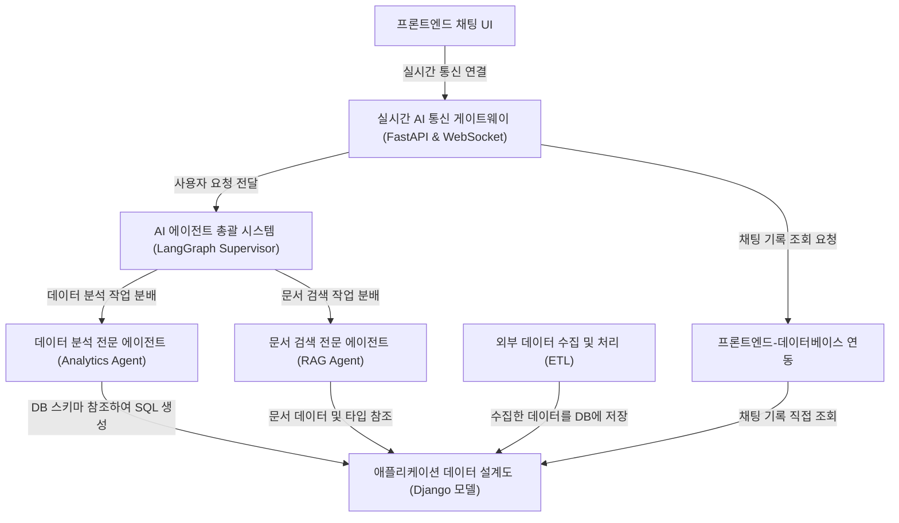

# TSKN10-FINAL-1Team

이 프로젝트는 사용자가 채팅으로 업무를 요청할 수 있는 **지능형 AI 비서 시스템**입니다. 사용자가 웹 UI에서 질문을 던지면, *AI 에이전트 총괄 시스템(슈퍼바이저)*이 요청의 의도를 파악합니다. 그리고 "회사 규정이 뭐지?"와 같은 질문은 *문서 검색 전문 에이전트(RAG)*에게, "고객의 성비를 시각화해줘"와 같은 데이터 분석 요청은 *데이터 분석 전문 에이전트*에게 작업을 분배합니다. 이 모든 데이터는 체계적인 *애플리케이션 데이터 설계도(Django 모델)*에 따라 저장되며, 프론트엔드와 AI 시스템은 *실시간 AI 통신 게이트웨이(fastAPI & WebSocket)*를 통해 매끄럽게 연결되어 사용자가 AI의 답변 생성 과정을 실시간으로 볼 수 있습니다.

**Source Repository:** [None](None)

## Chapters

1. [애플리케이션 데이터 설계도 (Django 모델)
](docs/01_애플리케이션_데이터_설계도__django_모델__.md)
2. [프론트엔드 채팅 UI
](docs/02_프론트엔드_채팅_ui_.md)
3. [실시간 AI 통신 게이트웨이 (FastAPI & WebSocket)
](docs/03_실시간_ai_통신_게이트웨이__fastapi___websocket__.md)
4. [AI 에이전트 총괄 시스템 (LangGraph Supervisor)
](docs/04_ai_에이전트_총괄_시스템__langgraph_supervisor__.md)
5. [데이터 분석 전문 에이전트 (Analytics Agent)
](docs/05_데이터_분석_전문_에이전트__analytics_agent__.md)
6. [문서 검색 전문 에이전트 (RAG Agent)
](docs/06_문서_검색_전문_에이전트__rag_agent__.md)
7. [외부 데이터 수집 및 처리 (ETL)
](docs/07_외부_데이터_수집_및_처리__etl__.md)
8. [프론트엔드-데이터베이스 연동
](docs/08_프론트엔드_데이터베이스_연동_.md)

---