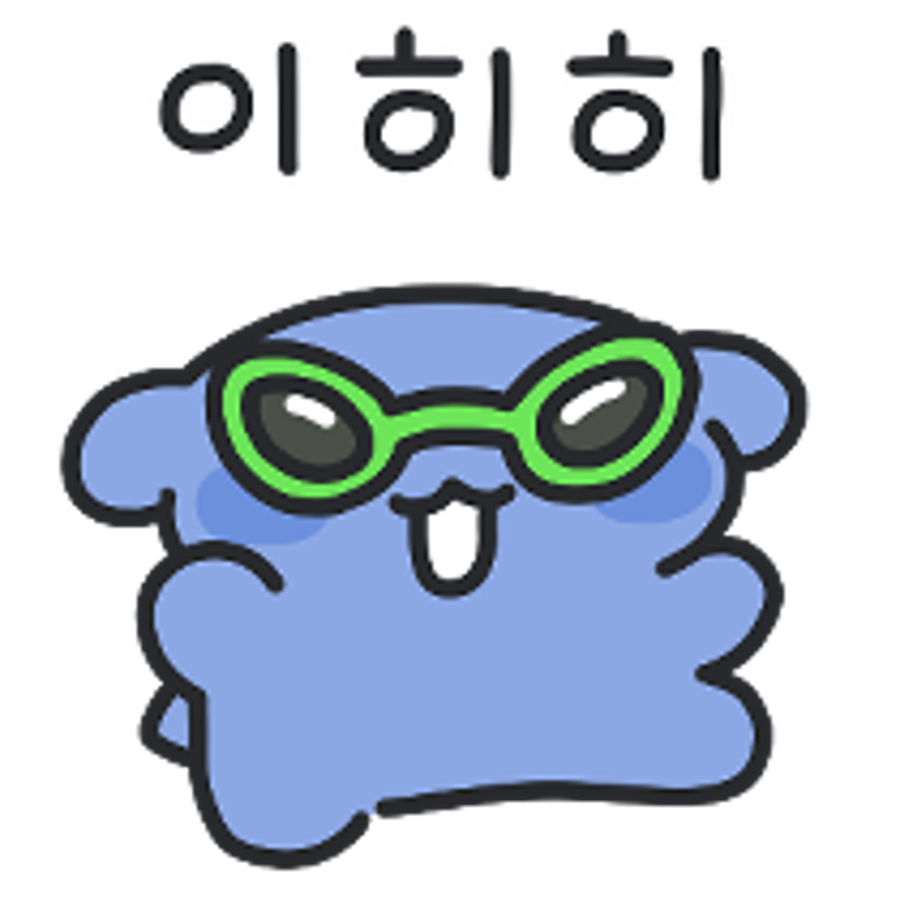
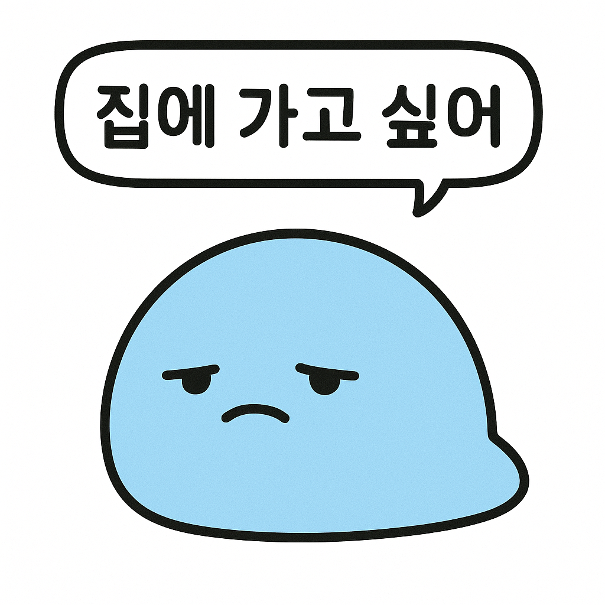
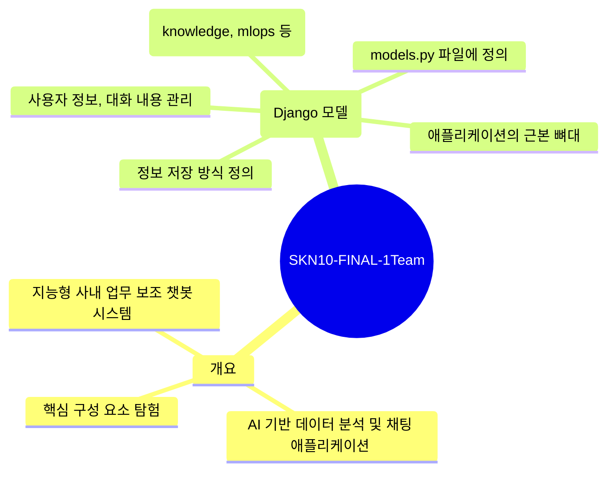

## TSKN10-FINAL-1Team

## 프로젝트 개요
이 프로젝트는 사용자가 채팅으로 업무를 요청할 수 있는 **지능형 사내 업무 보조 챗봇 시스템**입니다. 사용자의 질문 의도를 **AI 에이전트 총괄 시스템 (LangGraph Supervisor)**이 파악하여 적절한 전문 에이전트에게 작업을 분배합니다. 마치 오케스트라의 지휘자처럼, 슈퍼바이저는 전체적인 요청을 보고 적임자(에이전트)를 찾아 지시를 내립니다. 예를 들어, 회사 규정 관련 질문은 **문서 검색 전문 에이전트 (RAG Agent)**에게, 데이터 분석 요청은 **데이터 분석 전문 에이전트 (Analytics Agent)**에게 전달됩니다. 코드 관련 질문은 **코드 분석 에이전트**가 담당할 수 있습니다. 모든 데이터는 **애플리케이션 데이터 설계도 (Django 모델)**에 따라 체계적으로 저장되며, 프론트엔드는 **실시간 AI 통신 게이트웨이 (FastAPI & WebSocket)**를 통해 AI 시스템과 매끄럽게 연결되어 AI 답변 생성 과정을 실시간으로 보여줍니다 (스트리밍). 이 시스템은 복잡한 내부 구조를 몰라도 사용자가 AI를 사람과 대화하듯 편안하게 사용할 수 있도록 설계되었습니다.

## 핵심 기능
*   **AI 에이전트 총괄 시스템 (LangGraph Supervisor)**: 사용자의 자연어 요청을 분석하여 가장 적합한 전문 에이전트 노드에게 작업을 라우팅하는 역할을 합니다. 슈퍼바이저는 특정 '업무 지침서'(Prompt)를 바탕으로 다음 에이전트를 결정합니다.
*   **문서 검색 전문 에이전트 (RAG Agent)**: 회사 내부 문서(정책, 매뉴얼, 회의록 등)에 대한 사용자의 질문에 답변합니다. Retrieval-Augmented Generation (RAG) 기술을 사용하며, 질문과 관련 있는 문서 조각을 **임베딩(Embedding)**과 **벡터 데이터베이스(Pinecone)**를 통해 먼저 검색한 뒤(Retrieval), 그 내용을 바탕으로 답변을 생성합니다(Generation).
*   **데이터 분석 전문 에이전트 (Analytics Agent)**: 데이터베이스에 저장된 데이터를 분석하고 통찰력을 제공합니다. 사용자의 자연어 질문을 컴퓨터가 이해하는 SQL 쿼리로 변환하고 데이터베이스에서 실행하여 결과를 가져옵니다. 결과는 텍스트로 요약되거나 **Mermaid 차트** 코드로 시각화됩니다. (논의를 통해 시계열 예측보다는 이상치 모델링 방향으로 고려되었습니다).
*   **코드 분석 에이전트 (Code Agent)** (논의 중): GitHub 저장소나 사내 코드 베이스의 내용을 분석하고 질의응답하는 것을 목표로 합니다. 코드의 오류 부분을 파악하거나, 특정 함수의 사용 위치나 상호작용하는 파일을 알려주고, 도큐멘테이션을 참고하여 질문에 답변할 수 있습니다. 필요에 따라 코드 변환 기능도 포함될 수 있습니다. 사용자의 코드 언어 버전 탐지 및 해당 버전에 맞는 답변 제공이 중요하게 고려됩니다.
*   **실시간 AI 통신 게이트웨이 (FastAPI & WebSocket)**: 사용자의 브라우저과 AI 시스템을 연결하는 통신 다리 역할을 합니다. **WebSocket**을 통해 한 번 연결되면 끊기지 않는 '전화 통화'처럼 실시간으로 데이터를 주고받으며, **FastAPI**가 이 통신을 효율적으로 처리합니다. 이를 통해 AI 답변 생성 과정을 실시간 스트리밍으로 사용자에게 보여줍니다.
*   **외부 데이터 수집 및 처리 (ETL)**: AI 에이전트가 사용할 데이터(고객 정보, 뉴스, 문서 등)를 외부에서 가져와(Extract) 시스템이 사용하기 좋은 형태로 가공한 뒤(Transform), 데이터베이스나 벡터 저장소에 저장하는(Load) 자동화된 스크립트(파이프라인)를 의미합니다. tools 및 lambda 폴더의 파이썬 스크립트가 이 역할을 수행합니다. (CSV 파일의 고객 데이터, 최신 뉴스, 문서 파일(PDF, HTML) 텍스트 및 벡터 변환 등을 처리합니다).
*   **프론트엔드 채팅 UI**: 사용자가 AI와 직접 소통하고 눈으로 볼 수 있는 '얼굴'입니다. 메시지 입력창, 대화 내용이 보이는 말풍선(메시지 목록), 과거 대화 목록을 보여주는 사이드바 등으로 구성됩니다. React(Next.js)의 useState 기능을 사용하여 UI 상태를 관리하고, 서버로부터 받은 메시지를 화면에 그려줍니다.

## 기술 스택
*   **백엔드/AI**:
    *   웹 프레임워크: **Django** (애플리케이션 데이터 설계 및 전통적인 API 연동)
    *   AI 통신 게이트웨이: **FastAPI** (실시간 통신 처리 및 에이전트 시스템 연동)
    *   실시간 통신: **WebSocket**
    *   AI 오케스트레이션: **LangGraph** (다양한 에이전트들의 작업 흐름 및 협업 설계)
    *   LLM: **GPT 모델** (주요 모델), 필요에 따라 **Local LLM** (Qwen 1.5 32B 등) 서빙 (Runpod 활용), 다른 오픈소스 모델 (Mistral 등) 및 상용 모델 (Claude, Gemini) 고려.
    *   임베딩 모델: **BGE-M3** (Dense 및 Sparse 벡터 생성 지원). OpenAI 임베딩 모델도 사용됨.
    *   벡터 데이터베이스: **Pinecone** (문서 임베딩 저장 및 검색), PostgreSQL w/ pgvector (논의됨). 하이브리드 서치 및 리랭킹 기능 고려.
    *   관계형 데이터베이스: **PostgreSQL** (사용자 정보, 채팅 내용, 분석 결과, 정형 데이터셋 등 저장).
    *   객체 스토리지: **AWS S3** (업로드 파일, 원본 문서, 모델 저장 등).
    *   ETL 스크립트: **Python** (requests, psycopg2, tqdm, pdfplumber, beautifulsoup, OpenAI API 등 활용).
    *   배포: **AWS EC2**, **Runpod** (VLLM 서빙).
    *   툴 호출 표준: **MCP** (논의됨).
    *   AI 개발 환경: **LangSmith** (LangGraph 흐름 설계 및 디버깅).
*   **프론트엔드**:
    *   프레임워크: **Next.js** (React 기반).
    *   UI/UX 디자인: **Figma** (별도 작업).

## 팀원 및 역할 (Roles and Responsibilities)
| 이름 | 이미지 | 역할 |
| ------ | ------ | ------ |
| **신정우** (PM) |  | 데이터 분석 에이전트 개발 및 머신러닝 모델링 (프로젝트 기획 및 일정/이슈 관리 포함) |
| **경규휘** |  | 문서 검색 전문 에이전트 (RAG) 개발 및 데이터 검색 (Product 문서 데이터 수집 및 RAG 테스트 포함) |
| **남궁승원** |  | 데이터 분석 에이전트 개발 및 머신러닝 모델링 (ML 부분 포함) (기술 문서 및 사내 정책 문서 데이터 수집 포함) |
| **이태수** |  | 시장 조사 및 문서 검색 전문 에이전트 (RAG) 개발 (뉴스 수집 API 개발 및 이슈/동향 수집 포함) |
| **황인호** |  | AI 에이전트 총괄 시스템 (LangGraph Supervisor), 코드 에이전트, 프론트엔드 개발 (ERD, 배포, 데이터 조회 프로그램 개발 포함) |

## 문서 구조 (Chapters)
프로젝트의 핵심 구성 요소 및 개발 과정에 대한 자세한 내용은 다음 장에서 확인할 수 있습니다.
1.  [애플리케이션 데이터 설계도 (Django 모델)](docs/01_애플리케이션_데이터_설계도__django_모델__.md)
2.  [프론트엔드 채팅 UI](docs/02_프론트엔드_채팅_ui_.md)
3.  [실시간 AI 통신 게이트웨이 (FastAPI & WebSocket)](docs/03_실시간_ai_통신_게이트웨이__fastapi___websocket__.md)
4.  [AI 에이전트 총괄 시스템 (LangGraph Supervisor)](docs/04_ai_에이전트_총괄_시스템__langgraph_supervisor__.md)
5.  [데이터 분석 전문 에이전트 (Analytics Agent)](docs/05_데이터_분석_전문_에이전트__analytics_agent__.md)
6.  [문서 검색 전문 에이전트 (RAG Agent)](docs/06_문서_검색_전문_에이전트__rag_agent__.md)
7.  [외부 데이터 수집 및 처리 (ETL)](docs/07_외부_데이터_수집_및_처리__etl__.md)
8.  [프론트엔드-데이터베이스 연동](docs/08_프론트엔드_데이터베이스_연동_.md)

## 협업 및 일정 관리
*   **회의**: 정기적인 팀 회의를 통해 프로젝트 진행 상황 공유 및 다음 업무 논의.
*   **회의록**: Notion, ClovaNote 등을 활용하여 회의 내용, 결정 사항, 개별 업무 내용 기록 및 공유.
*   **코드 관리**: Git Repository를 사용하여 코드 버전 관리 및 협업.
*   **일정/이슈 관리**: GitHub Project를 활용하여 업무 이슈 등록, 담당자 배정, 진행 상황 추적.
*   **커뮤니케이션**: Discord, KakaoTalk 등을 활용하여 실시간 소통.
*   **기술 스터디**: LangGraph, LangSmith, Pinecone 사용법 등 핵심 기술에 대한 팀원 간 스터디 진행.

