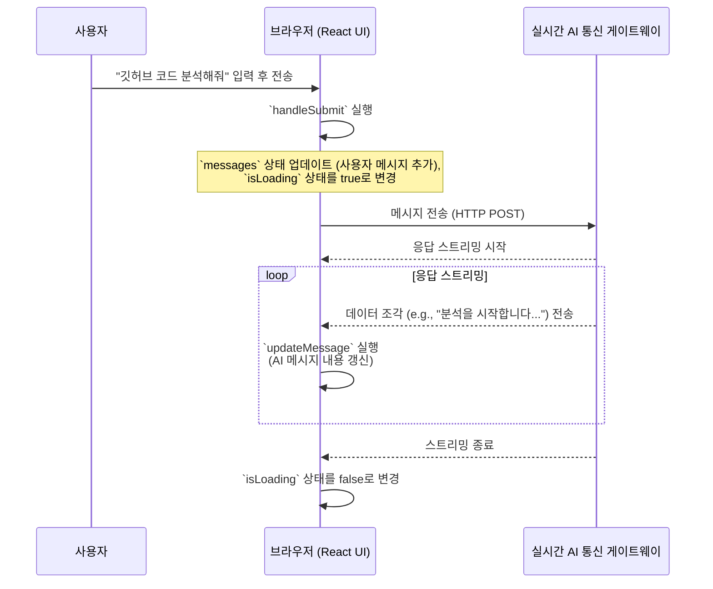

# Chapter 1: 대화형 프론트엔드 (React/Next.js UI)

안녕하세요! AI 챗봇 만들기 프로젝트에 오신 것을 환영합니다. 이 프로젝트의 첫 번째 여정으로, 우리는 사용자가 직접 눈으로 보고 상호작용하는 부분, 바로 '챗봇의 얼굴'인 프론트엔드를 만들어 볼 것입니다.

## 왜 '대화형 프론트엔드'가 필요한가요?

카카오톡이나 페이스북 메신저 같은 채팅 앱을 떠올려보세요. 메시지를 입력하고 '전송' 버튼을 누르면 내 메시지가 말풍선으로 뿅 나타나죠. 잠시 후 상대방이 입력 중이라는 표시가 뜨고, 이윽고 상대방의 메시지가 화면에 나타납니다. 이런 자연스러운 대화 경험을 우리 챗봇에도 그대로 적용하고 싶었습니다.

'대화형 프론트엔드'는 바로 이 역할을 합니다. 사용자가 AI와 실시간으로 대화하는 것처럼 느끼게 만들어주는 것이 핵심 목표입니다. 이를 위해 우리는 다음과 같은 기능들을 구현할 것입니다.

*   메시지를 입력할 수 있는 입력창
*   대화 내용이 오고 가는 것을 보여주는 말풍선
*   이전 대화 목록을 볼 수 있는 사이드바
*   AI가 답변을 생성하는 동안 보여주는 로딩 애니메이션

이 모든 것을 만들기 위해 우리는 **React**와 **Next.js**라는 강력한 웹 개발 도구를 사용할 것입니다. 마치 레고 블록을 조립하듯, 작고 재사용 가능한 부품(컴포넌트)들을 합쳐 전체 채팅 화면을 만들어 나갈 겁니다.

## 핵심 개념: React의 세 가지 마법

React는 사용자 인터페이스(UI)를 만드는 것을 매우 쉽게 해주는 도구입니다. React의 작동 방식을 이해하기 위해 세 가지 중요한 개념을 알아봅시다.

### 1. 컴포넌트 (Components): 레고 블록처럼 조립하기

우리의 챗봇 화면은 여러 조각으로 이루어져 있습니다. 왼쪽의 대화 목록(`Sidebar`), 가운데의 메시지 창(`ChatMessage`), 아래의 입력창(`MessageInput`) 등이 각자의 역할을 하는 독립적인 '컴포넌트'입니다.


이렇게 기능을 분리하면 코드를 관리하기 쉽고, 똑같은 모양의 '말풍선' 컴포넌트를 여러 번 재사용할 수도 있어 매우 효율적입니다.

### 2. 상태 (State): 컴포넌트의 기억 장치

'상태(State)'는 컴포넌트가 기억해야 할 정보입니다. 예를 들어, 메시지 입력창은 사용자가 지금 입력하고 있는 글자를 기억해야 하고(`input` 상태), 채팅 화면은 지금까지 오고 간 모든 메시지 목록을 기억해야 합니다(`messages` 상태).

React에서는 `useState`라는 특별한 함수를 사용해 상태를 만듭니다.

```tsx
// frontend/app/chatbot/page.tsx

// 'input'이라는 상태를 만들고, 초기값은 빈 문자열 ""로 설정합니다.
const [input, setInput] = useState("");

// 'messages'라는 상태를 만들고, 초기값은 빈 배열 []로 설정합니다.
const [messages, setMessages] = useState<TMessage[]>([]);
```

`useState`를 사용하면 `[기억할_정보, 정보_변경_함수]` 형태의 쌍을 얻게 됩니다. `setInput("안녕하세요")` 처럼 변경 함수를 호출하면, React는 `input` 상태가 바뀐 것을 알아채고 화면을 자동으로 새로 그려줍니다. 이것이 React가 동적으로 보이는 이유입니다!

### 3. 효과 (Effects): 특정 상황에 반응하기

만약 새로운 메시지가 추가될 때마다 채팅창을 맨 아래로 스크롤하고 싶다면 어떻게 해야 할까요? 이처럼 '어떤 상태가 바뀔 때마다' 특정 행동을 하고 싶을 때 `useEffect`를 사용합니다.

```tsx
// frontend/app/chatbot/page.tsx

// messages 상태가 변경될 때마다 실행될 코드를 등록합니다.
useEffect(() => {
  // messagesEndRef는 채팅창의 맨 아래를 가리키는 지점입니다.
  // 이 지점이 보이도록 부드럽게 스크롤합니다.
  messagesEndRef.current?.scrollIntoView({ behavior: "smooth" });
}, [messages]); // 이 배열 안에 있는 상태가 바뀔 때만 실행됩니다.
```

`useEffect`는 우리의 앱에 생동감을 불어넣는 중요한 마법입니다.

## 챗봇은 어떻게 말하고 들을까? (핵심 동작 원리)

이제 사용자가 메시지를 보내고 AI의 답변을 받는 전체 과정을 단계별로 따라가 보겠습니다.

**1단계: 메시지 입력 및 전송**

사용자가 입력창에 메시지를 입력하고 '전송' 버튼을 누르면 `handleSubmit` 함수가 실행됩니다.

```tsx
// frontend/app/chatbot/page.tsx

const handleSubmit = async (e: FormEvent) => {
  e.preventDefault(); // 페이지 새로고침 방지

  // 사용자가 입력한 메시지를 객체 형태로 만듭니다.
  const userMessage: TMessage = {
    id: `user-${Date.now()}`,
    role: "user",
    content: input,
    createdAt: new Date().toISOString(),
  };

  addMessage(userMessage); // 만든 메시지를 화면에 바로 추가
  setInput("");           // 입력창을 비웁니다.
  setIsLoading(true);     // AI가 생각 중임을 알리는 로딩 상태로 변경
  
  // (이후 백엔드로 메시지를 전송하는 코드가 이어집니다...)
};
```

이 함수는 먼저 사용자의 메시지를 `messages` 상태에 추가하여 화면에 즉시 표시합니다. 그리고 입력창을 비우고, 로딩 상태를 `true`로 바꿔 사용자에게 AI가 응답을 준비하고 있음을 알려줍니다.

**2단계: AI의 실시간 답변 스트리밍**

가장 흥미로운 부분입니다. `handleSubmit` 함수는 백엔드 서버로 사용자의 메시지를 보냅니다. 이때 서버는 답변 전체가 완성될 때까지 기다렸다가 한 번에 보내는 것이 아니라, 생성되는 대로 **실시간으로 조금씩 여러 번에 걸쳐** 보내줍니다. 이를 '스트리밍(Streaming)'이라고 합니다.

프론트엔드는 이 데이터 조각들을 받아서 AI의 말풍선 내용을 계속 업데이트합니다.

```tsx
// frontend/app/chatbot/page.tsx (handleSubmit 함수 내부)

// ...
try {
  // 백엔드 API로 메시지를 전송합니다.
  const response = await fetch(/* ... */);

  const reader = response.body.getReader(); // 스트림 데이터를 읽는 리더
  let accumulatedContent = ""; // 데이터 조각을 모을 변수

  // 스트림이 끝날 때까지 반복
  while (true) {
    const { done, value } = await reader.read(); // 데이터 조각 읽기
    if (done) break; // 스트림 종료

    // 받은 데이터 조각(chunk)을 텍스트로 변환하고 처리
    // ...
    accumulatedContent += "새로 받은 텍스트 조각";

    // AI 메시지 ID를 찾아 내용을 계속 덧붙여 업데이트
    updateMessage(assistantMessageId, {
      content: accumulatedContent,
    });
  }
} catch (error) { /* ... */ }
```

`while` 루프 안에서 `reader.read()`를 통해 데이터 조각을 계속 받아옵니다. 받은 조각을 `accumulatedContent`에 계속 더하고, `updateMessage` 함수를 호출하여 AI 메시지의 `content`를 갱신합니다. 상태가 계속 바뀌기 때문에, React는 화면을 계속 새로 그려주고, 사용자는 마치 AI가 실시간으로 타이핑하는 듯한 효과를 보게 됩니다.

## 코드 깊게 들여다보기

이제 전체 시스템이 어떻게 상호작용하는지 그림으로 살펴보고, 핵심 코드 조각들을 더 자세히 알아보겠습니다.

### 전체 흐름도

사용자가 메시지를 보내면, 브라우저의 React UI는 즉시 화면을 업데이트하고 백엔드로 요청을 보냅니다. 백엔드는 응답을 스트리밍하고, 브라우저는 이 스트림을 받아 화면을 실시간으로 업데이트합니다.



### 상태 관리의 분리: 커스텀 훅 (Custom Hooks)

`ChatbotPage.tsx` 파일이 모든 로직을 다 처리하면 코드가 너무 복잡해집니다. 그래서 우리는 관련 로직들을 별도의 '커스텀 훅'으로 분리했습니다. 훅은 `use`로 시작하는 특별한 함수로, 상태 관련 로직을 재사용할 수 있게 해줍니다.

-   **`useChatSessions`**: 사이드바에 표시될 전체 대화 목록을 관리합니다. 서버에서 대화 목록을 가져오고, 새 대화를 만들거나 기존 대화를 삭제하는 기능을 제공합니다. 이 훅은 나중에 배울 [2장: 데이터 모델 및 백엔드 (Django Backend)](02_데이터_모델_및_백엔드__django_backend_.md)와 통신합니다.

    ```tsx
    // frontend/hooks/useChatSessions.ts
    export function useChatSessions() {
      const [sessions, setSessions] = useState<TSession[]>([]);
      const [activeSessionId, setActiveSessionId] = useState<string | null>(null);

      // (컴포넌트가 처음 로드될 때 서버에서 세션 목록을 가져오는 로직...)
      
      const createNewSession = async () => { /* ... */ };
      const deleteSession = async (sessionId: string) => { /* ... */ };

      return { sessions, activeSessionId, createNewSession, /*...*/ };
    }
    ```

-   **`useChatMessages`**: 현재 활성화된 하나의 대화에 속한 메시지들을 관리합니다. `activeSessionId`가 바뀌면, 해당 대화의 메시지들을 서버에서 새로 불러옵니다. 메시지를 추가(`addMessage`)하거나 업데이트(`updateMessage`)하는 함수도 제공합니다.

    ```tsx
    // frontend/hooks/useChatMessages.ts
    export function useChatMessages(activeSessionId: string | null) {
      const [messages, setMessages] = useState<TMessage[]>([]);

      useEffect(() => {
        if (activeSessionId) {
          // activeSessionId가 변경되면 새 대화의 메시지를 불러옴
          const fetchMessages = async () => { /* ... */ };
          fetchMessages();
        }
      }, [activeSessionId]);

      // (addMessage, updateMessage 함수들...)
      return { messages, addMessage, updateMessage, /*...*/ };
    }
    ```

### AI의 도구 사용 시각화: `ToolCallDisplay`

때때로 AI는 단순히 텍스트로 답하는 것을 넘어, 차트를 그리거나 데이터베이스를 조회하는 등 특별한 '도구'를 사용해야 할 때가 있습니다.

이때 `ToolCallDisplay` 컴포넌트는 AI가 어떤 도구를, 어떤 목적으로, 어떤 결과를 가지고 사용했는지를 시각적으로 보여줍니다. 이 정보 또한 백엔드로부터 스트리밍되는 데이터에 포함되어 있습니다.

```tsx
// frontend/components/ChatMessage.tsx

// ...
<div className="flex-1 max-w-3xl">
  {/* AI가 사용한 도구 목록을 보여주는 컴포넌트 */}
  <ToolCallDisplay toolCalls={message.tool_calls || []} />

  {/* AI의 최종 답변을 보여주는 부분 */}
  <div className="bg-white ...">
    <ReactMarkdown>{message.content}</ReactMarkdown>
  </div>
</div>
```

사용자는 이 컴포넌트를 통해 AI가 "생각하는" 과정을 투명하게 볼 수 있어, 시스템에 대한 신뢰도를 높일 수 있습니다. AI가 어떤 도구를 사용하는지에 대한 자세한 내용은 [4장: AI 에이전트 오케스트레이터 (LangGraph Swarm)](04_ai_에이전트_오케스트레이터__langgraph_swarm_.md)와 [5장: 전문가 AI 에이전트 도구 (Specialized Agent Tools)](05_전문가_ai_에이전트_도구__specialized_agent_tools_.md)에서 깊게 다룰 예정입니다.

## 마무리하며

이번 장에서는 사용자와 AI가 만나는 첫 관문인 대화형 프론트엔드를 살펴보았습니다. React의 핵심 개념인 **컴포넌트, 상태(state), 효과(effect)**를 이용해 어떻게 동적이고 생동감 있는 채팅 인터페이스를 만드는지 배웠습니다. 또한, 백엔드로부터 응답을 **스트리밍**하여 실시간 대화 경험을 구현하는 원리도 이해했습니다.

이제 우리는 멋진 '얼굴'을 만들었습니다. 하지만 이 얼굴이 기억하고 말할 내용을 저장하는 '뇌'와 '기억 저장소'는 어디에 있을까요?

다음 장에서는 우리의 모든 대화 데이터를 안전하게 저장하고 관리하는 시스템의 심장부, [2장: 데이터 모델 및 백엔드 (Django Backend)](02_데이터_모델_및_백엔드__django_backend_.md)에 대해 알아보겠습니다.

---

Generated by [AI Codebase Knowledge Builder](https://github.com/The-Pocket/Tutorial-Codebase-Knowledge)