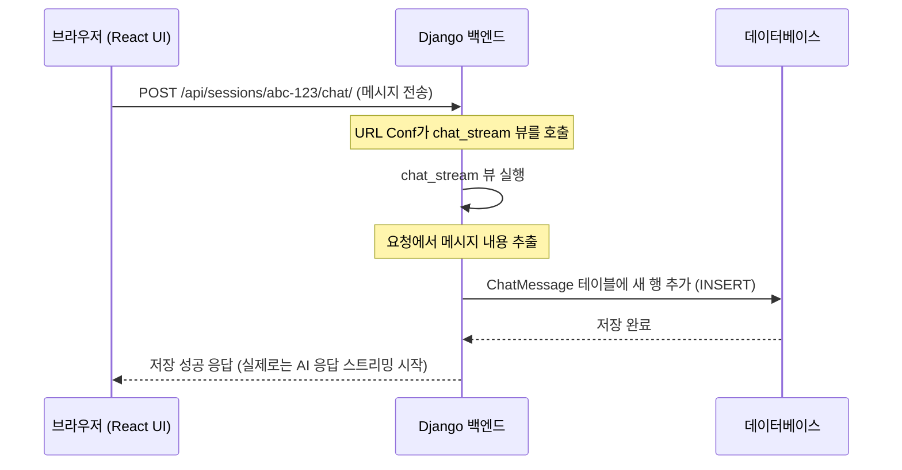

# Chapter 2: 데이터 모델 및 백엔드 (Django Backend)

[1장: 대화형 프론트엔드 (React/Next.js UI)](01_대화형_프론트엔드__react_next_js_ui_.md)에서 우리는 사용자와 직접 소통하는 멋진 챗봇의 '얼굴'을 만들었습니다. 사용자가 메시지를 입력하고 보내면 화면에 즉시 나타나는 것을 보셨죠? 하지만 F5 키를 눌러 페이지를 새로고침하면 대화 내용이 전부 사라져 버립니다. 왜 그럴까요? 바로 우리가 아직 대화 내용을 저장할 '기억 저장소'를 만들지 않았기 때문입니다.

이번 장에서는 우리 챗봇의 '뇌'와 '기억'을 담당하는 부분, 바로 **백엔드(Backend)**를 구축해 보겠습니다. 백엔드는 눈에 보이지는 않지만, 우리가 나눈 모든 대화를 안전하게 보관하고, 사용자가 누구인지 인증하며, 전체 시스템의 뼈대를 잡아주는 아주 중요한 역할을 합니다. 우리는 이 뼈대를 만들기 위해 **Django(장고)**라는 강력하고 안정적인 웹 프레임워크를 사용할 것입니다.

## 왜 '백엔드'가 필요한가요?

친구와 카카오톡으로 나눈 대화는 앱을 껐다 켜도 그대로 남아 있습니다. 이는 모든 대화 내용이 카카오의 서버 컴퓨터(백엔드)에 차곡차곡 저장되기 때문입니다. 우리 챗봇도 마찬가지입니다. 사용자와 나눈 대화를 기억하고, 이전 대화를 다시 불러오려면 데이터를 저장할 공간과 관리 시스템이 필요합니다.

Django 백엔드는 바로 이 역할을 수행합니다.
*   **데이터 저장:** 사용자가 보낸 메시지, AI의 답변, 대화 세션 정보 등을 데이터베이스에 영구적으로 저장합니다.
*   **사용자 관리:** 누가 로그인했는지, 어떤 권한을 가지고 있는지 관리합니다.
*   **규칙과 논리:** 프론트엔드에서 "이전 대화 목록 보여줘!"라고 요청하면, 데이터베이스에서 해당 사용자의 대화 목록을 찾아 전달하는 것과 같은 규칙을 처리합니다.

마치 건물을 지을 때 보이지 않는 철근과 기둥이 건물 전체를 지탱하는 것처럼, Django 백엔드는 우리 애플리케이션의 안정적인 기반이 됩니다.

## 핵심 개념: Django의 세 가지 기둥

Django는 '모델-뷰-템플릿(Model-View-Template)'이라는 설계 패턴을 따르지만, 여기서는 초보자가 이해하기 쉽도록 세 가지 핵심 요소인 **모델, 뷰, URL**로 나누어 설명하겠습니다. 이 세 가지는 마치 우체국 시스템처럼 함께 작동합니다.

### 1. 모델 (Models): 데이터의 '설계도'

'모델'은 어떤 데이터를 어떻게 저장할지 정의하는 '설계도'입니다. 데이터베이스에 표를 만든다고 상상해보세요. 어떤 열(column)이 필요한지 미리 정해야겠죠?

예를 들어, 채팅 메시지를 저장하려면 `ChatMessage`라는 표에 '누가 보냈는지(`role`)', '내용은 무엇인지(`content`)', '언제 보냈는지(`created_at`)'와 같은 정보가 필요합니다. Django에서는 이 설계를 코드로 작성합니다.

```python
# backend/conversations/models.py

from django.db import models

class ChatMessage(models.Model):
    # (id, session 정보는 생략)
    role = models.CharField(max_length=20)  # user 또는 assistant
    content = models.TextField()              # 채팅 내용
    created_at = models.DateTimeField(auto_now_add=True) # 생성 시간 자동 저장

    # ...
```
이 코드는 데이터베이스에게 "앞으로 `ChatMessage`라는 데이터를 저장할 건데, 여기에는 `role`, `content`, `created_at`이라는 칸이 필요해!"라고 알려주는 것과 같습니다. 이렇게 설계도를 잘 만들어두면 데이터가 뒤죽박죽 섞이지 않고 항상 일관성을 유지할 수 있습니다.

### 2. 뷰 (Views): 요청을 처리하는 '일꾼'

'뷰'는 프론트엔드로부터 요청을 받았을 때 실제로 어떤 일을 할지 결정하는 '로직' 또는 '일꾼'입니다. "로그인 시켜주세요", "대화 목록을 주세요", "새 메시지를 저장해주세요"와 같은 요청을 받아서 처리하는 부분이죠.

예를 들어, 사용자가 새 메시지를 보냈을 때 그 메시지를 데이터베이스에 저장하는 뷰를 살펴봅시다.

```python
# backend/conversations/views.py (간략화된 버전)
from django.http import JsonResponse
from .models import ChatSession, ChatMessage

@login_required # 로그인이 된 사용자만 접근 가능
async def chat_stream(request, session_id):
    # 1. 프론트엔드에서 보낸 메시지 내용 가져오기
    data = json.loads(request.body)
    user_message_content = data.get("message")
    
    # 2. 어떤 대화에 속한 메시지인지 찾기
    session = await ChatSession.objects.aget(id=session_id)
    
    # 3. 모델을 사용해 새 메시지를 데이터베이스에 저장
    await ChatMessage.objects.acreate(
        session=session, 
        role='user', 
        content=user_message_content
    )
    
    # (이후 AI에게 메시지를 보내는 로직이 이어집니다...)
    return JsonResponse({"status": "message saved"})
```
뷰는 마치 우체국의 직원 같습니다. 편지(요청)를 받아서, 주소(session_id)를 확인하고, 편지 내용(user_message)을 정해진 서류함(ChatMessage 모델)에 잘 정리해 넣습니다.

### 3. URL: '주소'를 알려주는 길잡이

프론트엔드는 수많은 뷰 중에서 어떤 뷰에게 요청을 보내야 할지 어떻게 알 수 있을까요? 바로 'URL' 덕분입니다. URL은 특정 뷰를 찾아갈 수 있는 고유한 '웹 주소'입니다.

`config/urls.py`나 각 앱의 `urls.py` 파일에서 어떤 주소로 요청이 오면 어떤 뷰를 실행할지 연결해줍니다.

```python
# backend/config/urls.py (예시)
from django.urls import path
from conversations import views

urlpatterns = [
    # ...
    # 'api/sessions/세션ID/chat/' 주소로 요청이 오면,
    # conversations 앱의 views.py에 있는 'chat_stream' 뷰를 실행해!
    path('api/sessions/<uuid:session_id>/chat/', views.chat_stream, name='chat_stream'),
    # ...
]
```
URL은 우체국의 주소 체계와 같습니다. "서울특별시 강남구 테헤란로..."라는 주소가 특정 건물을 가리키듯, `/api/sessions/.../chat/` 이라는 URL은 `chat_stream`이라는 특정 '일꾼(뷰)'을 정확히 찾아가게 해줍니다.

## 데이터는 어떻게 저장될까? (핵심 동작 원리)

이제 1장에서 보았던 메시지 전송 과정을 백엔드의 관점에서 다시 살펴보겠습니다.

1.  **프론트엔드(React)**: 사용자가 메시지를 입력하고 '전송' 버튼을 누릅니다.
2.  **HTTP 요청**: 브라우저는 `fetch` 함수를 이용해 Django 백엔드의 특정 URL(예: `/api/sessions/abc-123/chat/`)로 메시지 데이터를 담아 POST 요청을 보냅니다.
3.  **Django URL**: Django는 요청된 URL을 보고, 이 주소와 연결된 '일꾼'이 `conversations.views.chat_stream` 뷰라는 것을 확인합니다.
4.  **Django 뷰**: `chat_stream` 뷰가 실행됩니다. 요청에 담긴 메시지 내용을 꺼내고, URL에 포함된 `session_id`를 확인합니다.
5.  **Django 모델**: 뷰는 `ChatMessage.objects.acreate()` 라는 명령을 통해, `ChatMessage` 모델(설계도)에 맞게 새로운 메시지 데이터를 만들어 데이터베이스에 저장을 요청합니다.
6.  **데이터베이스**: 요청받은 데이터를 `chat_messages` 테이블에 새로운 행으로 안전하게 저장합니다.
7.  **(그 이후)** 뷰는 이 메시지를 [3장: 실시간 AI 통신 게이트웨이 (FastAPI Server)](03_실시간_ai_통신_게이트웨이__fastapi_server_.md)로 전달하여 AI의 답변을 요청합니다.

이 모든 과정이 눈 깜짝할 사이에 일어납니다. 전체 흐름을 그림으로 보면 더 쉽게 이해할 수 있습니다.



## 코드 깊게 들여다보기

우리 프로젝트의 실제 코드 구조를 통해 백엔드가 어떻게 구성되어 있는지 더 자세히 살펴보겠습니다.

### 데이터베이스의 청사진: `models.py`

우리의 애플리케이션은 다양한 데이터를 다룹니다. 각 데이터의 설계도는 해당 기능을 담당하는 앱 폴더 안의 `models.py` 파일에 정의되어 있습니다.

-   **사용자 정보 (`accounts/models.py`)**: 누가 우리 시스템을 사용하는지 정의합니다.

    ```python
    # backend/accounts/models.py
    class User(AbstractBaseUser, PermissionsMixin):
        id = models.UUIDField(primary_key=True, default=uuid.uuid4, editable=False)
        org = models.ForeignKey(Organization, on_delete=models.CASCADE)
        email = models.EmailField(unique=True)
        name = models.CharField(max_length=100, blank=True)
        role = models.CharField(max_length=20, choices=UserRole.choices)
        # ...
    ```
    `User` 모델은 사용자의 이메일, 이름, 역할 등 기본적인 정보를 저장하는 틀입니다.

-   **대화 정보 (`conversations/models.py`)**: 채팅의 핵심 데이터입니다.

    ```python
    # backend/conversations/models.py
    class ChatSession(models.Model):
        id = models.UUIDField(primary_key=True, default=uuid.uuid4, editable=False)
        user = models.ForeignKey(User, on_delete=models.CASCADE) # 어떤 유저의 대화인가
        title = models.CharField(max_length=60, default="새 세션")
        # ...

    class ChatMessage(models.Model):
        session = models.ForeignKey(ChatSession, on_delete=models.CASCADE) # 어떤 세션에 속한 메시지인가
        role = models.CharField(max_length=20)  # user | assistant
        content = models.TextField()
        # ...
    ```
    `ChatSession`은 하나의 대화창을 의미하고, `ChatMessage`는 그 안에서 오고 간 개별 메시지들을 의미합니다. `ForeignKey`는 이 두 모델을 '연결'해주는 고리 역할을 합니다. 즉, "이 메시지는 저 세션에 속해있다"는 관계를 정의하는 것이죠.

### 요청 처리의 중심: `views.py`

뷰는 HTTP 요청에 응답하는 함수들의 모음입니다. 우리 프로젝트에서는 크게 두 가지 방식으로 뷰를 사용합니다.

-   **API 뷰 (for React)**: 프론트엔드(React)가 데이터를 주고받을 때 사용하는 뷰입니다. 주로 JSON 형식으로 데이터를 응답합니다. `login_view`는 사용자가 보낸 이메일과 비밀번호로 로그인을 처리하고, 성공 시 토큰(인증서)을 발급합니다.

    ```python
    # backend/accounts/views.py
    @api_view(['POST']) # POST 요청만 허용
    @permission_classes([AllowAny]) # 누구나 접근 가능
    def login_view(request):
        email = request.data.get('email')
        password = request.data.get('password')
        
        user = authenticate(username=email, password=password) # 사용자 인증
        
        if user:
            refresh = RefreshToken.for_user(user) # 토큰 생성
            return Response({
                'access': str(refresh.access_token), # 프론트엔드에 토큰 전달
                # ...
            })
        
        return Response({'detail': 'Invalid credentials.'}, status=401)
    ```

-   **깃허브 연동 로직**: AI가 코드를 분석하려면 먼저 깃허브 저장소에 접근해야 합니다. `accounts/views.py`에 있는 `list_github_repositories`와 같은 뷰들은 사용자의 깃허브 토큰을 이용해 저장소 목록을 가져오는 복잡한 로직을 처리합니다. 이처럼 뷰는 단순 데이터 처리뿐만 아니라 외부 서비스와 연동하는 역할도 수행합니다. 이 기능은 [6장: 깃허브 코드 분석 및 문서화 파이프라인](06_깃허브_코드_분석_및_문서화_파이프라인__code_analysis_pipeline_.md)에서 중요한 역할을 합니다.

## 마무리하며

이번 장에서는 챗봇의 보이지 않는 심장, Django 백엔드에 대해 알아보았습니다. 데이터의 설계도인 **모델(Model)**, 요청을 처리하는 일꾼인 **뷰(View)**, 그리고 이 둘을 연결하는 주소인 **URL**이 어떻게 협력하여 우리의 대화 내용을 안전하게 저장하고 관리하는지 배웠습니다. 이제 우리 챗봇은 대화를 '기억'할 수 있게 되었습니다!

하지만 단순히 데이터를 저장하는 것만으로는 충분하지 않습니다. 사용자의 질문에 지능적으로 답변하려면 AI의 '두뇌'가 필요합니다. 다음 장에서는 사용자의 메시지를 받아 AI 모델에게 전달하고, 그 답변을 실시간으로 프론트엔드에 스트리밍하는 관문 역할을 하는 [3장: 실시간 AI 통신 게이트웨이 (FastAPI Server)](03_실시간_ai_통신_게이트웨이__fastapi_server_.md)를 구축해 보겠습니다. 이제 진짜 AI와의 대화가 시작됩니다

---

Generated by [AI Codebase Knowledge Builder](https://github.com/The-Pocket/Tutorial-Codebase-Knowledge)