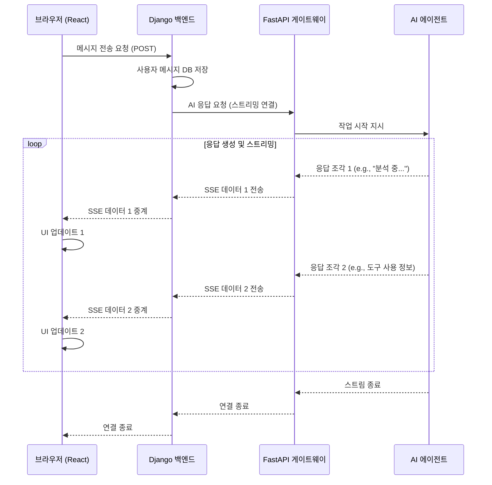

# Chapter 3: 실시간 AI 통신 게이트웨이 (FastAPI Server)

[2장: 데이터 모델 및 백엔드 (Django Backend)](02_데이터_모델_및_백엔드__django_backend_.md)에서 우리는 챗봇의 대화를 안전하게 저장하고 관리하는 '기억 저장소'를 만들었습니다. 마치 도서관의 서고처럼, Django 백엔드는 모든 정보를 체계적으로 정리하고 보관합니다. 하지만 사용자가 질문을 던졌을 때, 이 질문을 받아서 AI 전문가에게 전달하고, 전문가의 답변을 실시간으로 통역해주는 역할은 누가 할까요?

이번 장에서는 바로 그 '실시간 통역사'이자 '신경계' 역할을 하는 **실시간 AI 통신 게이트웨이**를 구축해 보겠습니다. 우리는 이 중요한 역할을 위해 **FastAPI**라는 매우 빠르고 현대적인 도구를 사용할 것입니다. FastAPI는 사용자의 브라우저와 AI의 두뇌를 끊김 없이 연결하여, AI가 생각하고 답변을 만들어내는 과정을 실시간으로 생생하게 전달해 줍니다.

## 왜 '통신 게이트웨이'가 별도로 필요한가요?

AI 챗봇과 대화하는 것을 상상해 보세요. 우리가 원하는 것은 AI가 답변을 한 번에 '툭' 던져주는 것이 아니라, 마치 사람이 생각하며 말하듯 자연스럽게 단어와 문장을 만들어내는 모습을 보는 것입니다. "분석을 시작합니다...", "데이터베이스에서 정보를 찾는 중...", "결과를 종합하여 보고서를 작성합니다..." 와 같은 AI의 생각 과정을 실시간으로 볼 수 있다면 훨씬 더 흥미롭고 신뢰가 가겠죠.

이런 실시간 '스트리밍(Streaming)' 통신은 서버에 상당한 부담을 줍니다. 수많은 사용자가 동시에 접속해서 각자의 AI와 대화한다고 생각해보세요. 모든 연결을 계속 유지하면서 데이터를 끊임없이 주고받아야 합니다.

이때, 데이터베이스 관리와 사용자 인증 등 안정성이 중요한 작업을 처리하는 Django 백엔드에게 이 모든 실시간 통신 부담까지 지게 하는 것은 비효율적입니다. 마치 레스토랑의 주방장이 요리뿐만 아니라 서빙과 계산까지 모두 처리하려는 것과 같습니다.

그래서 우리는 역할을 분리하기로 했습니다.
*   **Django 백엔드**: 데이터 저장, 사용자 관리 등 묵직하고 안정적인 작업 담당 (총괄 매니저)
*   **FastAPI 게이트웨이**: 수많은 실시간 스트리밍 연결을 처리하는 전문적인 작업 담당 (실시간 통역 및 통신 전문가)

이렇게 역할을 나누면 각자 자신의 전문 분야에 집중할 수 있어 전체 시스템이 훨씬 빠르고 안정적으로 동작하게 됩니다.

## 핵심 개념: FastAPI의 비동기 마법

FastAPI가 어떻게 이렇게 빠른 실시간 통신을 처리할 수 있는지, 그 비결인 두 가지 핵심 개념을 알아봅시다.

### 1. 비동기 처리 (Async / Await): 혼자서 여러 손님 상대하기

레스토랑에 아주 유능한 웨이터가 한 명 있다고 상상해 봅시다.

*   **동기(Synchronous) 방식**: 첫 번째 손님의 주문을 받고, 주방에 전달하고, 음식이 나올 때까지 기다렸다가, 음식을 가져다준 후에야 비로소 다음 손님에게 갑니다. 첫 번째 손님의 요리가 오래 걸리면 다른 손님들은 하염없이 기다려야 합니다.
*   **비동기(Asynchronous) 방식**: 첫 번째 손님의 주문을 받고 주방에 전달합니다. 음식이 조리되는 동안, 두 번째 손님의 주문을 받고, 세 번째 손님에게 물을 가져다줍니다. 그러다 첫 번째 손님의 음식이 나왔다는 알림이 오면, 하던 일을 잠시 멈추고 음식을 가져다줍니다.

**비동기 처리**가 바로 이 유능한 웨이터처럼 작동하는 방식입니다. `async` 키워드로 함수를 정의하면 "이 작업은 시간이 걸릴 수 있으니, 기다리는 동안 다른 일을 할 수 있습니다"라고 표시하는 것과 같습니다. 그리고 `await` 키워드는 AI의 답변을 기다리거나 데이터베이스에 접속하는 등 시간이 걸리는 작업을 만났을 때 "이 작업이 끝날 때까지 잠시 기다릴게. 그동안 다른 급한 일 먼저 처리해!"라고 알려주는 신호입니다.

```python
# fastapi_server/main.py (개념 설명용 코드)

# async: 이 함수는 비동기적으로 동작합니다.
async def get_ai_response(user_message: str):
    print("AI에게 답변을 요청합니다...")
    
    # await: ai_model.generate가 끝날 때까지 기다리되, 서버는 다른 요청을 처리할 수 있습니다.
    response = await ai_model.generate(user_message) 
    
    print("AI로부터 답변을 받았습니다!")
    return response
```

이 방식 덕분에 FastAPI 서버는 단 하나의 프로세스로도 수많은 클라이언트의 요청을 동시에 효율적으로 처리할 수 있습니다.

### 2. 서버-센트 이벤트 (Server-Sent Events, SSE): 실시간 라디오 방송

AI의 답변을 어떻게 조각내어 실시간으로 보낼 수 있을까요? 우리는 **SSE**라는 기술을 사용합니다.

HTTP 통신은 보통 클라이언트가 "이거 주세요!"라고 요청(Request)하면 서버가 "여기 있습니다!"하고 응답(Response)하는 단발성 관계입니다. 하지만 SSE는 마치 라디오 방송국처럼, 서버가 클라이언트에게 "지금부터 계속 업데이트되는 소식을 보내줄게!"라고 말하고 **연결을 끊지 않은 채 계속해서 데이터를 보내는 방식**입니다.

FastAPI는 이 SSE를 아주 쉽게 구현할 수 있게 해줍니다.

```python
# fastapi_server/main.py (개념 설명용 코드)

async def event_stream():
    # 'yield'는 값을 반환하고 함수를 끝내는 'return'과 달리,
    # 값을 하나 보내고 연결은 유지한 채로 대기합니다.
    yield "data: AI가 생각 중...\n\n"
    await asyncio.sleep(1) # 1초 대기
    yield "data: 첫 번째 문장을 생성했습니다.\n\n"
    await asyncio.sleep(1) # 1초 대기
    yield "data: 곧 답변이 완료됩니다.\n\n"
```
`yield` 키워드를 사용해 데이터를 조금씩 보내면, 프론트엔드는 이 조각들을 받아서 화면에 실시간으로 보여주게 됩니다. `data: ...\n\n` 형식은 SSE의 정해진 약속(프로토콜)입니다.

## AI와 대화는 어떻게 이루어질까? (전체 동작 원리)

이제 사용자가 메시지를 보냈을 때, 우리 시스템의 각 부분이 어떻게 유기적으로 협력하여 실시간 답변을 만들어내는지 전체 과정을 따라가 보겠습니다.

1.  **사용자**: 브라우저에서 "깃허브 코드 분석해줘"라고 입력하고 전송합니다.
2.  **브라우저 (React)**: 이 메시지를 [2장: 데이터 모델 및 백엔드 (Django Backend)](02_데이터_모델_및_백엔드__django_backend_.md)로 보냅니다.
3.  **Django 백엔드**:
    *   사용자가 보낸 메시지를 데이터베이스에 저장합니다.
    *   AI의 답변을 받기 위해, 저장된 메시지를 **FastAPI 게이트웨이**로 전달합니다. Django는 이때 스트리밍 응답을 받을 준비를 합니다.
4.  **FastAPI 게이트웨이**:
    *   Django로부터 메시지를 받고, 이 요청을 처리할 AI 두뇌, 즉 [4장: AI 에이전트 오케스트레이터 (LangGraph Swarm)](04_ai_에이전트_오케스트레이터__langgraph_swarm_.md)를 준비시킵니다.
    *   AI 두뇌에게 작업을 시작하라고 지시합니다.
5.  **AI 에이전트 (LangGraph)**:
    *   요청을 분석하고, 도구를 사용하는 등 답변을 생성하기 시작합니다.
    *   생성되는 텍스트나 도구 사용 현황(`tool_calls`)을 **조각(chunk) 단위로** FastAPI 게이트웨이에게 계속해서 보냅니다.
6.  **FastAPI 게이트웨이**: AI 에이전트로부터 받은 데이터 조각을 SSE 형식(`data: ...`)으로 포장하여 Django 백엔드로 실시간 스트리밍합니다.
7.  **Django 백엔드**: FastAPI로부터 받은 스트림 데이터를 한 줄 한 줄 그대로 브라우저로 중계(Relay)합니다.
8.  **브라우저 (React)**: Django가 중계해준 데이터 조각을 받아서 화면의 AI 말풍선 내용을 계속 업데이트합니다.

이 복잡한 과정을 그림으로 보면 훨씬 이해하기 쉽습니다.



## 코드 깊게 들여다보기

이제 실제 코드를 통해 FastAPI 게이트웨이가 어떻게 마법을 부리는지 살펴보겠습니다.

### 1단계: FastAPI가 요청 받기 (`fastapi_server/main.py`)

모든 요청의 시작점은 `main.py` 파일의 `/invoke` 엔드포인트입니다. Django 백엔드는 바로 이 주소로 AI 응답을 요청합니다.

```python
# fastapi_server/main.py

@app.post("/invoke")
async def invoke_agent(invocation_request: InvocationRequest):
    """
    사용자 요청을 받아 AI 에이전트를 호출하고,
    메시지와 디버그 이벤트를 모두 스트리밍합니다.
    """
    # ... (사용자 메시지 추출 로직)

    # event_stream 함수를 통해 스트리밍 응답을 반환합니다.
    return StreamingResponse(event_stream(), media_type="text/event-stream")
```
*   `@app.post("/invoke")`: FastAPI에게 `/invoke`라는 주소로 들어오는 POST 요청을 이 `invoke_agent` 함수가 처리하도록 지시합니다.
*   `async def`: 이 함수가 비동기적으로 동작함을 의미합니다.
*   `StreamingResponse`: 스트리밍 응답을 보낼 때 사용하는 특별한 응답 객체입니다. `event_stream`이라는 '방송국'이 보내는 내용을 `text/event-stream`(SSE 형식)으로 송출하라고 설정합니다.

### 2단계: AI의 답변을 조각내어 보내기 (`fastapi_server/main.py`)

실제 스트리밍 로직은 `event_stream`이라는 내부 함수에 들어있습니다.

```python
# fastapi_server/main.py (invoke_agent 함수 내부)

async def event_stream():
    # ... AI 두뇌(그래프) 준비 ...
    graph = get_graph_by_organization(...)

    # graph.astream: AI 응답을 비동기 스트림으로 받습니다.
    async for chunk in graph.astream(...):
        try:
            # 받은 데이터 조각(chunk)을 JSON 형식으로 변환
            serializable_chunk = make_serializable(chunk)
            
            # SSE 형식으로 포장하여 yield!
            yield f"data: {json.dumps(serializable_chunk, ensure_ascii=False)}\n\n"
        except Exception as e:
            # ... 에러 처리 ...
```
*   `async for chunk in graph.astream(...)`: 이 부분이 바로 실시간 스트리밍의 핵심입니다. AI 두뇌(`graph`)가 답변 조각(`chunk`)을 만들어낼 때마다 루프가 한 번씩 실행됩니다.
*   `yield f"data: ..."`: `yield` 키워드는 루프가 돌 때마다 생성된 데이터 조각을 **연결을 끊지 않고** 호출자(Django)에게 즉시 보냅니다. 이것이 반복되면서 실시간 스트리밍이 구현됩니다.

### 3단계: Django가 스트림 중계하기 (`backend/conversations/views.py`)

Django는 FastAPI로부터 받은 방송을 그대로 시청자(브라우저)에게 전달하는 중계기 역할을 합니다.

```python
# backend/conversations/views.py (chat_stream 함수 내부)

async def event_stream():
    # ...
    fastapi_url = os.environ.get("FASTAPI_SERVER_URL", ...)

    async with httpx.AsyncClient() as client:
        # FastAPI 서버의 /invoke 엔드포인트에 스트리밍 연결을 요청합니다.
        async with client.stream("POST", f"{fastapi_url}/invoke", ...) as response:
            
            # FastAPI가 보내주는 데이터 라인을 하나씩 읽어옵니다.
            async for line in response.aiter_lines():
                if line.startswith("data: "):
                    # 받은 라인을 그대로 브라우저로 다시 yield 합니다.
                    yield f"{line}\n\n"
```
*   `client.stream(...)`: `httpx` 라이브러리를 사용해 FastAPI 서버에 스트리밍 연결을 엽니다.
*   `async for line in response.aiter_lines()`: FastAPI가 `yield`로 보내주는 데이터 라인을 하나씩 받습니다.
*   `yield f"{line}\n\n"`: 받은 라인을 가공하지 않고 거의 그대로 다시 `yield` 합니다. 이 `yield`는 최종적으로 브라우저로 응답을 보냅니다.

이처럼 Django는 중간에서 다리 역할만 충실히 수행함으로써, 복잡한 스트리밍 처리 부담은 FastAPI 전문가에게 맡기고 자신은 원래의 역할에 집중할 수 있게 됩니다.

## 마무리하며

이번 장에서는 우리 챗봇 시스템의 '신경계'인 실시간 AI 통신 게이트웨이를 살펴보았습니다. **FastAPI**와 **비동기 처리**, 그리고 **서버-센트 이벤트(SSE)**를 이용해 어떻게 빠르고 효율적으로 AI의 응답을 사용자에게 실시간 스트리밍할 수 있는지 배웠습니다. 또한, 왜 안정성을 담당하는 Django와 실시간 통신을 담당하는 FastAPI의 역할을 분리하는 것이 현명한 설계인지 이해했습니다.

이제 사용자와 AI를 연결하는 초고속 통신망까지 구축했습니다. 프론트엔드라는 '얼굴', Django라는 '기억 저장소', 그리고 FastAPI라는 '신경계'가 준비되었습니다. 그렇다면 이 신경계의 끝에 연결될 AI의 진짜 '두뇌'는 어떻게 생겼을까요?

다음 장에서는 드디어 우리 프로젝트의 가장 핵심적인 부분, 여러 전문 AI 에이전트들이 협력하여 복잡한 문제를 해결하는 [4장: AI 에이전트 오케스트레이터 (LangGraph Swarm)](04_ai_에이전트_오케스트레이터__langgraph_swarm_.md)에 대해 알아볼 것입니다. 진짜 AI의 세계로 떠날 준비를 하세요

---

Generated by [AI Codebase Knowledge Builder](https://github.com/The-Pocket/Tutorial-Codebase-Knowledge)