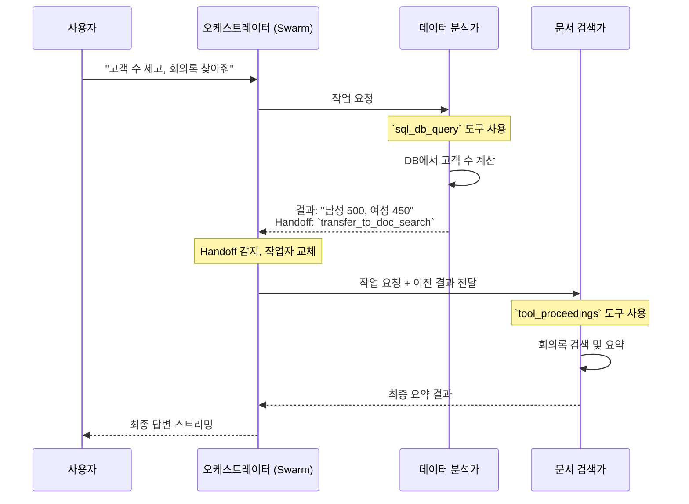

# Chapter 4: AI 에이전트 오케스트레이터 (LangGraph Swarm)

[3장: 실시간 AI 통신 게이트웨이 (FastAPI Server)](03_실시간_ai_통신_게이트웨이__fastapi_server_.md)에서 우리는 사용자와 AI 두뇌를 연결하는 초고속 '신경망'을 구축했습니다. 이제 사용자의 메시지는 지체 없이 AI에게 전달될 준비가 끝났습니다. 하지만 만약 사용자의 요청이 아주 복잡해서 한 명의 AI 전문가만으로는 해결할 수 없다면 어떨까요?

예를 들어, "지난 분기 고객 데이터를 분석해서 가장 많이 구매한 고객층을 찾아내고, 그 결과를 바탕으로 마케팅팀의 최신 회의록을 검색해서 관련 내용을 요약해줘." 와 같은 요청을 생각해 보세요. 이 작업은 '데이터 분석'과 '문서 검색'이라는 전혀 다른 두 가지 전문성이 필요합니다.

이번 장에서는 바로 이 문제, 즉 **여러 전문가 AI를 지휘하여 복잡한 문제를 해결하는 'AI 오케스트라 지휘자'**를 만들어 볼 것입니다. 우리는 이 지휘자 역할을 수행하기 위해 **LangGraph Swarm**이라는 강력한 도구를 사용할 것입니다. 이 도구를 통해 각기 다른 능력을 가진 AI 에이전트들이 마치 한 팀처럼 협력하는 시스템의 '두뇌'를 구축하게 됩니다.

## 왜 '오케스트레이터'가 필요한가요?

한 명의 만능 천재에게 모든 일을 맡기는 것보다, 각 분야의 전문가들로 팀을 꾸리는 것이 훨씬 효율적입니다. 우리 AI 시스템도 마찬가지입니다.
- **데이터 분석 전문가**: 복잡한 데이터 속에서 의미 있는 통찰을 찾아냅니다.
- **문서 검색 전문가**: 방대한 내부 자료 속에서 정확한 정보를 찾아냅니다.
- **코딩 전문가**: 깃허브 코드를 읽고, 쓰고, 분석합니다.

'AI 에이전트 오케스트레이터'는 이 전문가 팀의 '프로젝트 매니저' 또는 '지휘자'입니다. 사용자의 요청을 가장 먼저 받아서, "이 부분은 데이터 분석 전문가가 맡고, 분석이 끝나면 그 결과를 문서 검색 전문가에게 전달해서 다음 작업을 진행시켜!" 와 같이 업무를 분배하고 전체 작업 흐름을 관리합니다.

이렇게 역할을 나누면 각각의 AI 에이전트는 자신의 전문 분야에만 집중할 수 있어 더 높은 품질의 결과를 만들어낼 수 있고, 시스템 전체가 더 유연하고 확장 가능해집니다.

## 핵심 개념: 전문가 팀을 만드는 세 가지 요소

LangGraph Swarm을 이용해 전문가 팀을 구성하는 방법을 세 가지 핵심 개념으로 나누어 살펴보겠습니다.

### 1. 전문가 에이전트 (Agent): 각자의 역할을 가진 전문가

'에이전트'는 특정 임무를 부여받은 하나의 AI입니다. 각 에이전트는 자신만의 '역할(Prompt)'과 '도구(Tools)'를 가지고 있습니다.
- **역할(Prompt)**: "너는 데이터 분석 전문가야. SQL 쿼리를 실행해서 데이터를 분석하고 차트를 만드는 게 주된 임무야." 와 같이 에이전트의 정체성과 행동 지침을 정의하는 명령서입니다.
- **도구(Tools)**: 에이전트가 실제로 사용할 수 있는 능력들입니다. 예를 들어 데이터 분석가는 `sql_db_query`(데이터베이스 조회)나 `analyst_chart_tool`(차트 그리기) 같은 도구를 가집니다.

LangGraph에서는 `create_react_agent` 함수를 사용해 이런 전문가 에이전트를 쉽게 만들 수 있습니다.

```python
# fastapi_server/agent/graph.py (개념을 위한 단순화된 코드)

from langgraph.prebuilt import create_react_agent

# 데이터 분석가 에이전트 생성
analyst_assistant = create_react_agent(
    model="openai:gpt-4.1-2025-04-14",
    tools=analyst_tools,  # 데이터 분석가가 사용하는 도구 목록
    prompt="""You are a specialized data analyst assistant...""", # 역할 정의
    name="analyst_assistant" # 에이전트의 이름
)
```
이 코드는 "analyst_assistant"라는 이름의 데이터 분석 전문가를 '고용'하는 것과 같습니다. 이 전문가는 `analyst_tools`라는 연장 가방을 들고, 프롬프트에 적힌 대로 행동할 것입니다.

### 2. 업무 위임 도구 (Handoff Tool): 전문가 간의 협력

한 전문가가 자신의 일을 마친 뒤 다른 전문가에게 작업을 넘겨야 할 때는 어떻게 할까요? 이때 '업무 위임 도구(Handoff Tool)'를 사용합니다.

이것은 "이제 내 역할은 끝났으니, 이어서 코딩 전문가가 처리해주세요"라고 말하는 것과 같은 특별한 도구입니다. `create_handoff_tool` 함수로 이 도구를 만듭니다.

```python
# fastapi_server/agent/graph.py (개념을 위한 단순화된 코드)
from langgraph_swarm import create_handoff_tool

# 코딩 전문가에게 작업을 넘기는 도구 생성
transfer_to_coding_assistant = create_handoff_tool(
    agent_name="coding_assistant", # 누구에게 넘길지 이름 지정
    description="코딩, 깃허브 작업이 필요할 때 이 도구를 사용합니다."
)
```
이 `transfer_to_coding_assistant` 도구를 데이터 분석 전문가의 도구 목록에 추가해주면, 분석 전문가는 분석 작업이 끝난 후 필요에 따라 코딩 전문가를 호출할 수 있게 됩니다.

### 3. 스웜 (Swarm): 전문가 팀을 구성하고 지휘하기

이제 개별 전문가(Agent)들과 협력 방법(Handoff Tool)을 정의했으니, 이들을 모아 하나의 '팀(Swarm)'으로 묶어야 합니다. `create_swarm` 함수가 이 역할을 합니다.

```python
# fastapi_server/agent/graph.py (개념을 위한 단순화된 코드)
from langgraph_swarm import create_swarm

# 여러 에이전트들을 모아 하나의 팀(Swarm)으로 구성
graph = create_swarm(
    agents=[doc_search_assistant, analyst_assistant, coding_assistant],
    default_active_agent="doc_search_assistant" # 첫 요청을 받을 기본 에이전트
).compile(checkpointer=checkpointer) # 대화 기록을 저장할 장치 연결
```
`create_swarm` 함수는 정의된 모든 에이전트를 하나의 작업 흐름(Graph)으로 엮습니다. 여기서 `default_active_agent`는 사용자의 첫 요청을 누가 가장 먼저 검토할지 정하는 것입니다. 마치 프로젝트 매니저처럼, 첫 요청을 받고 가장 적합한 전문가에게 일을 넘겨주는 역할을 합니다.

## AI 오케스트라는 어떻게 연주될까? (핵심 동작 원리)

이제 사용자가 복잡한 요청을 보냈을 때, 우리 AI 팀이 어떻게 협력하여 문제를 해결하는지 단계별로 따라가 보겠습니다.

**요청**: "고객 데이터베이스에서 성별 별 고객 수를 세고, 결과를 바탕으로 마케팅 부서의 최신 회의록을 찾아줘."

1.  **요청 접수**: [3장: 실시간 AI 통신 게이트웨이 (FastAPI Server)](03_실시간_ai_통신_게이트웨이__fastapi_server_.md)가 사용자 요청을 받아서 LangGraph Swarm 오케스트레이터에게 전달합니다.
2.  **업무 분석 및 분배 (1차)**: 오케스트레이터는 기본 에이전트(예: 문서 검색 전문가)에게 요청을 보여줍니다. 하지만 에이전트는 요청의 첫 부분이 '고객 데이터베이스 분석'인 것을 보고 "이건 내 전문 분야가 아니야. 데이터 분석 전문가에게 넘겨야 해."라고 판단합니다.
3.  **1차 작업 수행 (데이터 분석 전문가)**: 오케스트레이터는 데이터 분석 전문가(`analyst_assistant`)를 활성화합니다. 분석 전문가는 자신의 `sql_db_query` 도구를 사용해 성별 별 고객 수를 계산하고 "남성: 500명, 여성: 450명" 같은 결과를 얻습니다.
4.  **업무 위임 (Handoff)**: 데이터 분석 전문가는 자신의 작업이 끝났음을 인지합니다. 그리고 원래 요청에 '회의록을 찾아줘'라는 부분이 남아있는 것을 확인하고, `transfer_to_doc_search_assistant`(문서 검색 전문가에게 위임) 도구를 사용합니다.
5.  **업무 분석 및 분배 (2차)**: 오케스트레이터는 '업무 위임' 신호를 받고, 이제 문서 검색 전문가(`doc_search_assistant`)를 활성화합니다. 이때, 이전 단계의 결과("남성: 500명, 여성: 450명")도 함께 전달합니다.
6.  **2차 작업 수행 (문서 검색 전문가)**: 문서 검색 전문가는 자신의 `tool_proceedings`(회의록 검색) 도구를 사용해 '마케팅'과 관련된 최신 회의록을 찾아내고, 그 내용을 요약합니다.
7.  **최종 답변 생성**: 모든 작업이 끝나면, 문서 검색 전문가는 최종 결과를 생성하여 오케스트레이터를 통해 사용자에게 전달합니다.

이 모든 과정은 각 단계의 결과가 실시간으로 스트리밍되어 사용자는 AI 팀이 협력하는 과정을 투명하게 지켜볼 수 있습니다.



## 코드 깊게 들여다보기

우리 프로젝트의 `fastapi_server/agent/` 폴더 안에는 이 AI 오케스트라를 구성하는 실제 설계도들이 들어있습니다.

### 역할별로 다른 전문가 팀 구성하기

우리 시스템은 접속한 사용자의 '역할(role)'에 따라 각기 다른 전문가 팀을 구성해 줍니다. 예를 들어, 엔지니어와 사업 분석가는 필요한 능력이 다르기 때문입니다. `fastapi_server/main.py` 파일에서 이 로직을 확인할 수 있습니다.

```python
# fastapi_server/main.py

def get_graph_by_organization(checkpointer, user_org, user_role):
    # 사용자의 조직/역할에 따라 다른 그래프(팀) 생성 함수를 매핑
    org_graph_mapping = {
        "development": get_engineer_graph,       # 개발팀용
        "administrator": get_admin_graph,        # 관리자용
        "business_strategy": get_analyst_graph,  # 사업분석팀용
    }
    
    # 적합한 그래프 생성 함수를 선택
    graph_function = org_graph_mapping.get(user_org, get_swarm_graph) # 기본값은 전체 그래프
    
    # 선택된 함수로 그래프(팀)를 생성하여 반환
    return graph_function(checkpointer)
```
`get_graph_by_organization` 함수는 사용자의 조직 정보(`user_org`)를 보고, `get_engineer_graph`나 `get_analyst_graph` 같은 각기 다른 팀 구성 함수를 호출합니다. 덕분에 개발팀 사용자에게는 코딩 전문가가 포함된 팀을, 사업분석팀 사용자에게는 데이터 분석에 특화된 팀을 제공할 수 있습니다.

### 엔지니어 팀의 구성 (`graph_engineer.py`)

개발팀 사용자를 위한 `get_engineer_graph`는 어떤 전문가들로 팀을 구성할까요? `fastapi_server/agent/graph_engineer.py` 파일을 살펴봅시다.

```python
# fastapi_server/agent/graph_engineer.py

def get_engineer_graph(checkpointer: AsyncPostgresSaver):
    """엔지니어 전용 스웜 그래프를 컴파일하고 반환합니다."""
    return create_swarm(
        # 엔지니어 팀은 '문서 검색가'와 '코딩 전문가'로 구성됩니다.
        agents=[doc_search_assistant, coding_assistant],
        default_active_agent="doc_search_assistant"
    ).compile(checkpointer=checkpointer)
```
이 파일에서는 팀(`swarm`)을 구성할 때 `doc_search_assistant`(문서 검색가)와 `coding_assistant`(코딩 전문가) 단 두 명의 전문가만 포함시키는 것을 볼 수 있습니다. 데이터 분석이나 고객 churn 예측 같은 기능은 엔지니어에게는 불필요하므로 팀에서 제외하여 더 효율적으로 만든 것입니다.

### 전문가의 상세 프로필 (`graph_engineer.py`)

그렇다면 엔지니어 팀의 `doc_search_assistant`는 어떤 역할을 부여받았을까요? 같은 파일에서 에이전트를 정의하는 부분을 보면 알 수 있습니다.

```python
# fastapi_server/agent/graph_engineer.py

doc_search_assistant = create_react_agent(
    model="openai:gpt-4.1-2025-04-14",
    # 도구 목록: 기술문서 검색, 제품문서 검색, 회의록 검색 등 + 코딩 전문가 호출 도구
    tools=doc_tools + [transfer_to_coding_assistant],
    prompt=(
        """You are an expert document search assistant for the **Development Team**.
        Your access is limited to development-related documents..."""
    ),
    name="doc_search_assistant"
)
```
프롬프트를 보면 "당신은 개발팀을 위한 전문가 문서 검색 도우미입니다"라고 명확히 역할이 지정되어 있으며, 접근 권한도 개발 관련 문서로 제한되어 있습니다. 또한, `tools` 목록에 `transfer_to_coding_assistant`가 포함되어 있어, 문서 검색 작업 중 코딩 관련 도움이 필요하면 즉시 코딩 전문가에게 작업을 넘길 수 있습니다.

이처럼 **LangGraph Swarm**을 사용하면 각기 다른 역할과 권한을 가진 AI 에이전트들을 유연하게 조합하여, 마치 실제 회사 조직처럼 특정 목적을 가진 전문가 팀을 구성하고 운영할 수 있습니다.

## 마무리하며

이번 장에서는 우리 챗봇 시스템의 핵심 두뇌, 즉 여러 AI 전문가들을 지휘하는 **AI 에이전트 오케스트레이터**에 대해 배웠습니다. **LangGraph Swarm**을 사용하여 각기 다른 역할을 가진 **에이전트(Agent)**들을 만들고, **업무 위임 도구(Handoff Tool)**를 통해 서로 협력하게 하여 하나의 강력한 **팀(Swarm)**으로 만드는 방법을 살펴보았습니다. 이를 통해 하나의 AI로는 해결하기 어려운 복잡하고 다층적인 문제를 효과적으로 해결할 수 있게 되었습니다.

이제 우리는 AI 전문가들로 이루어진 드림팀을 구성했습니다. 그런데 이 전문가들이 실제로 사용하는 '연장', 즉 그들의 '도구'는 정확히 무엇이고 어떻게 작동할까요?

다음 장에서는 이 전문가들의 손에 들린 마법 같은 도구들의 비밀을 파헤쳐 보겠습니다. [5장: 전문가 AI 에이전트 도구 (Specialized Agent Tools)](05_전문가_ai_에이전트_도구__specialized_agent_tools_.md)에서 데이터베이스를 조회하고, 깃허브를 조작하며, 차트를 그리는 도구들이 어떻게 만들어지는지 자세히 알아볼 것입니다.

---

Generated by [AI Codebase Knowledge Builder](https://github.com/The-Pocket/Tutorial-Codebase-Knowledge)