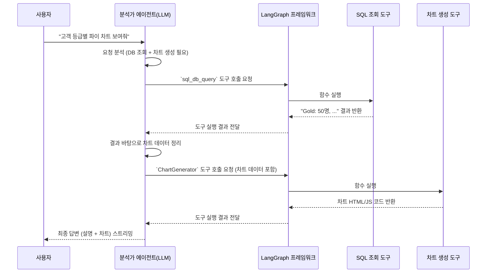

# Chapter 5: 전문가 AI 에이전트 도구 (Specialized Agent Tools)

[제4장: AI 에이전트 오케스트레이터 (LangGraph Swarm)](04_ai_에이전트_오케스트레이터__langgraph_swarm_.md)에서 우리는 마치 한 팀처럼 협력하는 'AI 전문가 드림팀'을 구성했습니다. 데이터 분석가, 코딩 전문가, 문서 검색가 등 각자의 역할이 정해져 있죠. 하지만 이 똑똑한 전문가들이 실제로 일을 하려면 무엇이 필요할까요? 바로 '연장'입니다. 훌륭한 목수가 망치와 톱 없이는 집을 지을 수 없듯, 우리의 AI 에이전트도 실제 작업을 수행할 '도구(Tool)'가 필요합니다.

이번 장에서는 각 전문가 AI 에이전트가 사용하는 '연장 가방'을 열어보고, 이 도구들이 어떻게 만들어지고 작동하는지 자세히 알아보겠습니다. 이 도구 덕분에 AI는 단순히 텍스트만 생성하는 것을 넘어, 데이터베이스에 접속하고, 깃허브 코드를 수정하며, 차트를 그리는 등 실제 세상과 상호작용할 수 있게 됩니다.

## AI에게 왜 '도구'가 필요한가요?

AI 언어 모델(LLM)은 기본적으로 텍스트를 이해하고 생성하는 '언어의 마법사'입니다. 하지만 그 능력은 텍스트의 세계에 갇혀 있습니다. 예를 들어, 우리가 AI에게 "지난 분기 매출 데이터를 데이터베이스에서 가져와서 막대 차트로 그려줘" 라고 요청했다고 상상해 봅시다. AI는 이 요청을 이해하고 어떤 SQL 쿼리를 실행해야 할지, 어떤 모양의 차트를 그려야 할지 '생각'할 수는 있지만, 직접 데이터베이스에 접속하거나 그림판을 열어 차트를 그릴 수는 없습니다.

바로 이때 '도구'가 등장합니다. 도구는 AI가 호출할 수 있는' 실제 파이썬 함수'입니다.
*   `sql_database_query` 도구: AI가 생각한 SQL 쿼리를 실제로 데이터베이스에 전송하고 결과를 받아옵니다.
*   `chart_generator` 도구: AI가 정리한 데이터를 바탕으로 실제 차트 이미지나 코드를 생성합니다.

AI는 자신의 임무를 수행하기 위해 어떤 도구가 필요한지 판단하고, 그 도구를 호출하여 실제 작업을 수행한 뒤, 그 결과를 바탕으로 최종 답변을 만듭니다. 즉, 도구는 AI의 '생각'을 '행동'으로 옮겨주는 다리 역할을 합니다.

## 핵심 개념: 도구를 만드는 두 가지 요소

LangChain 프레임워크를 사용하면 AI를 위한 도구를 아주 쉽게 만들 수 있습니다. 도구를 만들기 위해 꼭 알아야 할 두 가지 핵심 요소를 살펴봅시다.

### 1. 도구의 몸체: 실제 작업을 수행하는 함수

도구의 핵심은 특정 작업을 수행하는 파이썬 함수입니다. 이 함수는 데이터베이스를 조회하거나, 외부 API를 호출하거나, 파일을 읽는 등 우리가 AI에게 부여하고 싶은 모든 능력을 구현합니다.

예를 들어, 차트를 생성하는 도구의 핵심 함수는 다음과 같이 생겼을 수 있습니다.

```python
# fastapi_server/agent/analyst_tools.py (개념을 위한 단순화된 코드)

def generate_chart_html(title: str, chart_type: str, data: dict) -> str:
    """차트 생성을 위한 HTML과 자바스크립트 코드를 생성합니다."""
    # (내부적으로 Chart.js 라이브러리를 사용해 코드를 생성하는 로직)
    chart_id = f"chart-{uuid.uuid4().hex[:8]}"
    canvas_html = f"<div><canvas id='{chart_id}'></canvas></div>"
    script_js = f"""// ... Chart.js 초기화 코드 ..."""
    
    # 생성된 HTML과 JS 코드를 JSON 문자열 형태로 반환
    output = { "canvas_html": canvas_html, "script_js": script_js }
    return json.dumps(output)
```
이 함수는 `title`, `chart_type`, `data`를 입력받아 프론트엔드에서 바로 렌더링할 수 있는 HTML과 자바스크립트 코드를 만들어 반환합니다.

### 2. 도구의 설명서: 이름과 사용법

AI는 수많은 함수 중에서 어떤 상황에 어떤 함수를 써야 할지 어떻게 알 수 있을까요? 바로 '도구 설명서' 덕분입니다. 우리는 각 도구에 대해 AI가 이해할 수 있는 명확한 '이름'과 '설명'을 제공해야 합니다.

LangChain의 `StructuredTool`을 사용하면 이 설명서를 쉽게 만들 수 있습니다.

```python
# fastapi_server/agent/analyst_tools.py (개념을 위한 단순화된 코드)

from langchain_core.tools import StructuredTool

# 도구 생성
analyst_chart_tool = StructuredTool.from_function(
    func=generate_chart_html,  # 사용할 함수 (몸체)
    name="ChartGenerator",     # 도구의 이름 (설명서)
    description="차트를 위한 HTML과 자바스크립트를 생성합니다. 데이터를 시각화해야 할 때 사용하세요.", # 도구의 설명 (설명서)
)
```
*   **name**: AI가 이 도구를 호출할 때 사용할 고유한 이름입니다.
*   **description**: AI가 이 도구의 용도를 파악하는 가장 중요한 부분입니다. "이 도구는 언제, 어떤 목적으로 사용해야 하는가?"를 명확하고 상세하게 적어주는 것이 좋습니다.

AI는 이 설명서를 읽고, "아, 사용자가 '시각화'나 '차트'를 원하니까 `ChartGenerator` 도구를 사용해야겠구나!"라고 판단하게 됩니다.

## AI는 도구를 어떻게 사용할까? (핵심 동작 원리)

이제 데이터 분석 전문가 에이전트가 "고객 등급별 분포를 파이 차트로 보여줘"라는 요청을 받았을 때, 내부적으로 어떤 일이 일어나는지 단계별로 따라가 봅시다.

1.  **요청 분석**: 분석가 에이전트(LLM)는 사용자 요청을 분석합니다. "고객 등급별 분포"라는 부분에서 데이터베이스 조회가, "파이 차트"라는 부분에서 차트 생성이 필요하다고 판단합니다.
2.  **도구 선택 (1단계)**: 에이전트는 자신의 도구 목록 설명서를 훑어보고, 데이터베이스 조회에 가장 적합한 `sql_db_query` 도구를 선택하고 실행합니다.
3.  **결과 수신 (1단계)**: `sql_db_query` 도구로부터 "Gold: 50명, Silver: 120명, Bronze: 200명"과 같은 데이터를 반환받습니다.
4.  **도구 선택 (2단계)**: 에이전트는 이제 이 데이터를 시각화해야 합니다. 다시 도구 목록 설명서를 보고, "데이터를 시각화해야 할 때 사용하세요"라고 적힌 `ChartGenerator` 도구를 선택합니다.
5.  **도구 호출**: 에이전트는 `ChartGenerator` 도구를 호출하기 위해 필요한 인자(`title`, `chart_type`, `data`)를 채워서 실행 요청을 보냅니다.
6.  **함수 실행**: LangGraph 프레임워크는 이 요청을 받아 실제 파이썬 함수 `generate_chart_html`을 실행하고, 차트 HTML/JS 코드가 담긴 결과를 받아옵니다.
7.  **최종 답변 생성**: 에이전트는 `generate_chart_html` 함수가 반환한 차트 코드를 받고, 이를 포함하여 사용자에게 보여줄 최종 답변("고객 등급별 분포는 다음과 같습니다." + 차트 코드)을 생성합니다.

이 모든 과정을 그림으로 보면 다음과 같습니다.



## 코드 깊게 들여다보기: 전문가들의 연장 가방

우리 프로젝트의 전문가들은 어떤 도구들을 가지고 있을까요? `fastapi_server/agent/` 폴더에 있는 파일들을 살펴보며 그들의 '연장 가방'을 구경해 봅시다.

### 데이터 분석가의 도구 (`analyst_tools.py`)

데이터 분석가는 데이터를 다루는 데 특화된 두 가지 핵심 도구를 가집니다.

1.  **SQL 도구**: 사용자의 자연어 질문을 SQL 쿼리로 변환하고, 데이터베이스에 직접 실행하여 결과를 가져옵니다. 이 도구는 `langchain_community` 라이브러리의 `SQLDatabaseToolkit`을 사용하여 구현되었습니다.

    ```python
    # fastapi_server/agent/analyst_tools.py
    
    # ... (DB 접속 설정) ...
    db = SQLDatabase(engine)
    sql_toolkit = SQLDatabaseToolkit(db=db, llm=llm_for_sql_toolkit)
    
    # SQL 툴킷에서 여러 관련 도구(쿼리 실행, 쿼리 검사 등)를 가져옵니다.
    sql_tools_for_analyst = sql_toolkit.get_tools()
    ```
    이 코드 몇 줄만으로, AI는 "가장 최근에 가입한 고객 5명은 누구야?"와 같은 질문을 실제 SQL 쿼리로 바꿔 실행할 수 있는 강력한 능력을 얻게 됩니다.

2.  **차트 생성 도구**: 위에서 설명한 것처럼, SQL 조회 결과를 바탕으로 시각적인 차트를 생성하는 도구입니다.

    ```python
    # fastapi_server/agent/analyst_tools.py

    class ChartInputArgs(BaseModel):
        title: str = Field(..., description="차트의 제목입니다.")
        chart_type: str = Field(..., description="차트 종류 (예: 'bar', 'line', 'pie').")
        data: Dict[str, Any] = Field(..., description="Chart.js 구조를 따르는 차트 데이터입니다.")
    
    analyst_chart_tool = StructuredTool.from_function(
        func=generate_chart_html,
        name="ChartGenerator",
        description="차트에 필요한 HTML과 자바스크립트를 생성합니다...",
        args_schema=ChartInputArgs, # AI가 어떤 인자를 전달해야 하는지 알려주는 Pydantic 모델
    )
    ```
    `args_schema`에 `ChartInputArgs`를 지정함으로써, AI는 이 도구를 사용하기 위해 `title`, `chart_type`, `data`라는 세 가지 정보가 필요하다는 것을 명확히 알게 됩니다.

### 코딩 전문가의 도구 (`coding_agent_tools.py`)

코딩 전문가는 GitHub와 상호작용하고, 코드를 검색하며, 심지어 파이썬 코드를 직접 실행할 수도 있는 다양한 도구를 가지고 있습니다.

1.  **GitHub API 도구**: 이슈 생성, 파일 읽기/쓰기, 풀 리퀘스트(PR) 생성 등 GitHub에서 할 수 있는 거의 모든 작업을 수행하는 도구들입니다. 각 도구는 특정 GitHub API 엔드포인트를 호출하는 함수로 만들어져 있습니다.

    ```python
    # fastapi_server/agent/coding_agent_tools.py
    
    def _read_file(**kwargs) -> str:
        # ... PyGithub 라이브러리를 사용해 GitHub에서 파일 내용을 읽어오는 로직 ...
        repo = g.get_repo(repo_full_name)
        contents = repo.get_contents(file_path, ref=branch)
        return contents.decoded_content.decode("utf-8")
        
    StructuredTool(
        name="github_read_file",
        description="리포지토리 내 특정 파일의 내용을 읽어옵니다.",
        func=_read_file,
        args_schema=ReadFileSchema
    )
    ```
    `_read_file` 함수는 GitHub 리포지토리의 특정 파일 내용을 읽어와 텍스트로 반환합니다. 이 도구 덕분에 AI는 "A 프로젝트의 `main.py` 파일에 무슨 내용이 있는지 알려줘"라는 요청을 처리할 수 있습니다.

2.  **Pinecone 코드 문서 검색 도구**: 일반적인 코드 검색을 넘어, 미리 분석하고 '벡터화'해 둔 코드 문서 데이터베이스를 의미 기반으로 검색하는 특별한 도구입니다.

    ```python
    # fastapi_server/agent/coding_agent_tools.py
    
    def _search_tutorials_with_embedding_wrapper(**kwargs) -> List[Dict[str, Any]]:
        # ... 사용자의 쿼리를 벡터로 변환하고 Pinecone DB를 검색하는 로직 ...
        return _search_tutorials_with_embedding(**kwargs)

    StructuredTool(
        name="github_search_code_documents_with_embedding",
        description="Pinecone을 사용하여 문서화된 레포지터리 코드를 벡터 임베딩을 포함하여 검색합니다.",
        func=_search_tutorials_with_embedding_wrapper,
        # ...
    )
    ```
    이 도구를 사용하면 "로그인 기능과 관련된 코드를 찾아줘"와 같이 모호한 질문에도 AI가 의미적으로 가장 관련성 높은 코드 조각을 찾아낼 수 있습니다. 이 코드 문서가 어떻게 Pinecone에 저장되는지는 [제6장: 깃허브 코드 분석 및 문서화 파이프라인 (Code Analysis Pipeline)](06_깃허브_코드_분석_및_문서화_파이프라인__code_analysis_pipeline_.md)에서 자세히 다룹니다.

## 마무리하며

이번 장에서는 AI 에이전트의 '생각'을 '행동'으로 옮겨주는 강력한 '도구'의 세계를 탐험했습니다. 우리는 **파이썬 함수**와 **명확한 설명서(이름과 설명)**를 결합하여 AI가 실제 세계와 상호작용할 수 있는 도구를 만드는 법을 배웠습니다.

데이터 분석가는 SQL과 차트 도구로 무장했고, 코딩 전문가는 GitHub와 Pinecone을 자유자재로 다루는 도구를 갖게 되었습니다. 이제 우리 AI 전문가 팀은 명확한 역할, 협업 능력, 그리고 강력한 연장까지 모두 갖춘 완벽한 드림팀이 되었습니다.

우리는 지금까지 사용자가 대화하는 프론트엔드부터, 데이터를 저장하는 백엔드, 실시간 통신 게이트웨이, 그리고 여러 AI가 협업하는 두뇌와 그들이 사용하는 도구에 이르기까지, 챗봇의 거의 모든 부분을 완성했습니다.

하지만 한 가지 궁금증이 남습니다. 코딩 전문가가 사용하는 '코드 문서 검색 도구'는 대체 어디서 그 정보를 찾아오는 걸까요? 코드를 의미적으로 검색하려면 누군가 미리 코드를 읽고 분석해서 데이터베이스에 잘 정리해 두어야 합니다. 다음 마지막 장에서는 바로 이 모든 것의 시작점, 깃허브 리포지토리의 코드를 자동으로 분석하고 검색 가능한 지식 베이스로 만드는 [제6장: 깃허브 코드 분석 및 문서화 파이프라인 (Code Analysis Pipeline)](06_깃허브_코드_분석_및_문서화_파이프라인__code_analysis_pipeline_.md)에 대해 알아보겠습니다.

---

Generated by [AI Codebase Knowledge Builder](https://github.com/The-Pocket/Tutorial-Codebase-Knowledge)