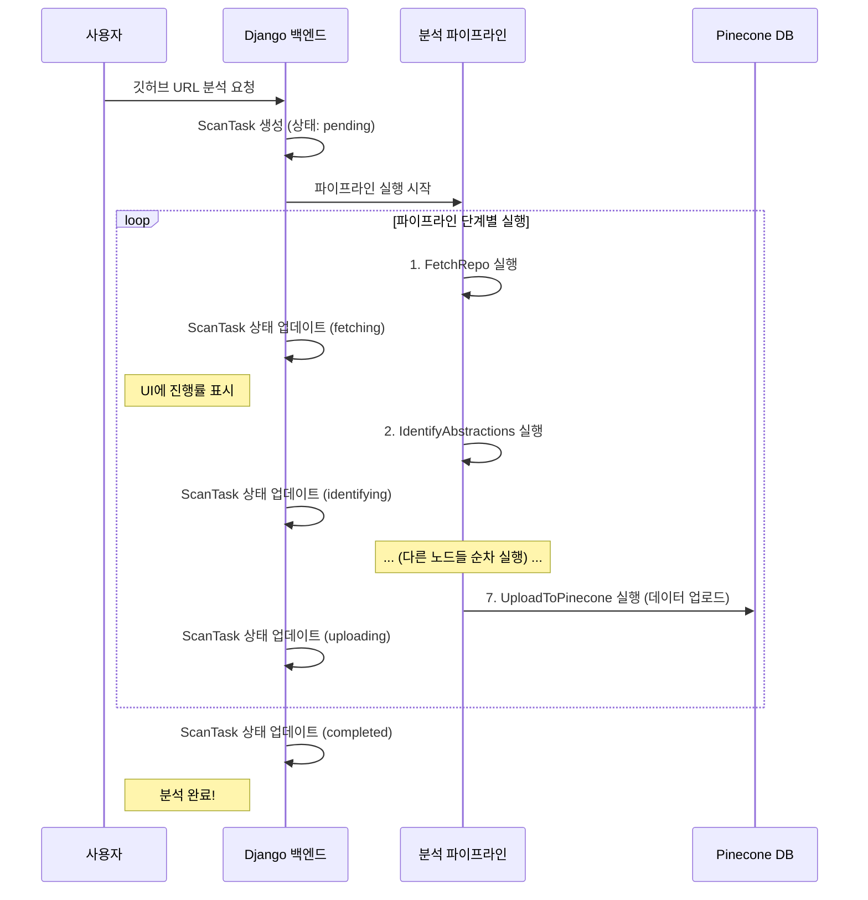

# Chapter 6: 깃허브 코드 분석 및 문서화 파이프라인 (Code Analysis Pipeline)

[제5장: 전문가 AI 에이전트 도구 (Specialized Agent Tools)](05_전문가_ai_에이전트_도구__specialized_agent_tools_.md)에서 우리는 AI 전문가들이 사용하는 강력한 '연장 가방'을 살펴보았습니다. 특히 코딩 전문가는 `github_search_code_documents_with_embedding`이라는 도구를 사용해, 마치 잘 정리된 도서관에서 책을 찾듯 깃허브 코드에 대한 정보를 의미 기반으로 검색할 수 있었습니다.

하지만 여기서 한 가지 근본적인 질문이 남습니다. 그 '잘 정리된 도서관'은 대체 누가, 어떻게 만든 걸까요? AI가 처음 보는 낯선 깃허브 프로젝트를 이해하고 질문에 답하려면, 누군가 먼저 그 방대한 코드를 읽고, 핵심 내용을 분석하고, 검색하기 쉬운 형태로 정리해 두어야 합니다. 이 모든 작업을 사람이 직접 한다면 엄청난 시간과 노력이 필요할 겁니다.

이번 마지막 장에서는 바로 이 문제, 즉 **주어진 깃허브 저장소의 코드를 자동으로 분석하여 튜토리얼과 검색 가능한 지식 베이스를 만들어내는 '자동 기술 문서 작성가'**에 대해 알아보겠습니다. 우리는 이 과정을 '코드 분석 및 문서화 파이프라인'이라 부르며, 이 파이프라인은 우리 프로젝트의 모든 기능이 시작되는 가장 근원적인 출발점입니다.

## 왜 '코드 분석 파이프라인'이 필요한가요?

새로운 프로젝트에 투입된 개발자를 상상해 보세요. 수십만 줄의 코드를 마주했을 때 가장 먼저 하는 일은 무엇일까요? 아마도 프로젝트의 전체 구조를 파악하고, 핵심적인 모듈이나 클래스가 무엇인지, 그리고 그것들이 서로 어떻게 상호작용하는지 이해하려고 노력할 것입니다. 이 과정은 매우 어렵고 시간이 많이 걸립니다.

우리의 AI 에이전트도 똑같은 문제를 겪습니다. AI에게 단순히 깃허브 URL을 던져주고 "이 프로젝트에 대해 설명해줘"라고 말하는 것만으로는 부족합니다. AI가 프로젝트에 대한 '전문가'가 되려면, 먼저 체계적으로 학습할 자료가 필요합니다.

'코드 분석 파이프라인'은 바로 이 '학습 자료'를 자동으로 만들어주는 시스템입니다. 마치 숙련된 시니어 개발자가 신입 개발자를 위해 프로젝트 온보딩 문서를 만들어주는 것과 같습니다. 이 파이프라인은 다음과 같은 일을 자동으로 처리합니다.

*   **코드 수집:** 깃허브 저장소의 모든 코드를 가져옵니다.
*   **핵심 개념 식별:** 코드 전체를 훑어보고 가장 중요한 개념(추상화)들을 찾아냅니다.
*   **관계 분석:** 찾아낸 개념들이 서로 어떻게 연결되고 상호작용하는지 분석합니다.
*   **튜토리얼 생성:** 분석된 내용을 바탕으로 초보자도 이해하기 쉬운 단계별 튜토리얼 문서를 작성합니다.
*   **지식 베이스 구축:** 생성된 튜토리얼을 AI가 검색하고 이해할 수 있는 형태로 '벡터 데이터베이스'에 저장합니다.

이 파이프라인 덕분에, 우리의 AI는 어떤 낯선 프로젝트라도 빠르게 학습하고 전문가 수준의 답변을 제공할 수 있게 됩니다.

## 핵심 개념: 공장 조립 라인처럼 작동하는 파이프라인

이 복잡한 문서화 과정은 어떻게 자동화될 수 있을까요? 우리는 '파이프라인(Pipeline)'이라는 개념을 사용합니다. 이는 마치 자동차를 만드는 공장의 '조립 라인'과 같습니다. 각 공정(Station)마다 정해진 역할이 있고, 한 공정이 끝나면 결과물이 다음 공정으로 전달되어 점차 완성품이 되어가는 방식입니다.

우리 파이프라인에서는 각 공정을 **노드(Node)**라고 부릅니다. 각 노드는 `pocketflow`라는 라이브러리를 사용해 만들어졌으며, 하나의 독립적인 작업을 수행합니다.

### 파이프라인의 7단계 공정 (노드)

우리 파이프라인은 총 7개의 노드로 구성되어 있으며, 데이터는 이 단계를 순서대로 거쳐갑니다.

1.  **`FetchRepo` (원자재 수급):** 지정된 깃허브 저장소를 복제하여 모든 소스 코드 파일을 가져옵니다. 조립 라인의 첫 단계에서 원자재를 공급받는 것과 같습니다.
2.  **`IdentifyAbstractions` (부품 식별):** 가져온 모든 코드들을 분석하여 프로젝트의 핵심 개념(클래스, 모듈, 기능 등)을 식별하고 목록을 만듭니다. 수많은 원자재 중에서 자동차의 엔진, 바퀴, 섀시 등 핵심 부품을 골라내는 과정입니다.
3.  **`AnalyzeRelationships` (설계도 분석):** 식별된 핵심 개념들 사이의 관계(예: "A가 B를 사용한다", "C는 D를 포함한다")를 분석합니다. 각 부품이 서로 어떻게 조립되어야 하는지 설계도를 그리는 단계입니다.
4.  **`OrderChapters` (조립 순서 결정):** 분석된 관계를 바탕으로, 어떤 개념부터 설명해야 초보자가 가장 이해하기 쉬울지 튜토리얼의 순서(목차)를 결정합니다. 엔진을 먼저 만들고 섀시에 얹은 뒤 바퀴를 다는 것처럼, 가장 효율적인 조립 순서를 정합니다.
5.  **`WriteChapters` (매뉴얼 작성):** 결정된 순서에 따라 각 핵심 개념에 대한 튜토리얼 챕터를 하나씩 작성합니다. 각 부품별 조립 매뉴얼을 상세히 쓰는 것과 같습니다.
6.  **`CombineTutorial` (완성본 제본):** 작성된 모든 챕터와 전체 구조도를 합쳐 하나의 완성된 튜토리얼(index.md와 여러 챕터 파일)로 묶습니다. 모든 부품별 매뉴얼을 모아 한 권의 완성된 자동차 조립 설명서를 만드는 과정입니다.
7.  **`UploadToPinecone` (디지털 라이브러리 등록):** 완성된 튜토리얼 내용을 AI가 검색할 수 있도록 벡터 형태로 변환하여 Pinecone 데이터베이스에 업로드합니다. 완성된 설명서를 누구나 쉽게 찾아볼 수 있는 디지털 라이브러리에 등록하는 마지막 단계입니다.

## 파이프라인은 어떻게 작동할까? (전체 동작 원리)

이제 사용자가 웹사이트에서 "이 깃허브 저장소 분석해줘!"라고 버튼을 클릭했을 때부터 이 모든 과정이 어떻게 흘러가는지 따라가 보겠습니다.

1.  **사용자 요청 (프론트엔드):** 사용자가 깃허브 URL을 입력하고 '분석 시작' 버튼을 누릅니다.
2.  **작업 지시 (Django 백엔드):** 요청은 Django 백엔드의 `scan_selected_repositories_view`로 전달됩니다. 이 뷰는 `ScanTask`라는 모델 객체를 데이터베이스에 생성하여 "새로운 분석 작업이 시작되었음"을 기록합니다. 이 `ScanTask`는 작업의 진행 상태를 추적하는 데 사용됩니다.
3.  **파이프라인 실행:** 뷰는 백그라운드 스레드에서 `create_tutorial_flow` 함수로 만들어진 파이프라인을 실행시킵니다.
4.  **노드 순차 실행:**
    *   `FetchRepo` 노드가 실행되어 코드를 가져옵니다. 작업이 성공하면 `ScanTask`의 상태를 'fetching'으로 업데이트합니다.
    *   결과물이 `IdentifyAbstractions` 노드로 전달됩니다. 이 노드는 LLM을 호출하여 핵심 개념을 식별합니다. 작업이 끝나면 `ScanTask` 상태를 'identifying'으로 업데이트합니다.
    *   이 과정이 `UploadToPinecone`까지 순서대로 반복됩니다. 각 노드가 끝날 때마다 `ScanTask`의 상태와 진행률(progress)이 계속 업데이트됩니다.
5.  **진행 상황 확인 (프론트엔드):** 프론트엔드는 주기적으로 `task_progress_view`에 `ScanTask`의 현재 상태를 물어봅니다. 이를 통해 사용자에게 "코드 분석 중 (35%)", "튜토리얼 작성 중 (70%)"과 같은 실시간 진행状況을 보여줄 수 있습니다.
6.  **작업 완료 및 결과 저장:** `UploadToPinecone` 노드까지 모두 성공적으로 실행되면, `ScanTask`의 상태는 'completed'로 변경됩니다. 이제 이 프로젝트에 대한 지식은 Pinecone 데이터베이스에 안전하게 저장되었습니다.
7.  **AI 에이전트 활용:** 이제부터 사용자가 이 프로젝트에 대해 질문하면, [제5장](05_전문가_ai_에이전트_도구__specialized_agent_tools_.md)에서 배운 코딩 전문가 에이전트가 Pinecone에 저장된 이 지식 베이스를 검색하여 정확하고 상세한 답변을 제공할 수 있게 됩니다.

이 전체 흐름을 다이어그램으로 보면 더욱 명확하게 이해할 수 있습니다.



## 코드 깊게 들여다보기

이제 실제 코드를 통해 이 자동화된 파이프라인이 어떻게 설계되고 실행되는지 살펴보겠습니다.

### 1. 거대한 작업의 시작점: `views.py`

모든 것은 `backend/accounts/views.py`의 `scan_selected_repositories_view` 함수에서 시작됩니다. 이 함수는 프론트엔드로부터 분석 요청을 받는 창구입니다.

```python
# backend/accounts/views.py

@login_required
@require_POST
def scan_selected_repositories_view(request):
    # ... (요청 데이터 파싱) ...
    
    for repo_url in repo_urls:
        # 1. 각 저장소 분석 요청마다 ScanTask를 생성하여 진행 상황을 추적합니다.
        task = ScanTask.objects.create(
            user=user,
            repo_url=repo_url,
            project_name=f"{owner}_{repo_name}",
            status='pending'  # 초기 상태는 '대기 중'
        )
        
        # 2. 실제 무거운 작업은 별도의 스레드에서 실행하여 웹 요청을 막지 않습니다.
        def run_tutorial():
            try:
                # 3. 파이프라인의 메인 함수를 호출합니다. task.id를 전달하여 진행 상황을 업데이트합니다.
                tutorial_main(
                    repo_url=repo_url,
                    # ... (여러 옵션들) ...
                    task_id=str(task.id) 
                )
            except Exception as e:
                task.mark_failed(str(e)) # 실패 시 상태 업데이트

        thread = threading.Thread(target=run_tutorial)
        thread.daemon = True
        thread.start() # 스레드 시작!
        
        # ... (결과 응답) ...
```
이 코드는 분석 요청을 받으면, 먼저 `ScanTask`를 만들어 데이터베이스에 "새 작업 시작!"이라고 기록합니다. 그 후, 실제 파이프라인을 실행하는 `tutorial_main` 함수를 별도의 스레드에서 실행시킵니다. 이렇게 하면 무거운 분석 작업이 진행되는 동안에도 웹사이트는 멈추지 않고 다른 요청을 처리할 수 있습니다.

### 2. 조립 라인의 설계도: `flow.py`

파이프라인의 전체 구조, 즉 노드들의 연결 순서는 `backend/accounts/utils/flow.py`의 `create_tutorial_flow` 함수에 정의되어 있습니다.

```python
# backend/accounts/utils/flow.py

from pocketflow import Flow
from .nodes import ( # 모든 노드 클래스를 가져옵니다.
    FetchRepo, IdentifyAbstractions, AnalyzeRelationships, 
    OrderChapters, WriteChapters, CombineTutorial, UploadToPinecone
)

def create_tutorial_flow():
    """튜토리얼 생성 파이프라인을 생성하고 반환합니다."""

    # 각 단계에 해당하는 노드 인스턴스를 생성합니다.
    fetch_repo = FetchRepo()
    identify_abstractions = IdentifyAbstractions()
    analyze_relationships = AnalyzeRelationships()
    order_chapters = OrderChapters()
    write_chapters = WriteChapters()
    combine_tutorial = CombineTutorial()
    upload_to_pinecone = UploadToPinecone()

    # '>>' 연산자를 사용해 노드를 순서대로 연결합니다.
    fetch_repo >> identify_abstractions
    identify_abstractions >> analyze_relationships
    analyze_relationships >> order_chapters
    order_chapters >> write_chapters
    write_chapters >> combine_tutorial
    combine_tutorial >> upload_to_pinecone

    # 첫 번째 노드를 시작점으로 하는 파이프라인(Flow)을 생성합니다.
    tutorial_flow = Flow(start=fetch_repo)

    return tutorial_flow
```
이 코드는 정말 직관적입니다. 각 노드의 인스턴스를 만든 후, `>>` 연산자를 사용하여 마치 화살표로 연결하듯 파이프라인의 흐름을 정의합니다. `A >> B`는 "A 노드의 작업이 끝나면 그 결과물을 B 노드로 전달하라"는 의미입니다.

### 3. 하나의 작업 공정 들여다보기: `nodes.py`

각 노드는 어떻게 작동할까요? `backend/accounts/utils/nodes.py`에 정의된 `IdentifyAbstractions` 노드를 예로 살펴보겠습니다. 모든 노드는 크게 `prep`(준비), `exec`(실행), `post`(후처리)의 세 단계로 나뉩니다.

```python
# backend/accounts/utils/nodes.py

class IdentifyAbstractions(Node):
    # 1. prep: 실행에 필요한 데이터를 준비하는 단계
    def prep(self, shared):
        files_data = shared["files"] # 이전 노드(FetchRepo)에서 전달받은 파일 목록
        # ... (LLM에 보낼 프롬프트와 컨텍스트를 만들기 위한 데이터 준비) ...
        return context, file_listing, project_name, language, ...
    
    # 2. exec: 실제 핵심 작업을 수행하는 단계
    def exec(self, prep_res):
        (context, file_listing, project_name, language, ...) = prep_res
        
        # LLM에게 보낼 프롬프트
        prompt = f"""
Analyze the following codebase for the project '{project_name}'.
Available files:
{file_listing}

Full context of all files:
{context}

Based on the provided codebase, identify the key abstractions...
Return at most 10 key abstractions.
Your response should be only the YAML list...
"""
        # LLM을 호출하여 응답을 받습니다.
        llm_response = call_llm(prompt)
        
        # LLM의 응답(YAML 형식)을 파싱하여 파이썬 객체로 변환합니다.
        abstractions = yaml.safe_load(cleaned_response)
        return abstractions

    # 3. post: 실행 결과를 공유 데이터에 저장하고 마무리하는 단계
    def post(self, shared, prep_res, exec_res):
        shared["abstractions"] = exec_res # 식별된 개념 목록을 공유 데이터에 저장
        # task_id를 사용해 데이터베이스의 작업 진행 상황을 업데이트합니다.
        update_task_progress(shared.get("task_id"), "identifying", 2)
```
`prep` 단계에서는 이전 노드로부터 받은 데이터(`shared`)를 가공하여 `exec` 단계에서 사용할 입력을 준비합니다. `exec` 단계에서는 이 입력을 바탕으로 LLM에게 보낼 프롬프트를 만들고, LLM을 호출하여 핵심적인 작업을 수행한 뒤 결과를 반환합니다. 마지막으로 `post` 단계에서는 `exec`의 결과물을 다시 `shared` 사전에 저장하여 다음 노드가 사용할 수 있도록 하고, `update_task_progress` 함수를 호출해 UI에 보여줄 진행 상황을 업데이트합니다.

이러한 '준비-실행-후처리' 패턴은 모든 노드에 공통적으로 적용되어, 복잡한 전체 과정을 체계적이고 관리하기 쉬운 작은 단위로 나눌 수 있게 해줍니다.

## 마무리하며: 완전한 자동화 사이클의 완성

이번 장에서는 우리 프로젝트의 숨겨진 엔진, '깃허브 코드 분석 및 문서화 파이프라인'을 탐험했습니다. 우리는 이 파이프라인이 어떻게 낯선 깃허브 저장소를 체계적인 여러 **노드(Node)**를 통해 분석하고, 초보자를 위한 튜토리얼을 생성하며,最终 AI가 검색할 수 있는 지식 베이스를 **Pinecone**에 구축하는지 배웠습니다.

이것으로 우리 프로젝트의 대장정이 마무리됩니다. 되돌아보면, 우리는 다음과 같은 거대한 시스템을 함께 만들어냈습니다.

1.  사용자가 AI와 실시간으로 대화하는 **대화형 프론트엔드** ([제1장](01_대화형_프론트엔드__react_next_js_ui_.md))
2.  모든 대화와 사용자 정보를 안전하게 저장하는 **Django 백엔드** ([제2장](02_데이터_모델_및_백엔드__django_backend_.md))
3.  AI의 답변을 실시간으로 전달하는 **FastAPI 통신 게이트웨이** ([제3장](03_실시간_ai_통신_게이트웨이__fastapi_server_.md))
4.  여러 전문가 AI를 지휘하여 협력시키는 **AI 오케스트레이터** ([제4장](04_ai_에이전트_오케스트레이터__langgraph_swarm_.md))
5.  전문가 AI가 실제 작업을 수행하는 **강력한 도구들** ([제5장](05_전문가_ai_에이전트_도구__specialized_agent_tools_.md))
6.  그리고 이 모든 것의 기반이 되는 지식을 자동으로 생성하는 **코드 분석 파이프라인** ([제6장](06_깃허브_코드_분석_및_문서화_파이프라인__code_analysis_pipeline_.md))

이 모든 조각들이 유기적으로 연결되어, 사용자가 깃허브 URL을 입력하는 간단한 행동만으로 해당 프로젝트에 대한 전문가 AI와 즉시 대화를 시작할 수 있는 강력하고 완전한 자동화 사이클을 완성했습니다. 이 튜토리얼이 여러분이 복잡한 AI 시스템을 이해하고 자신만의 프로젝트를 만드는 데 큰 도움이 되었기를 바랍니다. 수고하셨습니다

---

Generated by [AI Codebase Knowledge Builder](https://github.com/The-Pocket/Tutorial-Codebase-Knowledge)