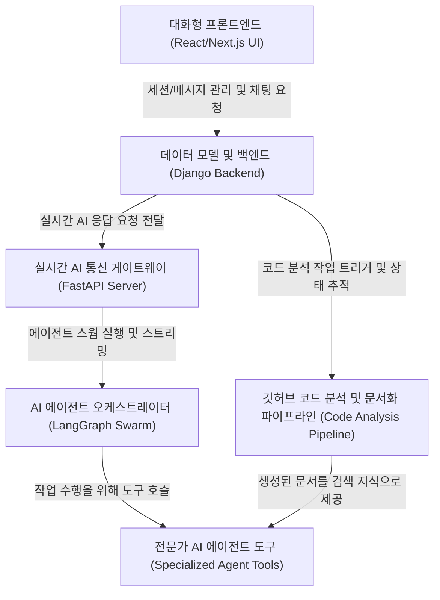

# Tutorial: SKN10-FINAL-1Team

이 프로젝트는 사용자가 **대화형 프론트엔드(React)**를 통해 상호작용하는 지능형 AI 비서 시스템입니다. 핵심은 여러 **전문가 AI 에이전트(Specialized AI Agents)**들이 협력하는 *LangGraph 스웜* 구조로, **AI 오케스트레이터**가 사용자 요청을 분석하여 문서 검색, 데이터 분석, 코딩 등 가장 적합한 에이전트에게 작업을 분배합니다.

안정적인 **Django 백엔드**는 사용자, 데이터, 채팅 세션을 관리하며, **실시간 게이트웨이(FastAPI)**를 통해 프론트엔드와 AI 에이전트 간의 통신을 중계합니다. 특히, 지정된 **깃허브 저장소를 자동으로 분석하고 튜토리얼 문서를 생성**하는 파이프라인을 갖추고 있으며, 생성된 문서는 AI 코딩 에이전트가 사용자의 코드에 대한 질문에 답변하는 데 활용됩니다.

**Source Repository:** [https://github.com/SKNETWORKS-FAMILY-AICAMP/SKN10-FINAL-1Team](https://github.com/SKNETWORKS-FAMILY-AICAMP/SKN10-FINAL-1Team)

## Chapters

1. [대화형 프론트엔드 (React/Next.js UI)](01_대화형_프론트엔드__react_next_js_ui_.md)
2. [데이터 모델 및 백엔드 (Django Backend)](02_데이터_모델_및_백엔드__django_backend_.md)
3. [실시간 AI 통신 게이트웨이 (FastAPI Server)](03_실시간_ai_통신_게이트웨이__fastapi_server_.md)
4. [AI 에이전트 오케스트레이터 (LangGraph Swarm)](04_ai_에이전트_오케스트레이터__langgraph_swarm_.md)
5. [전문가 AI 에이전트 도구 (Specialized Agent Tools)](05_전문가_ai_에이전트_도구__specialized_agent_tools_.md)
6. [깃허브 코드 분석 및 문서화 파이프라인 (Code Analysis Pipeline)](06_깃허브_코드_분석_및_문서화_파이프라인__code_analysis_pipeline_.md)

---

Generated by [AI Codebase Knowledge Builder](https://github.com/The-Pocket/Tutorial-Codebase-Knowledge)