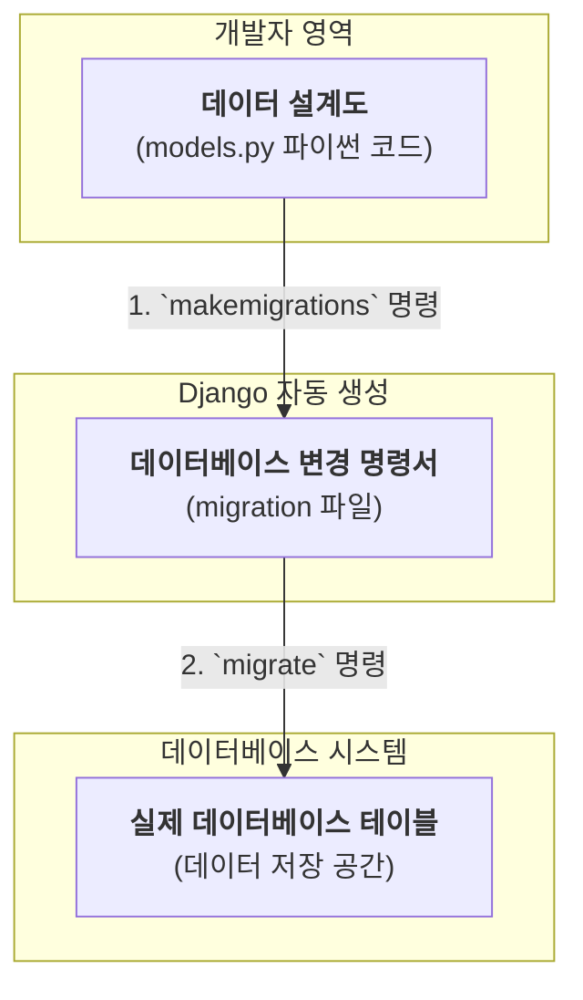
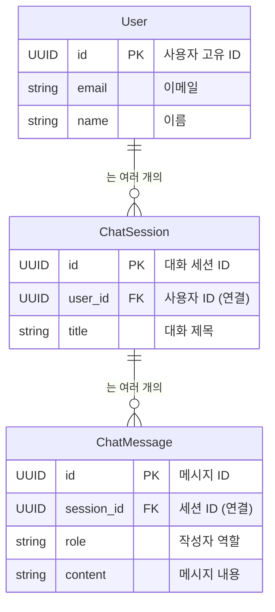

# Chapter 1: 애플리케이션 데이터 설계도 (Django 모델)


안녕하세요! `SKN10-FINAL-1Team` 프로젝트의 세계에 오신 것을 환영합니다. 이 튜토리얼 시리즈를 통해 우리는 AI 기반 데이터 분석 및 채팅 애플리케이션의 핵심 구성 요소를 하나씩 탐험해 볼 것입니다.

그 첫 번째 여정으로, 오늘은 우리 애플리케이션의 가장 근본적인 뼈대, 바로 **데이터 설계도**에 대해 알아보겠습니다.

## 모든 것은 설계도에서 시작됩니다

집을 짓는다고 상상해 보세요. 가장 먼저 무엇을 해야 할까요? 바로 '설계도'를 그리는 일입니다. 설계도에는 방의 개수, 각 방의 크기, 창문의 위치, 전기 배선 등 집에 대한 모든 정보가 담겨있습니다. 이 설계도가 있어야만 건축가와 인부들이 각자 맡은 역할을 정확히 수행하여 튼튼하고 멋진 집을 지을 수 있습니다.

우리 애플리케이션도 마찬가지입니다. 사용자는 누구인지, 어떤 대화를 나누었는지, AI가 분석한 결과는 무엇인지 등 수많은 정보를 저장하고 관리해야 합니다. **Django 모델**은 바로 이 모든 정보들을 어떻게 저장할지 정의하는 '데이터 설계도'입니다.

이 설계도를 이해하면, 우리 애플리케이션의 정보가 어디에, 어떻게 저장되는지 한눈에 파악할 수 있어 전체 시스템의 데이터 흐름을 이해하는 데 큰 도움이 됩니다. 이 설계도들은 프로젝트 `backend` 폴더 아래 각 앱의 `models.py` 파일에 정의되어 있습니다.

## 핵심 청사진 살펴보기: 사용자 정보와 대화 내용

가장 기본적인 시나리오를 생각해 봅시다. "사용자가 로그인해서 AI와 대화를 나눈다." 이 간단한 시나리오를 위해 애플리케이션은 최소한 두 가지를 기억해야 합니다.

1.  **누가** 대화하고 있는가? (사용자 정보)
2.  **어떤** 대화를 나누었는가? (대화 내용)

이 두 가지 정보를 저장하기 위한 설계도를 살펴보겠습니다.

### 1. 사용자 계정 설계도: `accounts/models.py`

먼저 사용자를 관리하는 설계도입니다. 이 파일은 사용자의 조직, 이메일, 이름, 역할 등 사용자 계정에 관한 모든 것을 정의합니다.

가장 중요한 `User` 모델의 일부를 살펴봅시다.

```python
# backend/accounts/models.py

class User(AbstractBaseUser, PermissionsMixin):
    # 각 사용자를 구분하는 고유 ID
    id = models.UUIDField(primary_key=True, default=uuid.uuid4, editable=False)
    
    # 사용자가 속한 조직 (다른 설계도와 연결)
    org = models.ForeignKey(Organization, on_delete=models.CASCADE, related_name="users")
    
    # 로그인 시 사용할 이메일 주소 (중복 불가)
    email = models.EmailField(unique=True)
    
    # 사용자의 이름
    name = models.CharField(max_length=100, blank=True)
    
    # 사용자의 역할 (관리자, 엔지니어 등)
    role = models.CharField(max_length=20, choices=UserRole.choices, default=UserRole.GUEST)
```

위 코드는 파이썬 클래스처럼 보이지만, Django는 이 코드를 보고 데이터베이스에 `users` 라는 표(테이블)를 만듭니다. 그리고 그 표에는 `id`, `org`, `email`, `name`, `role` 같은 칸(컬럼)이 생기죠. 새로운 사용자가 가입할 때마다 이 설계도에 따라 정보가 차곡차곡 저장됩니다.

### 2. 대화 내용 설계도: `conversations/models.py`

이제 사용자가 나눈 대화를 저장할 설계도를 보겠습니다. 여기에는 어떤 사용자가 언제, 어떤 내용의 대화를 시작했는지, 그리고 구체적인 메시지 하나하나가 기록됩니다.

```python
# backend/conversations/models.py

# 하나의 전체 대화 묶음을 정의
class ChatSession(models.Model):
    id = models.UUIDField(primary_key=True, default=uuid.uuid4, editable=False)
    
    # 이 대화를 진행한 사용자 (User 설계도와 연결)
    user = models.ForeignKey(User, on_delete=models.CASCADE, related_name="chat_sessions")
    
    # 대화의 제목
    title = models.CharField(max_length=60, default="새 세션")

# 대화 속 개별 메시지 하나를 정의
class ChatMessage(models.Model):
    id = models.UUIDField(primary_key=True, default=uuid.uuid4, editable=False)
    
    # 이 메시지가 속한 대화 묶음 (ChatSession 설계도와 연결)
    session = models.ForeignKey(ChatSession, on_delete=models.CASCADE, related_name="messages")
    
    # 메시지를 보낸 주체 (예: 'user' 또는 'assistant')
    role = models.CharField(max_length=20)
    
    # 실제 메시지 내용
    content = models.TextField()
```

여기서 중요한 점은 `ChatSession`이 `User`에 연결되고, `ChatMessage`는 다시 `ChatSession`에 연결된다는 것입니다. 이렇게 설계도를 서로 연결하면 "A라는 사용자가 B라는 대화에서 '안녕하세요'라고 말했다"는 관계를 명확하게 저장할 수 있습니다.

## 설계도는 어떻게 실제 데이터베이스가 될까?

우리가 `models.py`에 파이썬 코드로 설계도를 그리면, Django가 마법 같은 일을 해줍니다.

1.  `python manage.py makemigrations`: Django가 `models.py` 파일의 변경사항을 감지하고, 실제 데이터베이스 구조를 변경할 수 있는 '명령서'(migration 파일)를 생성합니다.
2.  `python manage.py migrate`: Django가 이 '명령서'를 들고 데이터베이스에 찾아가서, 설계도에 맞게 테이블을 만들거나 수정합니다.

이 과정을 시각적으로 표현하면 다음과 같습니다.



## 설계도 간의 연결: 관계의 힘

우리 애플리케이션의 데이터는 서로 긴밀하게 연결되어 있습니다. `ForeignKey`는 이 연결을 만드는 핵심 도구입니다. 앞서 본 `User`, `ChatSession`, `ChatMessage`의 관계를 다이어그램으로 그려보면 그 구조를 더 쉽게 이해할 수 있습니다.



*   `User`는 여러 개의 `ChatSession`을 가질 수 있습니다. (한 명의 사용자가 여러 번 대화 가능)
*   `ChatSession`는 여러 개의 `ChatMessage`를 가집니다. (하나의 대화에는 여러 메시지가 오고 감)

이런 연결 구조 덕분에, 우리는 특정 메시지(`ChatMessage`)로부터 시작해서 어떤 대화(`ChatSession`)에 속하는지, 그리고 그 대화를 나눈 사용자가 누구(`User`)인지까지 역으로 추적할 수 있습니다.

## 더 넓은 세계: AI 지식과 분석 결과의 설계도

우리 프로젝트는 단순한 챗봇이 아닙니다. AI가 문서를 학습하고 데이터를 분석하기도 하죠. 이러한 기능들을 위한 설계도도 물론 존재합니다.

*   **`knowledge/models.py`**: AI가 학습할 문서(`Document`)나 코드(`CodeFile`) 정보를 저장하는 설계도입니다. 이 정보는 나중에 [문서 검색 전문 에이전트 (RAG Agent)](06_문서_검색_전문_에이전트__rag_agent__.md)가 사용하게 됩니다.
*   **`mlops/models.py`**: 데이터 분석 후 생성된 이미지나 예측 결과(`AnalyticsResult`)를 저장하는 설계도입니다. 이 결과물은 [데이터 분석 전문 에이전트 (Analytics Agent)](05_데이터_분석_전문_에이전트__analytics_agent__.md)가 만들어냅니다.

이처럼 각 기능별로 잘 정리된 설계도 덕분에 우리 애플리케이션은 복잡한 정보들을 체계적으로 관리할 수 있습니다.

## 마무리하며

이번 장에서는 우리 애플리케이션의 뼈대를 이루는 **Django 모델**, 즉 '데이터 설계도'에 대해 알아보았습니다. 모델이 무엇인지, 어떻게 작성하는지, 그리고 모델들이 서로 어떻게 관계를 맺어 전체 데이터 구조를 형성하는지 살펴보았습니다.

이제 데이터가 어떻게 저장되는지에 대한 큰 그림을 이해했으니, 다음 장에서는 사용자가 실제로 이 데이터와 상호작용하는 화면을 만들어 볼 차례입니다.

다음 장에서 만나요!

---

**다음 장: [프론트엔드 채팅 UI](02_프론트엔드_채팅_ui_.md)**

---

Generated by [AI Codebase Knowledge Builder](https://github.com/The-Pocket/Tutorial-Codebase-Knowledge)