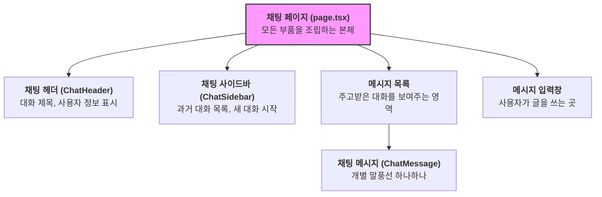
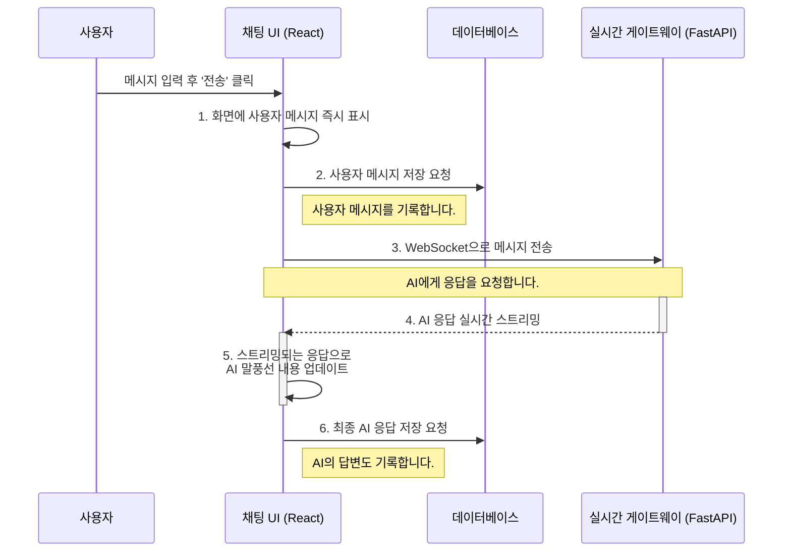

# Chapter 2: 프론트엔드 채팅 UI

지난 [1장: 애플리케이션 데이터 설계도 (Django 모델)](01_애플리케이션_데이터_설계도__django_모델__.md)에서는 우리 애플리케이션의 정보를 저장하는 뼈대, 즉 데이터 설계도에 대해 알아보았습니다. 이제 데이터가 어떻게 저장되는지 알았으니, 사용자가 이 데이터와 직접 소통하고 눈으로 볼 수 있는 '얼굴'을 만들 차례입니다.

이번 장에서는 사용자가 AI 에이전트와 대화하는 '프론트엔드 채팅 UI'를 탐험해 보겠습니다.

## AI와 대화하는 창, 채팅 UI

스마트폰에서 친구와 메시지를 주고받는 메신저 앱을 떠올려 보세요. 메시지를 입력하는 창, 대화 내용이 보이는 말풍선, 그리고 친구 목록이 있죠. 이 모든 것이 사용자 인터페이스(UI)입니다.

우리 프로젝트의 **프론트엔드 채팅 UI**도 같은 역할을 합니다. 사용자가 AI와 대화할 수 있도록 만들어진 시각적인 창구입니다.

*   **문제:** 데이터베이스에 저장된 대화 내용을 어떻게 사용자에게 보여주고, 새로운 메시지를 어떻게 입력받을까?
*   **해결책:** 웹 브라우저에서 실행되는 채팅 UI를 만든다. 이 UI는 사용자의 메시지를 입력받아 서버로 전송하고, 서버로부터 받은 AI의 응답을 화면에 예쁘게 그려주는 역할을 한다.

이 UI 덕분에 사용자는 복잡한 내부 구조를 몰라도 마치 사람과 대화하듯 편안하게 AI를 사용할 수 있습니다.

## 채팅 UI의 주요 구성 요소

우리 채팅 화면은 여러 개의 조립식 부품(컴포넌트)으로 만들어져 있습니다. 각 부품은 저마다의 역할을 담당하며, 이들이 모여 하나의 완성된 채팅 페이지를 이룹니다. 가장 핵심적인 파일은 `frontend/app/chat/page.tsx`이며, 이곳에서 모든 부품을 조립합니다.



1.  **채팅 사이드바 (`ChatSidebar`):** 화면 왼쪽에 위치하며, 과거 대화 목록을 보여주고 새로운 대화를 시작할 수 있게 해줍니다.
2.  **채팅 헤더 (`ChatHeader`):** 화면 상단에서 현재 대화의 제목을 보여주고, 제목을 수정하거나 대화를 삭제하는 버튼을 제공합니다.
3.  **메시지 목록:** 사용자와 AI가 주고받은 모든 메시지(말풍선)가 순서대로 표시되는 가장 중요한 영역입니다.
4.  **채팅 메시지 (`ChatMessage`):** 메시지 목록을 구성하는 개별 말풍선 하나하나를 의미합니다. 사용자의 메시지인지, AI의 메시지인지에 따라 다른 모양으로 표시됩니다.
5.  **메시지 입력창:** 사용자가 AI에게 보낼 메시지를 입력하고 '전송' 버튼을 누르는 곳입니다.

이 부품들이 어떻게 유기적으로 동작하며 대화를 만들어내는지 살펴보겠습니다.

## 사용자가 메시지를 보낼 때 생기는 일

사용자가 "오늘 날씨 어때?"라고 입력하고 전송 버튼을 누르는 간단한 시나리오를 통해 채팅 UI의 작동 방식을 따라가 보겠습니다.

### 1. 사용자의 입력을 기억하기

먼저, UI는 사용자가 입력한 내용, 화면에 표시될 대화 목록 등 여러 상태를 기억해야 합니다. React에서는 `useState`라는 기능을 사용해 이런 정보들을 변수에 저장하고 관리합니다.

```javascript
// frontend/app/chat/page.tsx

// 대화에 필요한 정보들을 기억하는 변수(상태)들
const [input, setInput] = useState(""); // 사용자가 입력창에 쓴 글
const [messages, setMessages] = useState<ChatMessage[]>([]); // 화면에 표시될 메시지 목록
const [isLoading, setIsLoading] = useState(false); // AI가 응답을 생성 중인지 여부
```

사용자가 입력창에 글자를 쓸 때마다 `input` 변수의 내용이 실시간으로 업데이트됩니다.

### 2. "전송" 버튼 누르기: `handleSendMessage` 함수 실행

사용자가 전송 버튼을 누르면, `handleSendMessage`라는 함수가 실행됩니다. 이 함수는 메시지 전송의 모든 과정을 처리하는 핵심 로직입니다.

```javascript
// frontend/app/chat/page.tsx

// 메시지 전송을 처리하는 함수
const handleSendMessage = async (e: FormEvent) => {
  e.preventDefault(); // 기본 폼 제출 동작 방지

  const userInput = input.trim(); // 사용자가 입력한 메시지
  if (!userInput) return; // 내용이 없으면 아무것도 안 함

  // 1. 사용자 메시지를 화면에 즉시 추가
  const userMessage: ChatMessage = {
    role: "user",
    content: userInput,
    // ... 기타 정보
  };
  setMessages((prev) => [...prev, userMessage]);
  
  // 2. 입력창 비우기
  setInput("");
  setIsLoading(true);

  // 3. 서버와 통신 시작 (다음 장에서 자세히 다룹니다)
  // ... WebSocket 연결 및 메시지 전송 로직 ...
};
```

가장 중요한 첫 단계는 **사용자 경험**을 위해 사용자의 메시지를 서버의 응답을 기다리지 않고 즉시 화면에 추가하는 것입니다. 그래야 사용자는 자신의 메시지가 성공적으로 보내졌다고 느낄 수 있습니다.

### 3. 화면에 메시지 그리기

`messages` 배열에 새로운 메시지가 추가되면, React는 이 변화를 감지하고 화면을 자동으로 다시 그립니다. `messages` 배열을 순회하며 각 메시지를 `ChatMessageComponent`라는 말풍선 부품으로 변환해 보여줍니다.

```javascript
// frontend/app/chat/page.tsx 의 일부

// messages 배열에 있는 각 메시지를 화면에 표시
{messages.map((message) => (
  <ChatMessageComponent key={message.id} message={message} />
))}
```

`ChatMessageComponent`는 메시지의 `role` (역할)이 'user'인지 'assistant'(AI)인지에 따라 다른 스타일의 말풍선을 그려줍니다.

```javascript
// frontend/components/chat-message.tsx 의 일부

export function ChatMessage({ message }: ChatMessageProps) {
  // 메시지 역할이 'user'이면 오른쪽, 아니면 왼쪽에 정렬
  return (
    <div className={`flex items-start gap-3 ${message.role === "user" ? "justify-end" : ""}`}>
      {/* 사용자 메시지일 경우 파란색 배경의 말풍선 표시 */}
      {message.role === "user" ? (
        <div className="bg-primary text-primary-foreground rounded-lg px-4 py-2">
          {message.content}
        </div>
      ) : (
        /* AI 메시지일 경우 흰색 배경의 말풍선 표시 */
        <div className="bg-white dark:bg-slate-900 rounded-lg px-4 py-3">
          {message.content}
        </div>
      )}
    </div>
  );
}
```

이처럼 각 컴포넌트는 제 역할을 충실히 수행하며, 이들이 모여 우리가 보는 동적인 채팅 화면을 완성합니다.

## 내부 동작 흐름: 메시지 전송 과정 엿보기

사용자가 메시지를 보낼 때 UI 내부와 외부에서는 어떤 일들이 순차적으로 일어날까요? 다음 다이어그램은 전체 과정을 보여줍니다.



1.  **즉각적인 피드백:** UI는 사용자의 메시지를 즉시 화면에 그려 사용자에게 빠른 피드백을 줍니다.
2.  **기록:** 동시에, 사용자의 메시지를 [데이터베이스](08_프론트엔드_데이터베이스_연동_.md)에 저장하여 대화 기록을 남깁니다.
3.  **실시간 통신:** 가장 중요한 단계로, UI는 메시지를 [실시간 AI 통신 게이트웨이 (FastAPI & WebSocket)](03_실시간_ai_통신_게이트웨이__fastapi___websocket__.md)로 보냅니다. 이 게이트웨이는 AI 에이전트에게 작업을 지시하는 역할을 합니다.
4.  **스트리밍 응답:** AI가 답변을 생성하기 시작하면, 게이트웨이는 전체 답변이 완성될 때까지 기다리지 않고 생성되는 대로 단어 하나하나를 실시간으로 UI에 보내줍니다. 이것을 '스트리밍'이라고 합니다.
5.  **화면 업데이트:** UI는 스트리밍으로 받은 텍스트 조각들을 AI의 말풍선에 계속해서 추가하여, 마치 AI가 실시간으로 타이핑하는 것처럼 보여줍니다.
6.  **최종 기록:** AI의 응답이 완전히 끝나면, 전체 내용을 다시 데이터베이스에 저장합니다.

이러한 흐름 덕분에 사용자는 지루하게 기다릴 필요 없이 역동적이고 생생한 대화 경험을 할 수 있습니다.

## 마무리하며

이번 장에서는 사용자와 AI가 만나는 관문인 '프론트엔드 채팅 UI'에 대해 알아보았습니다. 메신저 앱처럼 친숙한 화면이 어떤 부품들로 구성되어 있고, 사용자가 메시지를 보냈을 때 각 부품들이 어떻게 협력하여 대화를 진행하는지 살펴보았습니다.

핵심은 UI가 사용자의 입력을 받고, 이를 백엔드 시스템으로 전달하며, 다시 백엔드로부터 받은 결과를 사용자에게 보기 좋게 표시하는 '중간 다리' 역할을 한다는 것입니다.

이제 우리는 사용자가 메시지를 보낼 수 있는 창구를 만들었습니다. 그렇다면 이 메시지는 어떻게 순식간에 AI에게 전달되고, 그 답변은 또 어떻게 실시간으로 우리 눈앞에 나타나는 걸까요? 다음 장에서는 바로 이 '실시간 통신'의 비밀을 파헤쳐 보겠습니다.

---

**다음 장: [실시간 AI 통신 게이트웨이 (FastAPI & WebSocket)](03_실시간_ai_통신_게이트웨이__fastapi___websocket__.md)**

---