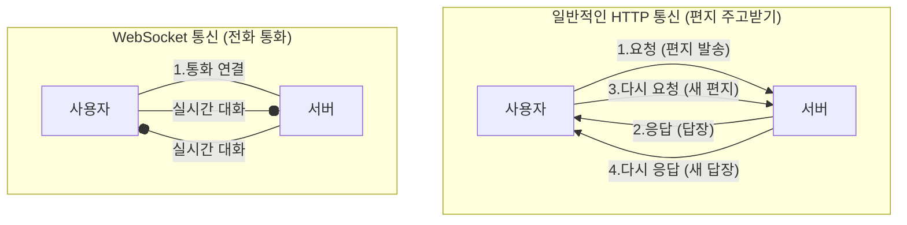
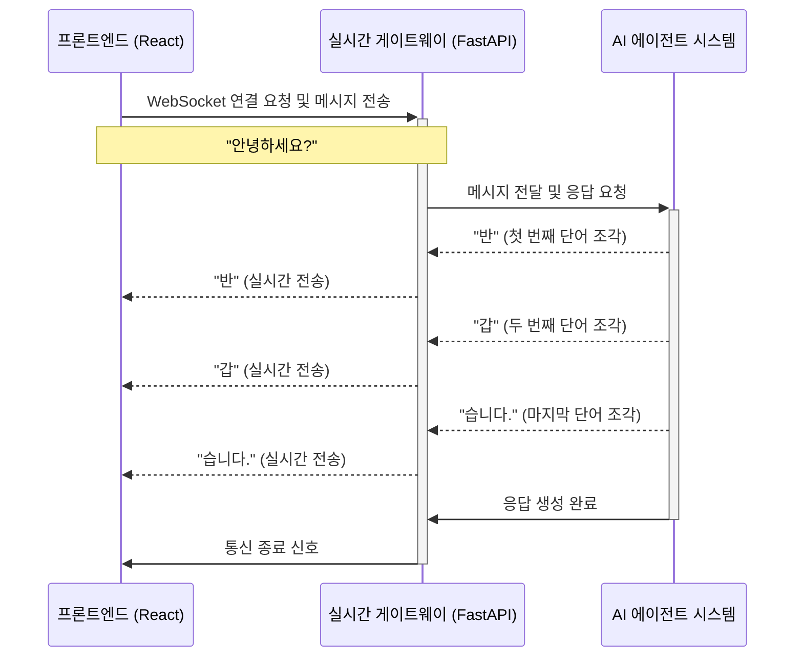

# Chapter 3: 실시간 AI 통신 게이트웨이 (FastAPI & WebSocket)


지난 [2장: 프론트엔드 채팅 UI](02_프론트엔드_채팅_ui_.md)에서는 사용자가 AI와 직접 대화하는 멋진 채팅 창을 만들었습니다. 사용자가 메시지를 입력하고 '전송' 버튼을 누를 수 있게 되었죠. 하지만 이 메시지는 어떻게 AI의 뇌까지 전달될까요? 그리고 AI의 답변은 어떻게 우리 눈앞에 실시간으로 타이핑되는 것처럼 나타날 수 있을까요?

이번 장에서는 바로 그 비밀, 사용자의 브라우저와 AI 시스템을 연결하는 초고속 '통신 다리', **실시간 AI 통신 게이트웨이**에 대해 알아보겠습니다.

## 왜 '실시간' 통신이 필요할까요?

친구에게 메신저로 메시지를 보냈다고 상상해 보세요. 친구가 한참 동안 답장이 없다가 갑자기 긴 장문의 글을 한 번에 보낸다면, 그동안 친구가 무엇을 하고 있는지 알 수 없어 답답할 수 있습니다.

AI와의 대화도 마찬가지입니다. 사용자가 "지난 분기 매출 데이터를 분석하고 보고서 초안을 써줘"라고 요청했을 때, AI가 모든 분석과 작성을 마칠 때까지 몇 분 동안 아무런 반응이 없다면 사용자는 시스템이 멈춘 건 아닐까 걱정하게 될 겁니다.

*   **문제:** AI의 응답이 길어질 경우, 사용자는 지루하게 기다려야만 한다.
*   **해결책:** AI가 답변을 생성하는 과정을 실시간으로 중계하여 보여준다. "데이터 분석 중...", "차트 생성 중...", "보고서 작성 중: 첫 번째 문단은..." 처럼 AI의 생각 과정을 단계별로 또는 단어 하나하나 보여주는 것입니다.

이를 위해 우리 프로젝트는 **WebSocket**이라는 특별한 통신 기술과 **FastAPI**라는 빠른 웹 서버를 사용해 실시간 통신 게이트웨이를 구축했습니다.

## 핵심 기술 엿보기: WebSocket과 FastAPI

이 게이트웨이를 만드는 두 명의 핵심 일꾼이 있습니다. 바로 'WebSocket'과 'FastAPI'입니다.

### 1. WebSocket: 끊기지 않는 전화 통화

일반적인 웹사이트 방문(HTTP 통신)은 편지를 주고받는 것과 비슷합니다. 우리가 웹사이트 주소를 입력하면('편지 발송'), 서버가 웹페이지 내용을 보내주고('답장 도착') 연결은 바로 끊어집니다. 또 다른 정보가 필요하면 다시 편지를 보내야 하죠.

반면, **WebSocket**은 한번 연결되면 계속 유지되는 '전화 통화'와 같습니다. 양쪽이 전화를 끊기 전까지는 언제든지 실시간으로 대화를 주고받을 수 있습니다.



이 '전화 통화' 방식 덕분에 서버(AI)는 생성되는 답변 조각들을 즉시 사용자에게 보낼 수 있고, 사용자는 이를 실시간으로 받아볼 수 있습니다.

### 2. FastAPI: 유능하고 빠른 관제탑

**FastAPI**는 이 WebSocket 통신을 포함한 모든 요청을 처리하는 빠르고 현대적인 파이썬 웹 프레임워크입니다. 우리 프로젝트에서는 AI 통신 게이트웨이를 만드는 '관제탑' 역할을 합니다.

*   사용자로부터 오는 WebSocket 연결 요청을 받아들입니다.
*   사용자의 메시지를 [AI 에이전트 총괄 시스템 (LangGraph Supervisor)](04_ai_에이전트_총괄_시스템__langgraph_supervisor__.md)에 전달합니다.
*   AI 에이전트로부터 오는 실시간 응답 조각들을 다시 사용자에게 중계합니다.

FastAPI는 이 모든 과정을 매우 효율적으로 처리하여 지연 없는 실시간 통신을 가능하게 합니다.

## 메시지의 여정: 실시간 스트리밍의 작동 원리

사용자가 메시지를 보내면, 이 게이트웨이를 통해 어떤 일이 일어나는지 순서대로 따라가 봅시다.



1.  **연결 수립:** 프론트엔드 UI는 FastAPI 게이트웨이의 특정 주소(`ws://...`)로 WebSocket 연결을 시작하고 사용자의 메시지를 보냅니다.
2.  **작업 지시:** 게이트웨이는 받은 메시지를 AI 에이전트 시스템에 전달하여 작업을 지시합니다.
3.  **실시간 중계:** AI 에이전트가 답변을 생성하기 시작하면, 완성된 문장이 아니라 생성되는 **단어 하나하나(토큰)**를 즉시 게이트웨이로 보냅니다.
4.  **즉시 전송:** 게이트웨이는 이 단어 조각을 받는 즉시 WebSocket을 통해 프론트엔드 UI로 전달합니다.
5.  **화면 업데이트:** 프론트엔드는 이 조각들을 받아 AI의 말풍선에 계속해서 추가하여, 마치 AI가 실시간으로 타이핑하는 것처럼 보여줍니다.

이제 이 과정이 실제 코드에서 어떻게 구현되는지 살펴보겠습니다.

## 코드 속으로: 실시간 통신의 구현

### 1. 프론트엔드: WebSocket 연결 시작하기

먼저, 프론트엔드는 FastAPI 서버와 '전화 통화'를 시작해야 합니다. 이 역할은 `frontend/lib/api/fastapi-service.ts` 파일의 `createChatWebSocket` 함수가 담당합니다.

```typescript
// frontend/lib/api/fastapi-service.ts

export function createChatWebSocket(
  threadId: string, // 대화를 구분하는 ID
  onToken: (token: string) => void, // 서버에서 단어(토큰)를 받을 때마다 실행될 함수
  // ... 기타 콜백 함수들
) {
  // WebSocket 서버 주소 생성
  const wsUrl = `${FASTAPI_WS_URL}/api/chat/ws/${threadId}`;
  
  // 새로운 WebSocket 연결 생성 (전화 걸기)
  const ws = new WebSocket(wsUrl);

  // 서버로부터 메시지가 도착했을 때(상대방이 말할 때) 실행될 로직
  ws.onmessage = (event) => {
    const streamEvent = JSON.parse(event.data);
    if (streamEvent.event_type === 'token') {
      // 받은 토큰을 onToken 함수에 전달
      onToken(streamEvent.data.token);
    }
    // ... 다른 이벤트 처리
  };

  // ...
}
```

*   `new WebSocket(wsUrl)`: 이 한 줄의 코드가 FastAPI 서버로 전화를 거는 것과 같습니다.
*   `ws.onmessage`: 서버로부터 어떤 데이터든 도착하면 이 함수가 실행됩니다. 우리는 받은 데이터(AI가 생성한 단어 조각)를 `onToken` 함수에 전달하여 화면에 표시하도록 합니다.

### 2. 백엔드(FastAPI): WebSocket 연결 받기

이제 FastAPI 서버 쪽에서 걸려온 전화를 받아야 합니다. 이 로직은 `fastapi_server/main.py` 파일에 정의되어 있습니다.

```python
# fastapi_server/main.py

# "/api/chat/ws/{thread_id}" 주소로 오는 WebSocket 요청을 처리하는 함수
@app.websocket("/api/chat/ws/{thread_id}")
async def websocket_endpoint(websocket: WebSocket, thread_id: str, agent_service: AgentService = Depends(get_agent_service)):
    # 클라이언트의 연결 요청을 수락 (전화 받기)
    await websocket.accept()
    logger.info(f"WebSocket 연결 성공: {thread_id}")
    
    try:
        # 연결이 끊어지지 않는 한 계속해서 메시지를 기다림
        while True:
            # 클라이언트로부터 메시지를 기다림 (사용자가 말하는 것을 듣기)
            data = await websocket.receive_text()
            message_data = json.loads(data)
            user_message = message_data.get("message", "")
            
            # 받은 메시지를 AI 에이전트 스트리밍 서비스로 처리
            await agent_service.process_message_stream(
                user_message,
                thread_id=thread_id,
                websocket=websocket
            )
    except Exception as e:
        logger.error(f"WebSocket 오류 발생: {str(e)}")
    # ...
```

*   `@app.websocket(...)`: FastAPI에게 이 함수가 WebSocket 연결을 처리하는 '창구'임을 알려줍니다.
*   `await websocket.accept()`: 클라이언트(프론트엔드)의 연결 요청을 공식적으로 수락합니다. 이제 '통화'가 시작됩니다.
*   `await websocket.receive_text()`: 클라이언트가 메시지를 보낼 때까지 기다렸다가, 메시지가 오면 그 내용을 `data` 변수에 저장합니다.
*   `agent_service.process_message_stream(...)`: 받은 메시지를 실시간으로 처리하고 응답을 스트리밍할 `AgentService`의 함수를 호출합니다.

### 3. 백엔드(AgentService): AI 응답 스트리밍하기

 여기가 바로 실시간 스트리밍의 마법이 일어나는 곳입니다. `fastapi_server/agent_service.py`의 `process_message_stream` 함수는 AI 에이전트로부터 응답 조각을 받아 WebSocket을 통해 클라이언트로 즉시 전송합니다.

```python
# fastapi_server/agent_service.py

class AgentService:
    async def process_message_stream(
        self, 
        message: str, 
        thread_id: str,
        websocket: WebSocket # 프론트엔드와 연결된 WebSocket 객체
    ) -> None:
        # ... (이전 대화 내용 불러오기 등 준비 과정)

        try:
            # AI 에이전트를 스트리밍 모드로 호출하고, 발생하는 모든 이벤트를 순회
            async for event in self.agent_app.astream_events(inputs, config=config, version="v2"):
                kind = event["event"]
                
                # 이벤트 종류가 'LLM에서 토큰이 생성될 때' 라면
                if kind == "on_chat_model_stream":
                    # 생성된 단어(토큰) 조각을 가져옴
                    content = event.get("data", {}).get("chunk", {}).content
                    if content:
                        # 받은 토큰을 JSON 형태로 만들어 WebSocket으로 즉시 전송
                        await websocket.send_json({
                            "event_type": "token",
                            "data": {"token": content}
                        })
            
            # 모든 스트리밍이 끝나면 '완료' 신호를 보냄
            await websocket.send_json({"event_type": "done", "data": { ... }})
        
        except Exception as e:
            # ... (에러 처리)
```

*   `async for event in ...`: AI 에이전트가 응답을 생성하며 발생하는 모든 이벤트를 실시간으로 하나씩 받아옵니다.
*   `if kind == "on_chat_model_stream"`: 받아온 이벤트가 '새로운 단어 조각 생성' 이벤트일 때만 아래 코드를 실행합니다.
*   `await websocket.send_json(...)`: 이것이 스트리밍의 핵심입니다. AI로부터 받은 단어 조각(`content`)을 지체 없이 바로 클라이언트에게 되돌려 보냅니다. 이 과정이 답변이 끝날 때까지 수십, 수백 번 반복됩니다.

## 마무리하며

이번 장에서는 사용자의 메시지가 AI에게 전달되고, AI의 답변이 실시간으로 우리 눈앞에 펼쳐지는 과정을 가능하게 하는 **실시간 AI 통신 게이트웨이**에 대해 배웠습니다.

**FastAPI**라는 효율적인 서버가 **WebSocket**이라는 '실시간 전화 통화' 기술을 사용하여 프론트엔드와 백엔드 AI 시스템 사이에 끊김 없는 통신 채널을 만든다는 것을 알게 되었습니다. 이 덕분에 사용자는 AI의 응답을 지루하게 기다리는 대신, 그 생각의 흐름을 라이브로 지켜보는 생생한 경험을 할 수 있습니다.

이제 우리는 멋진 UI와 그 UI를 AI와 연결하는 튼튼한 통신 다리까지 갖추게 되었습니다. 그렇다면 이 다리를 통해 전달된 메시지는 AI 시스템 내부에서 정확히 어떻게 처리될까요? 다음 장에서는 여러 전문 AI 에이전트들을 지휘하는 총괄 사령탑, **LangGraph Supervisor**의 세계로 떠나보겠습니다.

---

**다음 장: [AI 에이전트 총괄 시스템 (LangGraph Supervisor)](04_ai_에이전트_총괄_시스템__langgraph_supervisor__.md)**

---