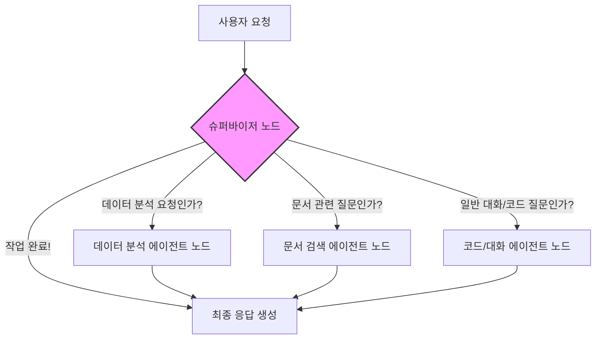
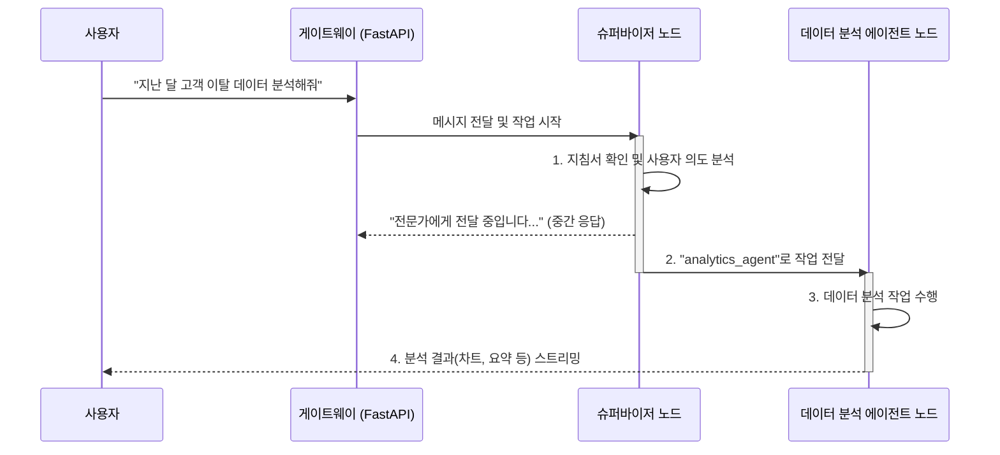

# Chapter 4: AI 에이전트 총괄 시스템 (LangGraph Supervisor)

이전 [3장: 실시간 AI 통신 게이트웨이 (FastAPI & WebSocket)](03_실시간_ai_통신_게이트웨이__fastapi___websocket__.md)에서 우리는 사용자의 메시지를 AI 시스템까지 안전하고 빠르게 전달하는 '통신 다리'를 구축했습니다. 이제 메시지는 성공적으로 AI 시스템의 현관문 앞에 도착했습니다.

하지만 여기서 중요한 질문이 생깁니다. "이 메시지를 과연 누가 처리해야 할까?" 사용자의 요청은 단순한 인사일 수도, 복잡한 데이터 분석 요청일 수도, 특정 문서에 대한 질문일 수도 있습니다. 우리 시스템에는 각 분야의 전문가들이 있는데, 이 요청에 가장 적합한 전문가는 누구일까요?

이번 장에서는 이 모든 요청을 가장 먼저 받아 적임자를 찾아주는 총괄 지휘 본부, **AI 에이전트 총괄 시스템 (LangGraph Supervisor)**에 대해 알아보겠습니다.

## 오케스트라의 지휘자, 슈퍼바이저

오케스트라 연주를 상상해 보세요. 수많은 악기들이 아름다운 하모니를 만들어냅니다. 하지만 바이올린, 첼로, 트럼펫 같은 각 악기 연주자들은 지휘자 없이는 언제, 어떻게 연주해야 할지 알 수 없습니다. 지휘자는 전체 악보를 보며 각 파트에게 정확한 지시를 내리고, 모든 소리가 어우러지도록 조율합니다.

우리 AI 시스템의 **슈퍼바이저(Supervisor)**가 바로 이 '지휘자' 역할을 합니다.

*   **문제:** 사용자의 다양한 요청(데이터 분석, 문서 검색, 일반 대화)을 어떻게 구분하고, 각 요청에 맞는 전문가에게 작업을 맡길 수 있을까?
*   **해결책:** 모든 요청을 가장 먼저 분석하는 '슈퍼바이저' 에이전트를 둔다. 슈퍼바이저는 사용자의 의도를 파악한 뒤, 우리 시스템에 있는 여러 전문가 에이전트들(데이터 분석가, 문서 검색 전문가 등) 중 가장 적절한 에이전트에게 작업을 넘겨준다.

슈퍼바이저 덕분에 우리 시스템은 마치 잘 훈련된 전문가 팀처럼, 어떤 복잡한 요청이 들어와도 체계적으로 협력하여 최상의 결과를 만들어낼 수 있습니다.

## AI 팀워크를 위한 설계도: LangGraph

슈퍼바이저가 아무리 똑똑해도, 각 에이전트에게 어떻게 작업을 전달하고, 그 결과를 다시 어떻게 받을지에 대한 명확한 규칙과 흐름이 없다면 시스템은 금방 엉망이 될 것입니다. 이 '팀워크의 규칙'을 정의하는 도구가 바로 **LangGraph**입니다.

LangGraph는 AI 에이전트들의 작업 흐름을 '그래프' 형태로 설계할 수 있게 도와주는 라이브러리입니다. 마치 회사 조직도나 업무 처리 순서도처럼, 각 단계에서 누가 무엇을 해야 할지 시각적으로 명확하게 정의할 수 있습니다.

LangGraph의 핵심 구성 요소는 두 가지입니다.

1.  **노드 (Node):** 그래프의 각 '지점'으로, 실제 작업을 수행하는 단위입니다. 우리 시스템에서는 '슈퍼바이저', '데이터 분석 에이전트', '문서 검색 에이전트' 등이 각각 하나의 노드가 됩니다.
2.  **엣지 (Edge):** 노드와 노드를 연결하는 '화살표'입니다. 작업의 흐름, 즉 어떤 노드에서 다음 노드로 이동할지를 결정하는 경로를 나타냅니다.

이 두 가지를 이용해 우리 시스템의 작업 흐름을 그려보면 다음과 같습니다.



이처럼 LangGraph를 사용하면 복잡한 AI 에이전트들의 협업 과정을 체계적으로 관리할 수 있습니다. 이 모든 설계도는 `fastapi_server/agent/graph.py` 파일에 코드로 구현되어 있습니다.

## 슈퍼바이저는 어떻게 결정을 내릴까?

그렇다면 슈퍼바이저 노드는 어떻게 사용자의 요청을 보고 다음 에이전트를 결정할까요? 그 비밀은 바로 슈퍼바이저에게 주어진 특별한 '업무 지침서'에 있습니다.

### 1단계: 업무 지침서(Prompt) 읽기

슈퍼바이저(AI 모델)는 작업을 시작하기 전에 `fastapi_server/agent/prompt.py` 파일에 정의된 `SUPERVISOR_SYSTEM_MESSAGE_GRAPH` 라는 시스템 메시지를 읽습니다. 이 지침서에는 슈퍼바이저의 역할과 결정 방법이 명확하게 적혀 있습니다.

```python
# fastapi_server/agent/prompt.py 의 일부

SUPERVISOR_SYSTEM_MESSAGE_GRAPH = """you are an expert customer service supervisor...
Your specialized agents are:
- DATA ANALYTICS AGENT: 데이터 분석, 통계, 시각화 전문가
- DOCUMENT RAG AGENT: 문서 및 지식 기반 검색 전문가
- CODE/CONVERSATION AGENT: 코드 설명 및 일반 대화 전문가

Your job is to:
1. Understand the user's needs
2. Route to the appropriate specialized agent
...
When making routing decisions, you MUST include one of these exact phrases:
- "Transfer to DATA ANALYTICS AGENT"
- "Transfer to DOCUMENT RAG AGENT"
- "Transfer to CODE/CONVERSATION AGENT"
- "FINISH"
"""
# (일부 내용을 한국어로 번역하여 이해를 돕기 위함)
```

이 지침서는 슈퍼바이저에게 "당신은 전문가 팀을 이끄는 슈퍼바이저입니다. 사용자의 요청을 분석해서, 'Transfer to ...' 라는 특정 문구를 포함하여 응답하세요" 라고 지시합니다.

### 2단계: 사용자 요청 분석 및 결정

이제 사용자가 "지난 달 고객 이탈 데이터를 분석해줘" 라고 요청했다고 가정해 봅시다. 슈퍼바이저 노드는 이 요청과 자신의 지침서를 함께 고려하여 결정을 내립니다.

이 결정 과정은 `fastapi_server/agent/graph.py` 파일의 `supervisor_router_node` 함수에서 일어납니다.

```python
# fastapi_server/agent/graph.py 의 일부 (단순화된 버전)

async def supervisor_router_node(state: SupervisorState, config: RunnableConfig):
    print("--- 슈퍼바이저 라우터 작동 ---")
    
    # 지침서(시스템 메시지)와 사용자 메시지를 함께 준비
    prompt_messages = [SystemMessage(content=SUPERVISOR_SYSTEM_MESSAGE_GRAPH)] + list(state["messages"])
    
    # 슈퍼바이저 LLM 호출하여 결정 요청
    supervisor_llm = get_llm()
    response_ai_message = await supervisor_llm.ainvoke(prompt_messages, config=config)
    
    response_content = response_ai_message.content
    print(f"슈퍼바이저의 결정: {response_content}") # 예: "Transfer to DATA ANALYTICS AGENT"
    
    # ... 응답 내용에서 다음 에이전트 이름 추출 ...
    next_agent_name = "analytics_agent" # 추출 결과
    
    return {
        "messages": [AIMessage(content="데이터 분석 전문가에게 전달하겠습니다.")],
        "next_node": next_agent_name
    }
```

슈퍼바이저 LLM은 "고객 이탈 데이터 분석"이라는 말을 보고, 자신의 지침서에 따라 "데이터 분석 전문가에게 맡겨야겠다"고 판단하고, `"Transfer to DATA ANALYTICS AGENT"` 라는 응답을 생성합니다. `supervisor_router_node` 함수는 이 응답을 보고 다음 목적지를 `analytics_agent`로 결정합니다.

### 3단계: 올바른 경로로 안내하기

슈퍼바이저가 `next_node`를 `analytics_agent`로 결정하면, LangGraph는 미리 정의된 '엣지' 규칙에 따라 작업의 흐름을 해당 에이전트 노드로 보냅니다.

```python
# fastapi_server/agent/graph.py 의 일부

# 그래프에 조건부 엣지 추가
workflow.add_conditional_edges(
    "supervisor_router",  # '슈퍼바이저' 노드에서
    determine_next_node,  # 이 함수로 다음 노드를 결정하고
    {  # 결정된 이름에 따라 아래 경로로 이동
        "analytics_agent": "analytics_agent",
        "rag_agent": "rag_agent",
        "code_agent": "code_agent",
        "FINISH": END 
    }
)
```

이 코드는 `supervisor_router` 노드의 작업이 끝나면, `determine_next_node` 함수가 반환한 값(예: "analytics_agent")에 해당하는 이름의 노드로 작업을 전달하라는 '교통 규칙'을 설정합니다.

## 메시지 한 개의 전체 여정

이제 전체 과정을 한눈에 볼 수 있도록 다이어그램으로 정리해 보겠습니다. 사용자가 데이터 분석을 요청했을 때, 시스템 내부에서는 다음과 같은 일이 벌어집니다.



1.  사용자의 메시지는 [실시간 게이트웨이](03_실시간_ai_통신_게이트웨이__fastapi___websocket__.md)를 통해 LangGraph 시스템의 진입점인 **슈퍼바이저 노드**에 도착합니다.
2.  **슈퍼바이저**는 사용자의 요청이 데이터 분석에 관한 것임을 파악하고, 다음 목적지를 `analytics_agent`로 결정합니다.
3.  LangGraph는 슈퍼바이저의 결정에 따라 작업을 **데이터 분석 에이전트 노드**로 전달합니다.
4.  **데이터 분석 에이전트**는 실제 데이터 분석을 수행하고, 그 결과를 사용자에게 실시간으로 전송합니다. 이 전문 에이전트에 대해서는 다음 장에서 자세히 알아볼 것입니다.

## 마무리하며

이번 장에서는 우리 AI 시스템의 '총괄 지휘 본부'인 **슈퍼바이저 에이전트**와, 에이전트들의 팀워크를 설계하는 도구인 **LangGraph**에 대해 배웠습니다.

슈퍼바이저는 모든 사용자 요청의 의도를 파악하고, 가장 적합한 전문가 에이전트에게 작업을 분배하는 핵심적인 역할을 합니다. 덕분에 우리 시스템은 여러 명의 전문가가 협력하여 복잡한 문제를 해결하는 하나의 팀처럼 움직일 수 있습니다.

이제 우리는 어떻게 지휘자가 오케스트라를 이끄는지 이해했습니다. 그렇다면 각 파트의 연주자, 즉 전문가 에이전트들은 실제로 어떤 놀라운 연주 실력을 가지고 있을까요? 다음 장에서는 그 첫 번째 전문가, 숫자의 마술사 **데이터 분석 전문 에이전트**를 만나보겠습니다.

---

**다음 장: [데이터 분석 전문 에이전트 (Analytics Agent)](05_데이터_분석_전문_에이전트__analytics_agent__.md)**

---

Generated by [AI Codebase Knowledge Builder](https://github.com/The-Pocket/Tutorial-Codebase-Knowledge)