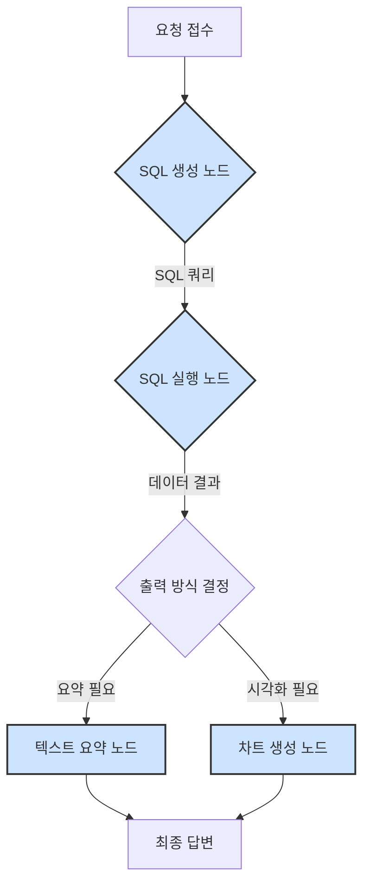
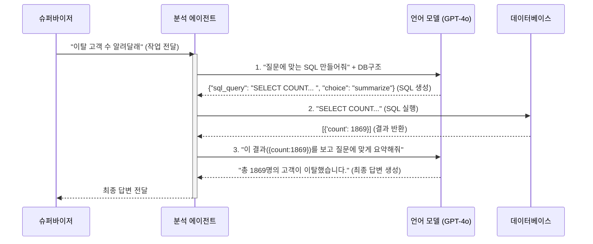

# Chapter 5: 데이터 분석 전문 에이전트 (Analytics Agent)


이전 [4장: AI 에이전트 총괄 시스템 (LangGraph Supervisor)](04_ai_에이전트_총괄_시스템__langgraph_supervisor__.md)에서는 오케스트라의 지휘자처럼 사용자의 요청을 분석하고 가장 적절한 전문가에게 일을 분배하는 '슈퍼바이저'를 만났습니다. 슈퍼바이저는 이제 막 사용자로부터 "지난달 매출 데이터를 분석해 줘"라는 요청을 받았습니다. 이 요청은 누구에게 전달해야 할까요?

바로 이번 장에서 만나볼 우리 팀의 데이터 전문가, **데이터 분석 전문 에이전트(Analytics Agent)**입니다. 이 에이전트는 숫자를 다루고, 숨겨진 의미를 찾아내고, 멋진 그래프로 결과를 보여주는 일에 특화되어 있습니다.

## "데이터 분석해 줘": 어떻게 알아들을까?

사용자가 "지난달 이탈한 고객은 몇 명이야?"와 같이 데이터와 관련된 질문을 하면, 우리 시스템은 어떻게 답변을 찾아낼까요? 사람이 이 질문을 받는다면, 다음과 같은 과정을 거칠 것입니다.

1.  질문을 듣고 '지난달', '이탈 고객', '몇 명'이라는 핵심 키워드를 파악합니다.
2.  데이터베이스에 접속해서 어떤 테이블에 고객 정보가 있는지 확인합니다.
3.  `SELECT COUNT(*) FROM customers WHERE churn_date BETWEEN '...' AND '...'` 와 같은 SQL 코드를 작성하여 데이터를 조회합니다.
4.  조회된 결과(예: `25`)를 보고, "지난달 이탈한 고객은 25명입니다."라고 정리하여 답변합니다.

데이터 분석 에이전트는 바로 이 과정을 똑똑하게 자동화한 '인공지능 데이터 과학자'입니다.

*   **문제:** 사용자의 자연어 질문을 어떻게 컴퓨터가 이해하고 데이터베이스에서 답을 찾게 할 수 있을까?
*   **해결책:** 질문 이해 → SQL 생성 → SQL 실행 → 결과 요약 및 시각화'라는 정해진 절차를 수행하는 전문 에이전트를 만든다.

이 에이전트 덕분에 사용자는 복잡한 SQL을 몰라도 마치 전문가에게 묻는 것처럼 편하게 데이터에 대해 질문할 수 있습니다.

## 데이터 분석 에이전트의 작업 흐름

데이터 분석 에이전트는 요청을 받으면 마치 숙련된 분석가처럼 체계적인 단계를 거쳐 작업을 처리합니다. 이 작업 흐름은 [AI 에이전트 총괄 시스템 (LangGraph Supervisor)](04_ai_에이전트_총괄_시스템__langgraph_supervisor__.md)에서 배운 LangGraph로 설계되어 있으며, `fastapi_server/agent/agent3.py` 파일 속에서 여러 개의 '노드'들이 순차적으로 실행되는 형태로 구현됩니다.



1.  **SQL 생성 (`generate_sql_node`):** 사용자의 질문을 이해하고 데이터베이스에서 정보를 가져올 수 있는 SQL 쿼리를 만듭니다. 동시에, 이 결과를 텍스트로 요약하는 게 좋을지, 차트로 그리는 게 좋을지도 함께 결정합니다.
2.  **SQL 실행 (`execute_sql_node`):** 생성된 SQL 쿼리를 실제 데이터베이스에서 실행하여 결과를 가져옵니다.
3.  **텍스트 요약 (`summarize_sql_result_node`):** SQL 실행 결과가 간단한 숫자나 텍스트일 경우(예: 이탈 고객 수), 그 의미를 알기 쉬운 문장으로 요약합니다.
4.  **차트 생성 (`create_visualization_node`):** SQL 실행 결과가 복잡하거나 시간의 흐름에 따른 변화를 담고 있을 경우, 사용자가 한눈에 이해할 수 있도록 Mermaid 차트 코드를 생성합니다.
5.  **최종 답변:** 요약된 텍스트나 생성된 차트를 사용자에게 최종적으로 전달합니다.

이제 각 단계가 코드 속에서 어떻게 작동하는지 살펴보겠습니다.

## 코드 속으로: 인공지능 데이터 과학자의 두뇌 엿보기

### 1단계: 질문을 SQL로 번역하기 (`generate_sql_node`)

이 노드의 역할은 사용자의 한국어 질문을 컴퓨터가 알아듣는 SQL 언어로 '번역'하는 것입니다. 이 마법 같은 번역은 그냥 일어나는 것이 아니라, 아주 상세한 '업무 지침서(Prompt)' 덕분입니다.

`fastapi_server/agent/prompt.py` 파일의 `sql_generation_chat_prompt_agent3` 프롬프트 일부를 살펴봅시다.

```python
# fastapi_server/agent/prompt.py

# ... (생략)
SystemMessage(content="""You are an expert SQL generation assistant. ...
Database Schema Information:
...
Table Name: telecom_customers
Columns:
  - customer_id (character varying)
  ...
  - churn (boolean)
...
Respond with a JSON object that strictly adheres to the Pydantic model `SQLGenerationOutput`.
The `sql_query` field MUST contain ONLY the SQL query string...
The `sql_output_choice` field must be one of 'summarize' or 'visualize'.
""")
```

이 지침서는 LLM에게 "당신은 SQL 생성 전문가입니다. 제가 알려주는 데이터베이스 구조(`telecom_customers` 테이블 등)를 보고 사용자의 질문에 맞는 SQL을 만드세요. 그리고 답변은 반드시 `sql_query`와 `sql_output_choice`가 들어있는 JSON 형식으로 주세요." 라고 아주 구체적으로 지시합니다.

이 지침을 받은 `generate_sql_node` 함수는 다음과 같이 작동합니다.

```python
# fastapi_server/agent/agent3.py

async def generate_sql_node(state: AgentState, ...):
    logger.info("--- SQL 생성 노드 진입 ---")
    
    # 지침서와 대화 내용을 합쳐 LLM(번역가)에게 전달
    chain = sql_generation_chat_prompt_agent3 | llm | JsonOutputParser(...)
    
    # LLM으로부터 SQL 쿼리와 출력 방식을 받아옴
    response = await chain.ainvoke({"messages": state.messages}, ...)
    
    # 상태에 결과 저장
    state.sql_query = response.sql_query
    state.sql_output_choice = response.sql_output_choice
    return state
```

만약 사용자가 "통신 서비스를 해지한 고객 수를 알려줘"라고 질문했다면, 이 노드는 `telecom_customers` 테이블의 `churn` 컬럼을 사용하여 다음과 같은 결과물을 만들어낼 것입니다.

*   **`sql_query`**: `"SELECT COUNT(*) FROM telecom_customers WHERE churn = true;"`
*   **`sql_output_choice`**: `"summarize"`

### 2단계: 데이터베이스에서 데이터 가져오기 (`execute_sql_node`)

이제 번역된 SQL 쿼리가 준비되었습니다. `execute_sql_node`는 이 쿼리문을 들고 실제 데이터베이스에 찾아가 "이 코드를 실행하고 결과를 주세요"라고 요청하는 심부름꾼입니다.

```python
# fastapi_server/agent/agent3.py

async def execute_sql_node(state: AgentState, ...):
    logger.info("--- SQL 실행 노드 진입 ---")
    sql_query = state.sql_query # 이전 노드에서 만든 SQL 가져오기
    
    # 데이터베이스에 연결해서 쿼리를 실행하는 함수 호출 (별도 스레드에서 안전하게)
    result_df = await asyncio.to_thread(_execute_sql_sync, sql_query, ...)
    
    # 받은 결과를 상태에 저장
    state.sql_result = result_df.to_dict(orient='records')
    return state
```

이 코드는 내부적으로 데이터베이스 접속 정보를 읽고 `psycopg2`와 `pandas` 라이브러리를 사용해 SQL을 실행합니다. 실행 결과(예: `[{'count': 1869}]`)는 다음 단계를 위해 `state.sql_result`에 저장됩니다.

### 3단계: 결과를 사람의 언어로 바꾸기

데이터베이스에서 가져온 `{'count': 1869}`는 그 자체로는 의미가 불분명합니다. 이제 이 결과를 사용자가 이해하기 쉬운 형태로 가공할 차례입니다. 1단계에서 결정된 `sql_output_choice`에 따라 작업의 흐름이 나뉩니다.

#### 선택지 A: 텍스트로 요약하기 (`summarize_sql_result_node`)

결과를 간단히 글로 설명해야 할 때 이 노드가 호출됩니다.

```python
# fastapi_server/agent/agent3.py

async def summarize_sql_result_node(state: AgentState, ...):
    logger.info("--- SQL 결과 요약 노드 진입 ---")
    
    # "결과를 자연스럽게 요약해줘" 라는 지침서와 함께 LLM 호출
    chain = sql_result_summary_chat_prompt_agent3 | llm
    response = await chain.ainvoke({
        "messages": state.messages, 
        "sql_query": state.sql_query, 
        "sql_result": str(state.sql_result)
    }, ...)
    
    # 최종 답변을 상태에 저장
    state.final_answer = response.content
    return state
```

이 노드는 LLM에게 "사용자의 원래 질문과 SQL 실행 결과를 줄 테니, 이걸 보고 자연스러운 한국어 문장으로 답변을 만들어줘"라고 요청합니다. 그 결과, "통신 서비스를 해지한 고객은 총 1869명입니다."와 같은 매끄러운 최종 답변이 생성됩니다.

#### 선택지 B: 차트로 시각화하기 (`create_visualization_node`)

만약 사용자가 "월별 계약 유형에 따른 평균 요금을 차트로 보여줘"처럼 복잡한 데이터를 요청했다면, 글보다는 차트가 훨씬 효과적입니다. `create_visualization_node`는 이 역할을 수행합니다.

```python
# fastapi_server/agent/agent3.py

async def create_visualization_node(state: AgentState, ...):
    logger.info("--- 시각화 생성 노드 진입 ---")
    # ... SQL 결과를 JSON 문자열로 변환 ...
    
    # LLM에게 Mermaid 차트 코드 생성을 요청하는 상세한 프롬프트
    prompt_text = f"""
    ... SQL 쿼리 결과를 바탕으로 가장 효과적인 Mermaid 다이어그램을 만들어주세요 ...
    SQL 결과:
    ```json
    {sql_result_str}
    ```
    """
    
    response = await llm.ainvoke([HumanMessage(content=prompt_text)])
    
    # LLM이 생성한 Mermaid 코드를 최종 답변으로 저장
    state.final_answer = response.content.strip()
    return state
```

이 노드는 LLM에게 "데이터를 줄 테니, 이걸 가장 잘 표현할 수 있는 Mermaid 차트 코드를 만들어줘"라고 지시합니다. LLM은 데이터의 특성을 분석하여 파이 차트, 막대그래프 등 가장 적절한 형태의 차트 코드를 생성하여 반환합니다.

## 내부 동작 흐름 한눈에 보기

사용자가 "이탈 고객 수를 알려줘"라고 했을 때, 시스템 내부에서는 어떤 대화가 오가는지 따라가 보겠습니다.



이처럼 데이터 분석 에이전트는 내부적으로 LLM, 데이터베이스와 긴밀하게 협력하여 사용자의 질문에 대한 정확하고 이해하기 쉬운 답변을 만들어냅니다.

## 마무리하며

이번 장에서는 우리 시스템의 '데이터 과학자', **데이터 분석 전문 에이전트**에 대해 깊이 있게 탐험했습니다. 이 에이전트는 사용자의 자연어 질문을 이해하고, 스스로 SQL 쿼리를 작성하여 데이터베이스에 질문하며, 그 결과를 다시 사람이 이해하기 쉬운 글이나 차트로 변환하는 놀라운 능력을 가지고 있습니다.

이 모든 과정은 LangGraph로 설계된 체계적인 작업 흐름(SQL 생성 → 실행 → 요약/시각화)을 통해 이루어집니다.

데이터에 관한 질문은 이제 이 전문가에게 맡기면 되겠군요. 그런데 만약 사용자가 "최신 회의록 내용 요약해줘"나 "우리 회사 휴가 정책 알려줘"처럼 데이터베이스가 아닌 문서에 대해 질문한다면 어떻게 해야 할까요? 이럴 때를 대비해 우리 시스템에는 또 다른 전문가가 대기하고 있습니다.

다음 장에서는 바로 그 '문서 검색 전문가'를 만나보겠습니다.

---

**다음 장: [문서 검색 전문 에이전트 (RAG Agent)](06_문서_검색_전문_에이전트__rag_agent__.md)**

---

Generated by [AI Codebase Knowledge Builder](https://github.com/The-Pocket/Tutorial-Codebase-Knowledge)