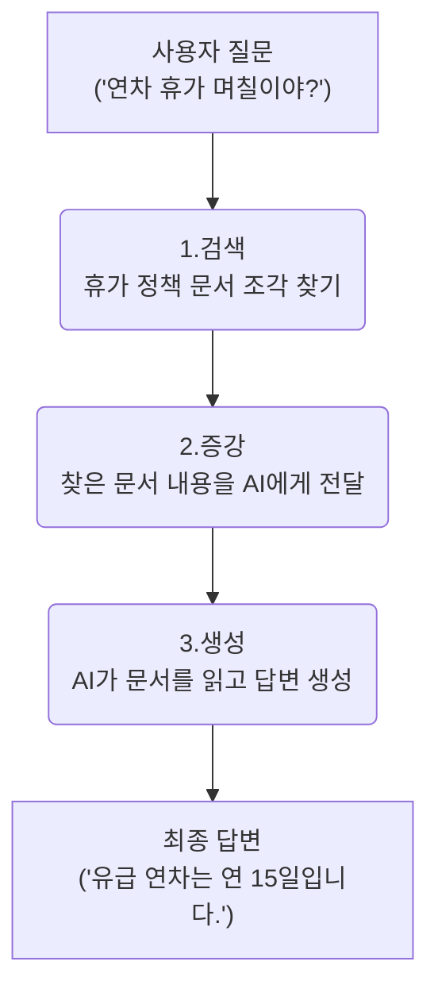
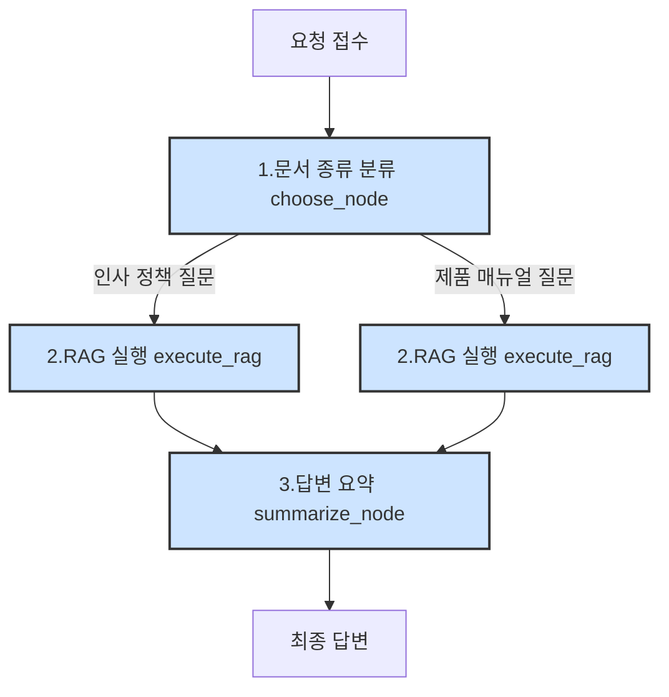
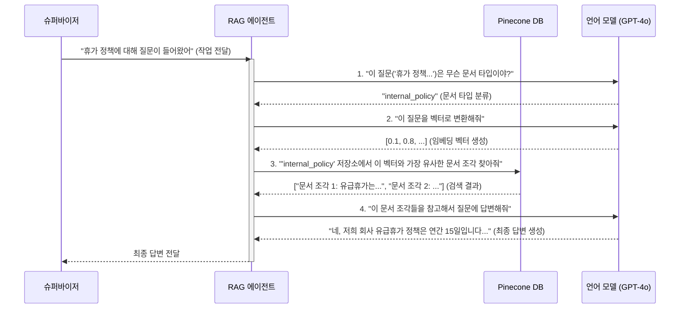

# Chapter 6: 문서 검색 전문 에이전트 (RAG Agent)


지난 [5장: 데이터 분석 전문 에이전트 (Analytics Agent)](05_데이터_분석_전문_에이전트__analytics_agent__.md)에서는 우리 시스템의 '데이터 과학자'를 만나보았습니다. 이 에이전트는 사용자가 데이터베이스에 대해 질문하면 똑똑하게 SQL을 만들어 답변을 찾아냈죠. 하지만 만약 사용자가 "우리 회사 연차 휴가 정책 알려줘"라고 질문한다면 어떨까요? 이 정보는 데이터베이스의 깔끔한 표가 아니라, PDF나 워드 같은 문서 파일 안에 잠들어 있습니다.

이번 장에서는 바로 이 '잠자는 문서 속 정보'를 깨워 사용자에게 전달하는, 우리 팀의 도서관 사서이자 문서 전문가인 **문서 검색 전문 에이전트(RAG Agent)**를 탐험해 보겠습니다.

## 방대한 자료 속에서 답을 찾는 도서관 사서

거대한 도서관에서 특정 주제에 대한 정보를 찾아야 한다고 상상해 보세요. 모든 책을 하나씩 다 읽어볼 수는 없습니다. 우리는 보통 도서관 사서에게 찾아가 도움을 요청할 겁니다. 사서는 우리의 질문을 듣고, 어떤 코너에 어떤 책이 있는지 자신의 지식을 활용해 정확한 책을 찾아줍니다.

문서 검색 전문 에이전트가 바로 이 '인공지능 도서관 사서' 역할을 합니다.

*   **문제:** 회사 내부 문서(정책, 매뉴얼, 회의록 등)에 대한 사용자의 질문에 어떻게 답변할 수 있을까?
*   **해결책:** Retrieval-Augmented Generation (RAG) 기술을 사용하는 전문 에이전트를 만든다. 이 에이전트는 질문과 가장 관련 있는 문서 조각을 먼저 '검색(Retrieval)'한 뒤, 그 내용을 바탕으로 답변을 '생성(Generation)'한다.

이 에이전트 덕분에 사용자는 수많은 문서 더미를 뒤질 필요 없이, 필요한 정보를 바로 얻을 수 있습니다.

## RAG의 핵심 원리: 검색하고, 읽고, 답변하기

RAG는 'Retrieval-Augmented Generation'의 약자로, '검색 증강 생성'이라고 번역할 수 있습니다. 이름은 복잡해 보이지만, 작동 원리는 세 단계로 간단하게 나눌 수 있습니다.

1.  **검색 (Retrieval):** 사용자의 질문을 이해하고, 수많은 문서 조각들 중에서 가장 관련 있는 내용을 찾아냅니다. (사서가 책을 찾는 단계)
2.  **증강 (Augmented):** 찾아낸 문서 내용을 AI 언어 모델(LLM)에게 참고 자료로 함께 전달합니다. (사서가 찾은 책을 우리에게 건네주는 단계)
3.  **생성 (Generation):** AI 언어 모델은 질문과 함께 전달받은 참고 자료를 바탕으로 최종 답변을 만듭니다. (우리가 책을 읽고 질문에 대한 답을 정리하는 단계)

이 과정을 그림으로 표현하면 다음과 같습니다.



### 어떻게 정확한 문서를 찾을까? - 임베딩과 벡터 데이터베이스

그렇다면 AI는 어떻게 수많은 문서 중에서 질문과 '관련 있다'는 것을 알 수 있을까요? 바로 **임베딩(Embedding)**과 **벡터 데이터베이스(Vector Database)** 덕분입니다.

*   **임베딩:** 모든 단어와 문장을 숫자로 이루어진 '좌표'로 바꾸는 기술입니다. 이 좌표 공간에서는 의미가 비슷한 단어(예: '휴가', '연차', '휴식')들이 서로 가까운 곳에 위치하게 됩니다.
*   **벡터 데이터베이스 (Pinecone):** 이렇게 변환된 문서들의 좌표(벡터)를 저장하고, 빠르게 검색할 수 있는 특별한 데이터베이스입니다. 우리 프로젝트에서는 **Pinecone**을 사용합니다.

사용자가 질문을 하면, 시스템은 질문 또한 좌표로 바꾼 뒤 Pinecone 데이터베이스에 "이 좌표랑 가장 가까운 문서 좌표들을 찾아줘!"라고 요청합니다. 그러면 Pinecone은 가장 가까운 거리에 있는 문서 조각들을 순식간에 찾아내 돌려주는 것이죠.

## 문서 검색 에이전트의 작업 흐름

이 에이전트 역시 [AI 에이전트 총괄 시스템 (LangGraph Supervisor)](04_ai_에이전트_총괄_시스템__langgraph_supervisor__.md)에서 배운 LangGraph를 기반으로 체계적인 작업 흐름을 따릅니다. 이 흐름은 `fastapi_server/agent/agent2.py` 파일에 정의되어 있습니다.



1.  **문서 종류 분류 (`choose_node`):** 사용자의 질문을 분석하여 어떤 종류의 문서(인사 정책, 제품 문서, 기술 문서 등)에 대한 질문인지 먼저 분류합니다. 이는 도서관의 특정 코너로 먼저 이동하는 것과 같습니다.
2.  **RAG 실행 (`execute_rag`):** 분류된 문서 종류에 해당하는 Pinecone 저장소(네임스페이스)에서 관련 문서를 검색합니다.
3.  **답변 요약 (`summarize_node`):** 검색된 문서 내용을 바탕으로, AI가 사용자가 이해하기 쉬운 최종 답변을 생성하고 요약합니다.

## 코드 속으로: AI 도서관 사서의 생각 엿보기

이제 코드를 통해 각 단계가 어떻게 실제로 작동하는지 살펴보겠습니다.

### 1단계: 어떤 종류의 책을 찾으시나요? (`choose_node`)

이 노드는 사용자의 질문을 보고 어떤 서가로 가야 할지 결정하는 역할을 합니다. 이 결정은 `fastapi_server/agent/prompt.py`에 정의된 `document_type_system_prompt_agent2`라는 지침서를 통해 이루어집니다.

```python
# fastapi_server/agent/prompt.py 의 일부
document_type_system_prompt_agent2 = (
    "사용자의 질문은 '{user_input}'입니다. "
    "질문을 분석하여 다음 문서 종류 중 하나로 분류하세요: product, hr_policy, technical_document, proceedings. "
    "다음 네 가지 값 중 정확히 하나만 응답해야 합니다..."
)
```

이 지침을 받은 `choose_document_type` 함수는 LLM을 호출하여 질문의 종류를 알아냅니다. 예를 들어 "휴가 정책 알려줘"라는 질문에는 'internal_policy'라는 결과를 돌려줄 것입니다. `choose_node`는 이 결과를 상태에 저장하여 다음 단계로 넘깁니다.

```python
# fastapi_server/agent/agent2.py 의 일부
def choose_node(state: State):
    user_input = state.user_input

    # LLM을 호출하여 문서 타입을 분류
    document_type = choose_document_type(user_input)
    
    # 상태에 분류된 문서 타입을 저장
    state.document_type = document_type
    
    return state.dict()
```

### 2단계: 책장에서 관련 페이지 찾기 (`execute_rag`)

이제 어떤 종류의 문서를 찾을지 결정했으니, 실제 검색을 수행할 차례입니다. `execute_rag` 함수는 이 과정을 담당하며, 내부적으로 여러 보조 함수를 사용합니다.

```python
# fastapi_server/agent/agent2.py 의 일부
def execute_rag(state: State):
    openai_client, pinecone_index = init_clients()

    # 1. 질문을 벡터 좌표로 변환
    query_vector = embed_query(openai_client, state.user_input)

    # 2. 분류된 문서 타입(네임스페이스)으로 검색 범위 한정
    namespace_to_search = state.document_type
    
    # 3. Pinecone에 벡터 검색 요청
    res = pinecone_index.query(
        vector=query_vector,
        namespace=namespace_to_search,
        top_k=5, # 5개의 가장 관련 있는 조각을 찾음
        include_metadata=True
    )
    matches = res.matches
    
    # 4. 검색된 조각들의 텍스트를 하나로 합침
    context = build_context_from_matches(matches)
    state.result = context
    return state.dict()
```

이 함수는 먼저 사용자의 질문을 `embed_query`를 통해 벡터로 변환합니다. 그런 다음, 1단계에서 결정된 `namespace`를 지정하여 `pinecone_index.query`를 호출합니다. 마지막으로, `build_context_from_matches` 함수는 검색된 여러 문서 조각의 텍스트를 모아 하나의 긴 '참고 자료(context)'로 만듭니다.

### 3단계: 찾은 내용을 바탕으로 답변 정리하기 (`summarize_node`)

이제 필요한 모든 참고 자료를 손에 넣었습니다. 마지막으로 `summarize_node`는 이 자료를 바탕으로 최종 답변을 생성합니다. 여기에서도 문서 종류에 따라 다른 지침서(프롬프트)를 사용합니다.

```python
# fastapi_server/agent/prompt.py 의 일부
internal_policy_summary_prompt_template_agent2 = (
    "당신은 회사 정책 문서 도우미입니다. 회사 문서를 줄 테니, "
    "'{user_input}'에 대한 답변을 요약해주세요. ... "
    "한국어로 답변해주세요."
)
```

이 지침과 함께 `execute_rag`에서 만든 참고 자료를 LLM에 전달하면, LLM은 매끄럽고 이해하기 쉬운 한국어 답변을 생성해 줍니다. 예를 들면, "문의하신 연차 휴가 정책에 따르면, 모든 정규직 직원은 연간 15일의 유급 휴가를 사용할 수 있습니다."와 같은 답변이 만들어집니다.

## 내부 동작 흐름 한눈에 보기

사용자가 "휴가 정책 알려줘"라고 질문했을 때, 우리 시스템 내부에서는 어떤 일이 벌어지는지 전체 과정을 따라가 보겠습니다.



이처럼 RAG 에이전트는 여러 시스템(LLM, Pinecone)과 체계적으로 협력하여, 마치 숙련된 사서처럼 정확하고 유용한 정보를 사용자에게 제공합니다.

## 마무리하며

이번 장에서는 우리 시스템의 '문서 전문가'인 **문서 검색 전문 에이전트 (RAG Agent)**에 대해 알아보았습니다. 이 에이전트는 RAG라는 강력한 기술을 사용하여, **임베딩**과 **Pinecone 벡터 데이터베이스**의 도움을 받아 방대한 문서 속에서 사용자가 원하는 정보를 정확하게 찾아냅니다.

이제 우리 시스템은 데이터베이스에 대한 질문과 문서에 대한 질문을 모두 처리할 수 있는 두 명의 든든한 전문가를 갖추게 되었습니다.

그런데 한 가지 궁금증이 남습니다. 이 전문가들이 참고하는 데이터베이스의 데이터나 Pinecone의 문서들은 애초에 어디서 온 걸까요? 어떻게 시스템에 입력되고 처리되는 걸까요? 다음 장에서는 바로 이 '데이터 준비 과정'의 비밀, **외부 데이터 수집 및 처리(ETL)**에 대해 파헤쳐 보겠습니다.

---

**다음 장: [외부 데이터 수집 및 처리 (ETL)](07_외부_데이터_수집_및_처리__etl__.md)**

---
