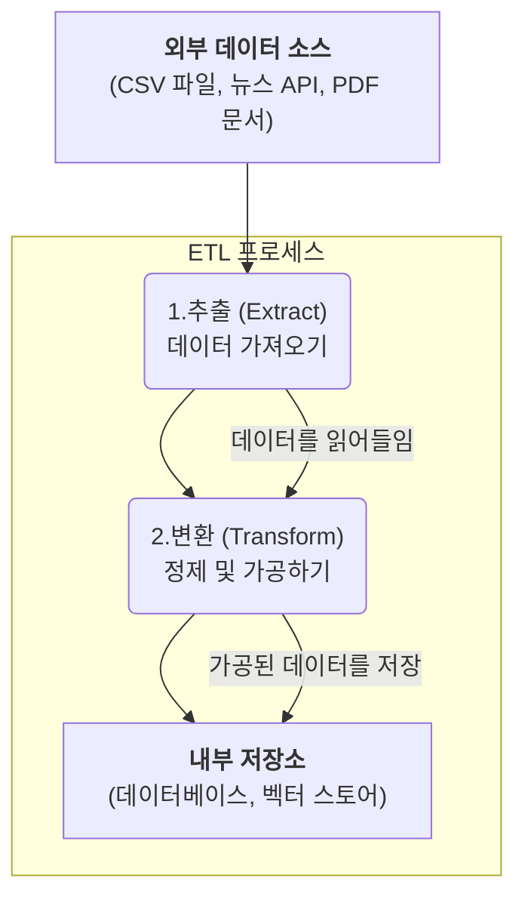
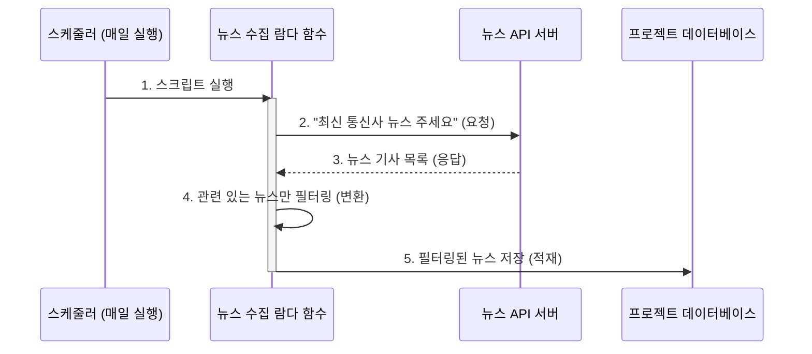

# Chapter 7: 외부 데이터 수집 및 처리 (ETL)


이전 [6장: 문서 검색 전문 에이전트 (RAG Agent)](06_문서_검색_전문_에이전트__rag_agent__.md)와 [5장: 데이터 분석 전문 에이전트 (Analytics Agent)](05_데이터_분석_전문_에이전트__analytics_agent__.md)에서 우리는 두 명의 놀라운 전문가를 만났습니다. 한 명은 방대한 문서 속에서 답을 찾아주고, 다른 한 명은 데이터베이스를 분석하여 통찰력을 제공했죠.

하지만 여기서 근본적인 질문이 생깁니다. 이 똑똑한 에이전트들이 참고하는 문서와 데이터는 애초에 어디에서 온 걸까요? 시스템이 처음부터 모든 정보를 알고 있지는 않을 텐데요.

이번 장에서는 바로 그 비밀, 우리 시스템에 외부의 귀중한 정보를 공급하는 '정보 수집가'이자 '요리 재료 준비사'인 **외부 데이터 수집 및 처리(ETL)** 과정에 대해 알아보겠습니다.

## AI를 위한 요리 재료 준비 과정, ETL

훌륭한 셰프(AI 에이전트)가 맛있는 요리(분석 결과, 답변)를 만들려면, 신선하고 잘 손질된 재료(데이터)가 필요합니다. 셰프가 직접 시장에 가서 재료를 사 오고, 씻고, 다듬어서 요리하기 좋게 준비해두는 과정이 반드시 필요하죠.

**ETL(Extract, Transform, Load)**은 바로 이 '재료 준비' 과정과 같습니다. 외부의 날것 그대로인 데이터를 가져와(Extract), 우리 시스템이 사용하기 좋은 형태로 가공한 뒤(Transform), 지정된 저장소에 잘 정리해두는(Load) 모든 작업을 의미합니다.

*   **문제:** AI 에이전트가 분석하고 답변하는 데 필요한 데이터(고객 정보, 최신 뉴스, 회사 정책 문서 등)는 어떻게 시스템 안으로 가져올 수 있을까?
*   **해결책:** 다양한 형태의 외부 데이터를 읽고, 정제하고, 데이터베이스나 벡터 저장소에 저장하는 자동화된 스크립트(ETL 파이프라인)를 만든다.

우리 프로젝트에서는 `tools`와 `lambda` 폴더에 있는 파이썬 스크립트들이 이 중요한 ETL 역할을 담당합니다.

## ETL의 세 가지 핵심 단계

ETL은 이름 그대로 세 가지 단계로 이루어집니다. 이 과정을 그림으로 보면 쉽게 이해할 수 있습니다.



1.  **추출 (Extract):** 필요한 데이터가 있는 곳(CSV 파일, 외부 웹사이트 API, PDF 문서 등)으로 찾아가 데이터를 가져오는 단계입니다.
2.  **변환 (Transform):** 가져온 데이터를 그대로 사용하기는 어렵습니다. 형식을 맞추고(예: 날짜 형식 통일), 불필요한 내용을 제거하며, AI가 이해하기 쉬운 형태로 가공합니다(예: 텍스트를 벡터로 변환).
3.  **적재 (Load):** 깨끗하게 가공된 데이터를 최종 목적지인 데이터베이스 테이블이나 Pinecone 같은 벡터 저장소에 저장하는 단계입니다.

이제 실제 우리 프로젝트의 스크립트들이 이 ETL 과정을 어떻게 수행하는지 두 가지 사례를 통해 살펴보겠습니다.

## 사례 1: CSV 파일에서 고객 데이터 불러오기

[데이터 분석 전문 에이전트 (Analytics Agent)](05_데이터_분석_전문_에이전트__analytics_agent__.md)가 분석하려면 고객 데이터가 필요합니다. 이 데이터가 `customer_data.csv`라는 파일에 들어있다고 가정해 봅시다. `tools/customer_db_input.py` 스크립트는 이 파일을 읽어 데이터베이스에 저장하는 역할을 합니다.

### 1단계: 추출 (Extract) - CSV 파일 읽기

가장 먼저 `pandas`라는 라이브러리를 사용해 CSV 파일의 내용을 읽어옵니다.

```python
# tools/customer_db_input.py

import pandas as pd

# ... (생략) ...

def main():
    try:
        # CSV 파일의 데이터를 DataFrame 객체로 읽어옵니다.
        df = pd.read_csv(CSV_FILE_PATH)
        print(f"CSV 파일에서 {len(df)}개의 행을 읽었습니다.")
    except FileNotFoundError:
        # ... (에러 처리) ...
```

이 코드는 마치 엑셀 파일을 열어보는 것처럼, CSV 파일의 모든 행과 열을 메모리로 가져옵니다.

### 2단계: 변환 (Transform) - 데이터 형식 맞추기

CSV 파일의 데이터는 보통 전부 문자열('text')로 되어 있습니다. 하지만 '월 요금'은 숫자여야 하고, '해지 여부'는 참/거짓(boolean) 값이어야 합니다. `to_decimal`, `to_bool` 같은 보조 함수들이 이 변환 작업을 수행합니다.

```python
# tools/customer_db_input.py

def to_decimal(value, default=Decimal('0.00')):
    """문자열을 십진수(Decimal) 숫자로 변환합니다."""
    try:
        cleaned_value = str(value).strip()
        if not cleaned_value: # 빈 문자열 처리
            return default
        return Decimal(cleaned_value)
    except (InvalidOperation, ValueError, TypeError):
        return default
```

이 함수는 `" 24.50 "`과 같은 문자열에서 양쪽 공백을 제거하고, 깔끔한 숫자 `24.50`으로 바꿔줍니다. 이런 식으로 각 데이터의 형식을 올바르게 맞춰주는 과정이 바로 '변환'입니다.

### 3단계: 적재 (Load) - 데이터베이스에 저장하기

모든 데이터가 깨끗하게 준비되면, `psycopg2` 라이브러리를 사용해 데이터베이스에 연결하고 `INSERT` SQL 명령어로 한 줄씩 저장합니다.

```python
# tools/customer_db_input.py

# ... (반복문 안에서) ...
    for index, row in tqdm(df.iterrows(), ...):
        # ... (데이터 변환 로직) ...

        # 데이터를 삽입할 SQL 쿼리 준비
        columns = ', '.join(record.keys())
        placeholders = ', '.join(['%s'] * len(record))
        sql = f"INSERT INTO {TABLE_NAME} ({columns}) VALUES ({placeholders})"
        
        # SQL 실행하여 데이터베이스에 한 행 삽입
        cur.execute(sql, list(record.values()))
```

`tqdm` 라이브러리는 진행 상황을 막대그래프로 보여주어, 수천 개의 데이터가 입력되는 과정을 시각적으로 확인할 수 있게 해줍니다.

## 사례 2: 매일 최신 뉴스 자동 수집하기

이번에는 매일 자동으로 실행되어 최신 통신사 뉴스를 가져오는 `lambda/news_to_pg_lambda.py` 스크립트를 살펴보겠습니다. 이 스크립트는 AWS Lambda와 같은 서버리스 환경에서 주기적으로 실행되도록 설계되었습니다.

### 자동화된 ETL 과정

이 스크립트의 작동 방식은 다음과 같습니다.



1.  **추출:** `requests.get`을 사용해 외부 뉴스 API에 최신 통신사 관련 기사를 요청하고 JSON 형식으로 데이터를 받습니다.

    ```python
    # lambda/news_to_pg_lambda.py
    
    # ... (생략) ...
    res = requests.get(BASE_URL, headers=headers, params=payload, timeout=30)
    articles = res.json().get('data', []) # 기사 데이터 추출
    ```

2.  **변환:** 모든 뉴스가 우리에게 유용한 것은 아닙니다. `is_telecom_related` 함수는 기사의 제목과 요약에 'SKT', '5G', '요금제' 같은 통신 관련 키워드가 포함되어 있는지 검사하여 관련 있는 뉴스만 골라냅니다.

    ```python
    # lambda/news_to_pg_lambda.py

    def is_telecom_related(title, summary):
        """제목과 요약에서 통신사 관련 키워드가 있는지 확인"""
        telecom_keywords = ['SKT', 'KT', 'LG U+', '통신사', ...]
        combined_text = (title + ' ' + summary).lower()
        for keyword in telecom_keywords:
            if keyword.lower() in combined_text:
                return True
        return False
    ```

3.  **적재:** 마지막으로, [사례 1](#사례-1-csv-파일에서-고객-데이터-불러오기)과 마찬가지로 `insert_into_db` 함수를 통해 필터링된 뉴스 기사를 데이터베이스의 `summary_news_keywords` 테이블에 저장합니다.

## 사례 3: 문서를 AI가 검색할 수 있도록 변환하기

[문서 검색 전문 에이전트 (RAG Agent)](06_문서_검색_전문_에이전트__rag_agent__.md)가 문서를 검색하려면, PDF나 HTML 같은 파일들을 미리 읽어서 AI가 이해할 수 있는 '벡터' 형태로 변환한 뒤, **Pinecone** 같은 벡터 데이터베이스에 저장해 두어야 합니다. `tools/embed_dataset.py` 스크립트가 이 복잡한 ETL 과정을 수행합니다.

1.  **추출:** `extract_text_from_pdf`나 `extract_text_from_html` 함수를 사용해 `dataset` 폴더에 있는 모든 파일에서 순수한 텍스트만 뽑아냅니다.
2.  **변환:** 이 단계가 핵심입니다. 추출된 텍스트를 `get_dense_embeddings` 함수를 통해 OpenAI의 임베딩 모델에 보냅니다. 모델은 텍스트의 의미를 담고 있는 숫자 배열(벡터)로 변환해 돌려줍니다.
    ```python
    # emb.py (embed_dataset.py에서 호출)

    def get_dense_embeddings(texts: List[str], ...):
        """텍스트 목록에 대한 dense 임베딩을 생성합니다."""
        response = openai_client.embeddings.create(
            input=texts,
            model="text-embedding-3-large"
        )
        # 임베딩 결과(숫자 배열)만 추출하여 반환
        return [record.embedding for record in response.data]
    ```
3.  **적재:** 변환된 벡터들을 `pinecone_index.upsert` 함수를 사용해 Pinecone 벡터 데이터베이스에 저장합니다. 이때 원본 텍스트도 '메타데이터'로 함께 저장하여, 나중에 검색 결과와 함께 원문을 보여줄 수 있도록 합니다.

## 마무리하며

이번 장에서는 우리 AI 시스템의 보이지 않는 영웅, **ETL 프로세스**에 대해 배웠습니다. ETL은 외부의 다양한 소스로부터 원시 데이터를 수집(Extract)하고, 시스템이 사용하기 좋은 형태로 깨끗하게 가공하며(Transform), 적절한 저장소에 안전하게 보관(Load)하는 모든 과정을 책임집니다.

*   `customer_db_input.py`는 CSV 파일의 고객 데이터를 데이터베이스로 옮깁니다.
*   `news_to_pg_lambda.py`는 매일 자동으로 최신 뉴스를 수집하여 데이터베이스에 추가합니다.
*   `embed_dataset.py`는 문서 파일들을 AI가 검색 가능한 벡터 형태로 변환하여 Pinecone에 저장합니다.

이러한 '정보 수집가'들 덕분에 우리 AI 에이전트들은 항상 최신의, 그리고 잘 정돈된 데이터를 바탕으로 똑똑하게 작업을 수행할 수 있습니다.

이제 데이터베이스와 벡터 저장소는 유용한 데이터로 가득 찼습니다. 그렇다면 사용자가 채팅 UI에서 과거 대화 목록을 보거나, AI가 생성한 이미지를 다시 볼 때, 프론트엔드는 이 데이터베이스와 어떻게 직접 상호작용할까요? 다음 장에서는 프론트엔드와 데이터베이스를 직접 연결하는 방법에 대해 알아보겠습니다.

---

**다음 장: [프론트엔드-데이터베이스 연동](08_프론트엔드_데이터베이스_연동_.md)**

---