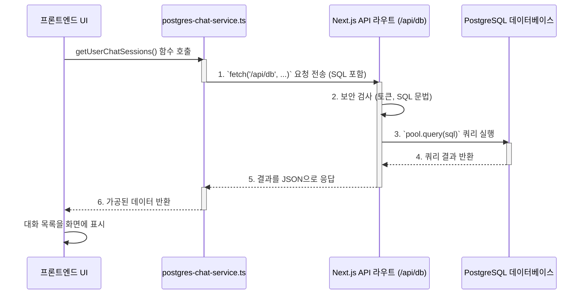

# Chapter 8: 프론트엔드-데이터베이스 연동


이전 [7장: 외부 데이터 수집 및 처리 (ETL)](07_외부_데이터_수집_및_처리__etl__.md)에서는 우리 AI 에이전트들이 사용할 귀중한 데이터를 어떻게 수집하고 가공하여 데이터베이스와 벡터 저장소에 채워 넣는지 배웠습니다. 이제 우리의 저장소는 유용한 정보로 가득 차 있습니다.

그렇다면 사용자가 보는 화면, 즉 프론트엔드는 이 저장소에 있는 데이터를 어떻게 가져와서 보여줄까요? 예를 들어, 사용자가 로그인했을 때 화면 왼쪽에 보이는 '과거 대화 목록'은 어떻게 불러오는 걸까요?

이번 장에서는 우리 애플리케이션의 '얼굴'인 프론트엔드와 '두뇌'인 데이터베이스가 서로 어떻게 소통하는지, 그 연결의 비밀을 파헤쳐 보겠습니다.

## 데이터를 가져오는 두 가지 길

일반적인 웹 애플리케이션에서는 프론트엔드가 백엔드 서버에게 "데이터 좀 줘!"라고 요청하면, 백엔드가 데이터베이스에서 데이터를 꺼내 전달해주는 한 가지 경로만 사용합니다. 하지만 우리 프로젝트는 조금 더 특별합니다. 데이터베이스와 소통하는 경로가 두 가지나 존재합니다.

1.  **전통적인 길 (Django API):** 사용자 인증처럼 보안이 중요하고 정해진 절차가 필요한 작업을 위한 공식적인 통로입니다.
2.  **직접적인 길 (Next.js API 라우트):** 채팅 기록 조회처럼 빠르고 빈번하게 일어나야 하는 작업을 위한 전용 고속도로입니다.

*   **문제:** 왜 두 가지 다른 방식으로 데이터베이스에 접근해야 할까? 하나의 방식으로 통일하면 더 간단하지 않을까?
*   **해결책:** 각 방식의 장점을 살려 역할에 맞게 사용한다. Django API는 사용자 관리와 같은 핵심 백엔드 로직을 안정적으로 처리하고, Next.js API 라우트는 프론트엔드와 밀접한 데이터를 빠르고 유연하게 처리한다. 특히 이 직접적인 길은 [실시간 AI 통신 게이트웨이 (FastAPI & WebSocket)](03_실시간_ai_통신_게이트웨이__fastapi___websocket__.md) 같은 다른 서비스도 쉽게 사용할 수 있는 독립적인 API 역할을 합니다.

이 두 가지 길을 이해하면 우리 애플리케이션의 전체 데이터 흐름을 명확하게 파악할 수 있게 됩니다.

## 경로 1: 정식 절차를 따르는 'Django API' 방식

이 방식은 회사에서 공식적인 결재 라인을 따르는 것과 비슷합니다. 프론트엔드(사원)가 요청서(HTTP 요청)를 작성해서 Django 백엔드(담당 부서)에 제출하면, 백엔드가 내부 규칙에 따라 데이터베이스(자료실)를 확인하고 결과를 프론트엔드에게 전달합니다.

가장 대표적인 예시는 **사용자 로그인**입니다.

### 로그인 과정 살펴보기

사용자가 이메일과 비밀번호를 입력하고 로그인 버튼을 누르면, 프론트엔드는 이 정보를 Django 백엔드의 `/api/accounts/login/` 주소로 보냅니다.

```python
# backend/accounts/views.py

# '/api/accounts/login/' POST 요청을 처리하는 함수
@api_view(['POST'])
@permission_classes([AllowAny])
def login_view(request):
    email = request.data.get('email')
    password = request.data.get('password')
    
    # Django의 인증 시스템을 사용하여 사용자 확인
    user = authenticate(username=email, password=password)
    
    if user:
        # 인증 성공 시, JWT라는 '출입증' 토큰을 발급
        refresh = RefreshToken.for_user(user)
        return Response({
            'access': str(refresh.access_token),
            # ... 기타 사용자 정보
        })
    
    return Response({'detail': '인증 실패'}, status=401)
```

이처럼 `login_view` 함수는 Django가 제공하는 안전한 `authenticate` 기능을 사용해 사용자를 확인하고, 성공하면 앞으로의 모든 요청에 사용할 수 있는 '출입증'(JWT 토큰)을 발급해 줍니다. 이 방식은 보안이 중요한 사용자 관리에 매우 적합하며, 모든 로직이 Django 백엔드 내에서 완결됩니다.

## 경로 2: 빠르고 유연한 'Next.js API 라우트' 방식

이제 우리 프로젝트의 독특한 특징인 두 번째 길을 살펴보겠습니다. 이 방식은 마치 특정 업무를 위한 '직통 전화'나 '전용 창구'와 같습니다. 프론트엔드는 Django라는 큰 부서를 거치지 않고, 프론트엔드 프로젝트 내에 있는 작은 API 창구를 통해 직접 데이터베이스에 필요한 것을 요청합니다.

이 방식은 주로 **채팅 기록을 불러올 때** 사용됩니다.

### 채팅 기록 조회 과정 살펴보기

프론트엔드에서 과거 대화 목록을 불러오는 `getUserChatSessions` 함수를 예로 들어보겠습니다. 이 함수는 `frontend/lib/api/postgres-chat-service.ts` 파일에 정의되어 있습니다.

```typescript
// frontend/lib/api/postgres-chat-service.ts

// 사용자의 채팅 세션 목록을 가져오는 함수
export async function getUserChatSessions(userId: string): Promise<ChatSession[]> {
  // 데이터베이스에 보낼 SQL 쿼리문 정의
  const sql = `
    SELECT id, user_id, title, started_at
    FROM chat_sessions
    WHERE user_id = $1
    ORDER BY started_at DESC
  `;

  // executeQuery 함수를 통해 쿼리를 실행
  const result = await executeQuery(sql, [userId]);
  return result.rows.map(/* ... 데이터 변환 ... */);
}
```

여기서 `executeQuery`라는 함수는 SQL 쿼리를 직접 실행하는 것이 아니라, 프론트엔드 프로젝트 내의 `/api/db` 라는 API 주소로 `fetch` 요청을 보내는 역할을 합니다. 정말 신기하죠? 프론트엔드가 자기 자신에게 API 요청을 보내는 셈입니다.

### 전용 창구의 비밀: `/api/db` 라우트

`/api/db`의 실제 코드는 `frontend/app/api/db/route.ts` 파일에 있습니다. 이 파일이 바로 데이터베이스와 직접 소통하는 '전용 창구'입니다.

```typescript
// frontend/app/api/db/route.ts

import { NextResponse } from 'next/server';
import { Pool } from 'pg'; // PostgreSQL 연결을 위한 라이브러리

// 데이터베이스 연결 풀 생성
const pool = new Pool({
  connectionString: process.env.POSTGRES_CONNECTION_STRING,
});

// POST 요청을 처리하는 메인 함수
export async function POST(request: NextRequest) {
  try {
    // 1. 요청에 포함된 SQL과 파라미터를 꺼냄
    const { sql, params } = await request.json();

    // 2. 보안 검사: 허용된 SQL 문법인지 확인 (매우 중요!)
    if (!isAllowedOperation(sql)) {
      return NextResponse.json({ error: '허용되지 않는 작업입니다.' }, { status: 403 });
    }
    
    // 3. 데이터베이스에 쿼리 실행
    const result = await pool.query(sql, params);
    
    // 4. 결과를 JSON 형태로 프론트엔드에 반환
    return NextResponse.json({ rows: result.rows });
  } catch (error) {
    // ... 에러 처리 ...
  }
}
```

이 코드는 다음과 같은 일을 합니다.

1.  `postgres-chat-service.ts`로부터 SQL 쿼리문이 담긴 요청을 받습니다.
2.  `isAllowedOperation`과 같은 보안 장치를 통해 `DROP TABLE`과 같이 위험한 명령어가 실행되지 않도록 철저히 검사합니다.
3.  안전하다고 판단되면 `pg` 라이브러리를 사용해 데이터베이스에 직접 쿼리를 실행합니다.
4.  데이터베이스로부터 받은 결과를 다시 요청한 곳(`postgres-chat-service.ts`)으로 돌려줍니다.

### 두 방식의 흐름 비교

두 가지 데이터 요청 방식의 흐름을 다이어그램으로 비교하면 그 차이를 명확하게 알 수 있습니다.

```mermaid
graph TD
    subgraph "경로 1: Django API 방식 (로그인)"
        A[프론트엔드 UI] --> B[Django 백엔드 API<br>(/api/accounts/login/)]
        B --> C[Django 인증 시스템]
        C --> D[데이터베이스]
        D --> C
        C --> B
        B --> A
    end

    subgraph "경로 2: Next.js API 방식 (채팅 기록 조회)"
        E[프론트엔드 UI] --> F[Next.js API 라우트<br>(/api/db)]
        F --> G[데이터베이스]
        G --> F
        F --> E
    end
```

경로 2가 훨씬 더 단순하고 직접적인 것을 볼 수 있습니다. 이런 구조 덕분에 채팅 데이터를 다루는 로직은 프론트엔드 프로젝트 내에서 독립적으로 관리될 수 있으며, 다른 서비스(예: FastAPI 서버)가 이 `/api/db` 엔드포인트를 재사용하여 채팅 이력을 조회하는 것도 가능해집니다.

## 내부 동작 흐름 한눈에 보기

사용자가 채팅 페이지를 열어 과거 대화 목록을 불러오는 과정을 순서도로 따라가 보겠습니다.



이처럼 프론트엔드는 마치 자기 자신과 대화하듯 API를 호출하여 데이터베이스의 정보를 가져옵니다. 이는 프론트엔드와 백엔드의 역할을 유연하게 나누는 현대적인 웹 개발 방식 중 하나입니다.

## 마무리하며: 전체 여정의 끝

이번 장에서는 우리 애플리케이션의 프론트엔드와 데이터베이스가 소통하는 두 가지 중요한 경로에 대해 배웠습니다. Django API를 통한 전통적이고 안정적인 방식과, Next.js API 라우트를 통한 빠르고 유연한 직접 연동 방식이 각자의 역할에 맞게 어떻게 사용되는지 살펴보았습니다.

이것으로 `SKN10-FINAL-1Team` 프로젝트의 핵심 구성 요소를 탐험하는 긴 여정이 마무리되었습니다.

우리는 [데이터 설계도](01_애플리케이션_데이터_설계도__django_모델__.md)에서 시작하여, 사용자와 만나는 [채팅 UI](02_프론트엔드_채팅_ui_.md)를 만들었습니다. 그리고 [실시간 통신 게이트웨이](03_실시간_ai_통신_게이트웨이__fastapi___websocket__.md)를 통해 메시지를 AI 시스템에 전달하고, [슈퍼바이저](04_ai_에이전트_총괄_시스템__langgraph_supervisor__.md)가 요청을 분석하여 [데이터 분석 전문가](05_데이터_분석_전문_에이전트__analytics_agent__.md)나 [문서 검색 전문가](06_문서_검색_전문_에이전트__rag_agent__.md)에게 작업을 맡기는 과정을 지켜보았습니다. 또한, 이 전문가들이 사용하는 데이터가 [ETL](07_외부_데이터_수집_및_처리__etl__.md)을 통해 어떻게 준비되는지, 그리고 오늘 배운 프론트엔드-데이터베이스 연동까지, 애플리케이션의 처음부터 끝까지 모든 데이터와 로직의 흐름을 함께 따라왔습니다.

이 튜토리얼 시리즈가 여러분이 우리 프로젝트의 복잡한 구조를 이해하고, 더 나아가 직접 코드를 수정하고 새로운 기능을 추가하는 데 훌륭한 길잡이가 되었기를 바랍니다.

지금까지 함께해 주셔서 감사합니다

---

Generated by [AI Codebase Knowledge Builder](https://github.com/The-Pocket/Tutorial-Codebase-Knowledge)